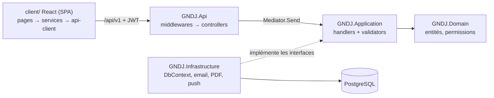
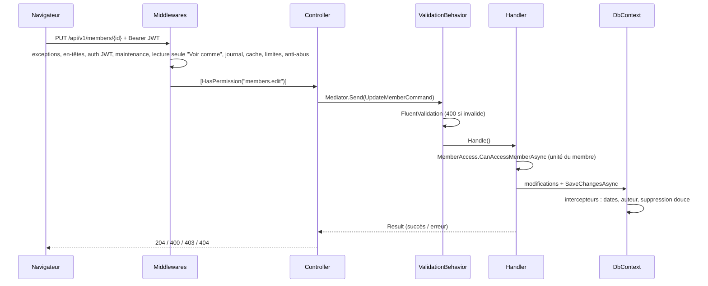
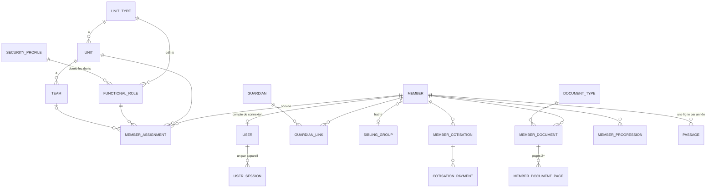
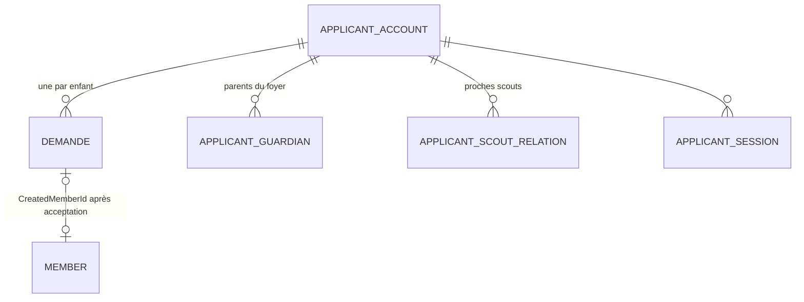

Cette documentation permet à un développeur de reprendre la plateforme. Le code est en **anglais**, l'interface en
**français**. Le dépôt contient aussi `CLAUDE.md` (historique détaillé de chaque fonctionnalité),
`docs/DEPLOYMENT.md` (installation d'un serveur) et `deploy/OPS.md` (exploitation).

## Vue d'ensemble

| Couche | Technologie |
|---|---|
| Backend | ASP.NET Core 10, Entity Framework Core 10 (Npgsql), Mediator (générateur de source), FluentValidation, Serilog, QuestPDF, ClosedXML |
| Base de données | PostgreSQL 18, clés UUIDv7, noms en `snake_case` |
| Frontend | React 19 + TypeScript + Vite, Tailwind CSS v4 + shadcn/ui, TanStack Query, Zustand, React Router |
| Authentification | JWT maison (pas d'ASP.NET Identity), BCrypt, une session par appareil (jetons de rafraîchissement tournants) |
| Hébergement | Windows Server + IIS (in-process) derrière Cloudflare |
| Tests | xUnit (logique), `tests/e2e` (API + navigateur, avant chaque mise en ligne) |



**Règles de dépendance** (Clean Architecture) : Domain ne dépend de rien ; Application dépend de Domain ;
Infrastructure implémente les interfaces d'Application ; Api assemble le tout.

## Organisation du dépôt

| Dossier | Contenu |
|---|---|
| `src/GNDJ.Domain` | ~60 entités, enums, `Permissions` (toutes les permissions sous forme de chaînes) |
| `src/GNDJ.Application` | Un dossier par fonctionnalité (`Members`, `Demandes`, `Passages`, `Documents`…) : commandes / requêtes + handlers + validators + DTO. `Common/` : règles partagées (`MemberAccess`, `LebanonClock`, `ScoutYearHelper`, `ValidationExtensions`…) |
| `src/GNDJ.Infrastructure` | `Persistence/` (DbContext, configurations, migrations, `SeedData`, `DataPatchRunner`), `Services/` (email, PDF, push, purge…), `Identity/` (jetons, utilisateur courant) |
| `src/GNDJ.Api` | Controllers (`api/v1/...`), middlewares, services d'arrière-plan, `Help/` (guides) |
| `client/src` | `pages/`, `components/` (dont `ui/` = shadcn), `services/` (un fichier par ressource d'API), `stores/` (Zustand), `lib/`, `hooks/` |
| `tests/` | Tests xUnit par couche + `e2e/` (suite de fumée) |
| `deploy/` | Scripts de publication, de mise à jour, d'exploitation ; `patches/` = correctifs de données SQL |
| `docs/help` | Ces guides (Markdown, servis dans l'application) |
| `tools/` | `help-docs` (captures d'écran, PDF), `Migration` (import historique depuis WEBDEV) |

## Le chemin d'une requête



**Ordre des middlewares** (`Program.cs`) : `ExceptionHandlingMiddleware` (traduit les exceptions en 400/403/409,
alerte l'administrateur sur les 500) → en-têtes de sécurité / CSP → fichiers statiques → authentification →
`ApiKeyMiddleware` → autorisation → `SlowRequestMiddleware` → `MaintenanceMiddleware` →
`ImpersonationReadOnlyMiddleware` → journalisation Serilog → `PublicCacheMiddleware` → cache de sortie → limites de
débit → `AbuseDetectionMiddleware` → controllers.

## Modèle de données

Le cœur du modèle :



Le portail d'inscription a son propre modèle, **isolé** des membres jusqu'à la conversion :



**Notions clés :**

| Notion | Détail |
|---|---|
| **Membre actif** | A au moins une affectation (`member_assignments`) avec `end_date IS NULL` |
| **Année scoute** | Du 1er octobre au 30 septembre ; `ScoutYearHelper`. L'année « courante » de la configuration est le réglage `passage.scout_year` |
| **Date du jour** | Toujours `LebanonClock.Today` (heure de Beyrouth), jamais `DateTime.UtcNow` pour une date ; les horodatages restent en UTC |
| **Suppression douce** | Les entités `BaseEntity` ont `IsDeleted` ; un filtre global les cache ; l'intercepteur transforme `Remove` en suppression douce |
| **Réglages** | Table clé / valeur `settings` (catégorie, type) ; créés au démarrage par `SeedMissingSettingsAsync` |
| **Listes gérées** | Écoles, classes, villes, domaines de profession : réglages JSON ; les fiches stockent la valeur texte (renommer = répercuter sur les fiches) |

## Sécurité

### Authentification

- **Membres** : identifiant `prenom.nom@scouts.gndj` + mot de passe (BCrypt), ou code à 6 chiffres par email.
  Jeton d'accès JWT de 15 minutes (permissions et unités incluses → aucune requête en base pour autoriser) +
  jeton de rafraîchissement **par appareil** (`user_sessions`, SHA-256, rotation avec 120 s de tolérance, 7 ou 90
  jours glissants).
- **Familles** (portail d'inscription) : comptes séparés (`applicant_accounts`), jetons séparés, sans aucune
  permission sur les membres.
- **Blocage** : 5 échecs → attente croissante par identifiant saisi (`ILoginThrottle`).

### Autorisation

Deux niveaux, **toujours les deux** :

1. **Permission** sur le controller : `[HasPermission(Permissions.MembersEdit)]` (chaînes dans
   `Domain/Enums/Permissions`, attribuées par les **profils de sécurité** liés aux fonctions).
2. **Portée** dans le handler : quel membre / quelle unité. Les règles communes sont dans `Common/MemberAccess` :

| Méthode | Règle |
|---|---|
| `CanAccessMemberAsync` | super-admin, **ou** sa propre fiche, **ou** `members.edit` + le membre est actif dans une unité autorisée, **ou** gestionnaire de groupe |
| `CanViewMemberAsync` | idem avec `members.view` (lecture seule) |
| `CanLeadUnit` | super-admin, ou `members.edit` + unité autorisée |
| `IsGroupManager` | super-admin ou `maitrise.manage` (chef de groupe, assistants) |

> ⚠️ Une fonctionnalité qui lit des données de membres doit passer par `MemberAccess`, jamais recopier la règle.
> Les endpoints « self-service » (`/my-profile/*`) résolvent le membre **côté serveur**, jamais depuis l'URL.

### Défenses

CSP stricte, HSTS, en-têtes de sécurité ; limites de débit par IP (vraie IP derrière Cloudflare) ; champ piège
(honeypot) sur les formulaires publics ; `AbuseDetectionMiddleware` (XSS / SQLi / jetons géants sur les corps
JSON, sauf contenus riches) ; validation magic-bytes des fichiers ; protection des chemins de fichiers ; « Voir
comme » en lecture seule par construction ; journal d'audit de chaque écriture et de chaque téléchargement de
document.

## Écrire une fonctionnalité

### Backend

```csharp
// Application/Widgets/WidgetHandlers.cs
public record CreateWidgetCommand(Guid UnitId, string Name) : IRequest<Result<Guid>>;

public class CreateWidgetCommandValidator : AbstractValidator<CreateWidgetCommand>
{
    public CreateWidgetCommandValidator()
    {
        RuleFor(x => x.Name).NotEmpty().MaximumLength(100).NoHtml();   // toujours : longueurs + NoHtml
    }
}

public class CreateWidgetCommandHandler(IApplicationDbContext context, ICurrentUserService user, IAuditService audit)
    : IRequestHandler<CreateWidgetCommand, Result<Guid>>
{
    public async ValueTask<Result<Guid>> Handle(CreateWidgetCommand request, CancellationToken ct)
    {
        if (!MemberAccess.CanLeadUnit(user, request.UnitId)) return Result<Guid>.Failure("Accès non autorisé.");
        var w = new Widget { UnitId = request.UnitId, Name = request.Name.Trim() };
        context.Widgets.Add(w);
        await context.SaveChangesAsync(ct);
        await audit.LogAsync("Create", "Widget", w.Id, null, new { w.Name }, ct);
        return Result<Guid>.Success(w.Id);
    }
}
```

Puis : le `DbSet` dans `IApplicationDbContext` + `GndjDbContext`, une configuration EF, la migration
(`dotnet ef migrations add AddWidgets --project src/GNDJ.Infrastructure --startup-project src/GNDJ.Api --output-dir Persistence/Migrations`),
l'endpoint dans un controller avec `[HasPermission]`.

### Frontend

Un fichier `services/widget-service.ts` (hooks `useQuery` / `useMutation`, clés `['widgets', …]`,
`invalidateQueries` après une écriture), une page dans `pages/` chargée en différé dans `App.tsx`, protégée par
`PermissionRoute`, et l'entrée de menu dans `components/layout/sidebar.tsx`.

### Liste de contrôle

| ✔ | Point |
|---|---|
| | Validator avec longueurs max, `NoHtml()`, `RealEmail()`, listes autorisées pour les valeurs fixes |
| | Permission sur le controller **et** portée dans le handler |
| | Dates avec `LebanonClock`, horodatages en UTC |
| | Toasts de succès / d'erreur (`sonner`), messages en français |
| | Mode sombre (couleurs par jetons, `dark:` pour les couleurs fixes) et affichage téléphone |
| | Une ligne dans `client/src/data/changelog.json` |
| | Une vérification ajoutée à `tests/e2e` si c'est un parcours important |
| | `dotnet build` sans avertissement, `npx tsc -b`, `npx eslint --max-warnings=0` |

## Tâches d'arrière-plan

| Service | Fréquence | Rôle |
|---|---|---|
| `OutboxSenderBackgroundService` | Continu (réveillé à chaque envoi) | Envoie la file d'emails, relances, limite horaire par serveur |
| `PushSenderBackgroundService` | Continu | Envoie les notifications Web Push |
| `DocumentCampaignBackgroundService` | 12 h | Étapes automatiques de la campagne de documents |
| `RentreeReminderBackgroundService` | 12 h | Rappel hebdomadaire des tâches de rentrée |
| `MemberPurgeBackgroundService` | 24 h | Purge définitive de la corbeille (30 jours) |
| `ApplicationLogMaintenanceBackgroundService` | 24 h | Rétention des journaux, notifications, envois |
| `OpsAlertBackgroundService` | 1 h | Email quotidien « points à vérifier » |

Chacun s'enregistre auprès de `IJobMonitor` (page Système). Au démarrage, les migrations, les données de départ et
les **correctifs de données** (`deploy/patches/*.sql`, exécutés une seule fois, dans une transaction, suivis dans
`data_patches`) passent sous un verrou consultatif PostgreSQL.

**Envois fiables :** emails et notifications sont d'abord écrits en base (`email_outbox`, `push_outbox`) puis
envoyés par le service : ils survivent à un redémarrage (au moins une livraison).

## Tests

| Commande | Ce qu'elle vérifie |
|---|---|
| `dotnet test GNDJ.slnx` | Tests unitaires (arrêter l'API avant : elle verrouille les DLL) |
| `powershell -ExecutionPolicy Bypass -File tests/e2e/run.ps1` | API (48 vérifications), navigateur (19), taille de l'application — **avant chaque mise en ligne** |

Les tests e2e tournent sur la base de dev copiée de la production (`deploy/dev-sync-from-prod.ps1`, qui neutralise
les serveurs d'email) ; mot de passe de toutes les connexions de dev : `Gndj2026!`.

## Pièges connus

| Piège | Conséquence | Bonne pratique |
|---|---|---|
| Modifier la collection de navigation d'un parent suivi (`parent.Pages.Add(...)`) | `DbUpdateConcurrencyException` (409) | Ajouter / supprimer les enfants via leur `DbSet` avec la clé étrangère |
| `Include(m => m.Assignments)` puis `Remove(member)` | 500 « association severed » | Charger le parent seul, lire les enfants par une requête séparée |
| `ExecuteSqlRaw` avec du JSON contenant `{` | `FormatException` | Correctifs SQL exécutés via `DbCommand` (déjà le cas dans `DataPatchRunner`) |
| `DateTime` venu de l'URL comparé à une colonne `timestamptz` | 500 « Kind=Unspecified » | `.AsUtc()` (`Common/DateTimeExtensions`) |
| `DbFns.Unaccent(variable C#)` | Exception (fonction base de données uniquement) | Appeler `Unaccent` **dans** l'expression LINQ |
| `new DateOnly(an, mois, jour)` dans une requête pour un 29 février | 500 en année non bissextile | Comparer mois et jour séparément |
| Nom d'espace de noms `GNDJ.Application.System` | Masque l'espace de noms .NET `System` | Choisir un autre nom (`SystemHealth`) |
| Scripts PowerShell avec des caractères non ASCII | Erreurs d'analyse sous PowerShell 5.1 | Scripts `deploy/` en ASCII uniquement |
| `dotnet ef migrations add` puis démarrage `--no-build` | Avertissement « modifications en attente » | Recompiler après avoir ajouté une migration |
| Un guide ou une donnée dans le bundle JavaScript | Téléchargeable par tous (les fichiers statiques sont publics) | Contrôle d'accès côté serveur (`/api/v1/help`) |

## Les guides (cette aide)

Les guides sont des fichiers Markdown dans `docs/help` (en-tête : `title`, `audience`, `order`, `summary`), servis
par `/api/v1/help` selon le rôle. Captures d'écran : `tools/help-docs/capture.mjs` (noms, emails et téléphones
remplacés par de faux) ; PDF : `tools/help-docs/pdf.mjs`. Voir `tools/help-docs/README.md`.
