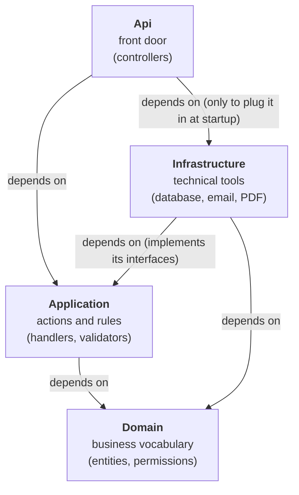
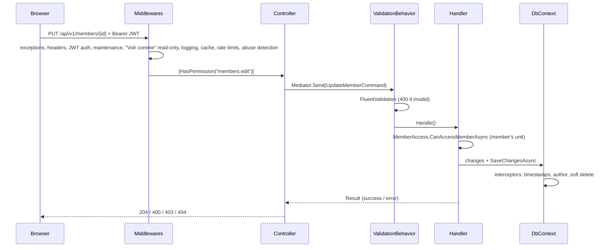
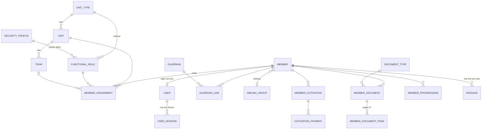

This documentation lets a developer take over the platform. The code is in **English**, the user interface in
**French**. The repository also contains `CLAUDE.md` (a detailed history of every feature),
`docs/DEPLOYMENT.md` (setting up a server) and `deploy/OPS.md` (day-to-day operations).

## Overview

| Layer | Technology |
|---|---|
| Backend | ASP.NET Core 10, Entity Framework Core 10 (Npgsql), Mediator (source generator), FluentValidation, Serilog, QuestPDF, ClosedXML |
| Database | PostgreSQL 18, UUIDv7 keys, `snake_case` names |
| Frontend | React 19 + TypeScript + Vite, Tailwind CSS v4 + shadcn/ui, TanStack Query, Zustand, React Router |
| Authentication | Custom JWT (no ASP.NET Identity), BCrypt, one session per device (rotating refresh tokens) |
| Hosting | Windows Server + IIS (in-process) behind Cloudflare |
| Tests | xUnit (logic), `tests/e2e` (API + browser, before every deploy) |

## How the code is split into layers

The backend is split into **four projects**, stacked like layers. Each layer has one job, and there is one strict
rule about which layer is allowed to know about which. (This style is called *Clean Architecture*.)

| Layer (project) | Its job, in plain words | Example |
|---|---|---|
| **Domain** (`GNDJ.Domain`) | *What things are.* The business vocabulary: a member, a unit, a document, a permission. Plain classes, no database, no web. | The `Member` class with its name, date of birth, gender |
| **Application** (`GNDJ.Application`) | *What the app can do, and the rules.* Every action ("create a member", "approve a document") with its validation and its access check. It says *what* it needs (save data, send an email) without saying *how*. | `UpdateMemberCommand` + its validator + its handler |
| **Infrastructure** (`GNDJ.Infrastructure`) | *How it is actually done.* The technical tools: talking to PostgreSQL, sending emails, generating PDFs, push notifications. | `GndjDbContext` (database), `EmailService` |
| **Api** (`GNDJ.Api`) | *The front door.* Receives web requests, checks the login token, hands the request to Application, sends back the answer. Also plugs Infrastructure into Application at startup. | `MembersController` |

The **frontend** (`client/`, React) is a separate program that runs in the browser. It only talks to the Api,
over HTTPS (`/api/v1/...`), never to the database.

### Who depends on whom

In the diagram below, **an arrow means "depends on"**: the project at the start of the arrow uses code from the
project the arrow points to. (In .NET terms: it has a project reference to it.)



Read it from top to bottom: **every arrow points down, towards Domain**. Domain is at the bottom with no arrow
leaving it — it depends on nothing. That is the whole point: the heart of the app (what things are, and the rules)
does not know or care whether data is stored in PostgreSQL or emails go through SMTP2GO. You could change those
tools without touching the rules.

> 💡 **The one surprising arrow: Infrastructure → Application.** You might expect Application to call
> Infrastructure ("to save a member, use the database"). Instead, Application only declares what it needs, as an
> **interface** — a contract such as `IEmailService` ("something that can send an email"). Infrastructure provides
> the real `EmailService` that fulfils that contract, so Infrastructure is the one that depends on Application.
> At startup, Api connects the two (this is *dependency injection*, in `DependencyInjection.cs` and `Program.cs`).

The rule, in one line each:

| Project | May use | Must never use |
|---|---|---|
| Domain | nothing | anything else |
| Application | Domain | Infrastructure, Api |
| Infrastructure | Application, Domain | Api |
| Api | all of them | — |

> ⚠️ If a change in Application or Domain seems to need `using GNDJ.Infrastructure...`, that's the sign something
> is in the wrong place: declare an interface in Application instead, and implement it in Infrastructure.

### What happens when someone clicks a button

The arrows above show *who knows about whom*, not the order things happen in. At run time, a request flows like
this: the browser calls the **Api** → the Api passes it to the right **Application** handler → the handler checks
the rules and uses the database through its interface (which is really **Infrastructure** doing the work) → the
answer goes back to the browser. The detailed version is in [The path of a request](#the-path-of-a-request) below.

## Repository layout

| Folder | Contents |
|---|---|
| `src/GNDJ.Domain` | ~60 entities, enums, `Permissions` (every permission as a string) |
| `src/GNDJ.Application` | One folder per feature (`Members`, `Demandes`, `Passages`, `Documents`…): commands / queries + handlers + validators + DTOs. `Common/`: shared rules (`MemberAccess`, `LebanonClock`, `ScoutYearHelper`, `ValidationExtensions`…) |
| `src/GNDJ.Infrastructure` | `Persistence/` (DbContext, configurations, migrations, `SeedData`, `DataPatchRunner`), `Services/` (email, PDF, push, purge…), `Identity/` (tokens, current user) |
| `src/GNDJ.Api` | Controllers (`api/v1/...`), middlewares, background services, `Help/` (guides) |
| `client/src` | `pages/`, `components/` (including `ui/` = shadcn), `services/` (one file per API resource), `stores/` (Zustand), `lib/`, `hooks/` |
| `tests/` | xUnit tests per layer + `e2e/` (smoke suite) |
| `deploy/` | Publish, update and operations scripts; `patches/` = SQL data patches |
| `docs/help` | These guides (Markdown, served inside the app) |
| `tools/` | `help-docs` (screenshots, PDF), `Migration` (historical import from WEBDEV) |

## The path of a request



**Middleware order** (`Program.cs`): `ExceptionHandlingMiddleware` (maps exceptions to 400/403/409, alerts the
administrator on 500s) → security headers / CSP → static files → authentication → `ApiKeyMiddleware` →
authorization → `SlowRequestMiddleware` → `MaintenanceMiddleware` → `ImpersonationReadOnlyMiddleware` → Serilog
request logging → `PublicCacheMiddleware` → output cache → rate limiting → `AbuseDetectionMiddleware` → controllers.

## Data model

The core of the model:



The enrolment portal has its own model, **isolated** from members until conversion:


**Key concepts:**

| Concept | Detail |
|---|---|
| **Active member** | Has at least one assignment (`member_assignments`) with `end_date IS NULL` |
| **Scout year** | October 1 to September 30; `ScoutYearHelper`. The configured "current" year is the `passage.scout_year` setting |
| **Today's date** | Always `LebanonClock.Today` (Beirut time), never `DateTime.UtcNow` for a calendar date; timestamps stay in UTC |
| **Soft delete** | `BaseEntity` entities have `IsDeleted`; a global query filter hides them; the interceptor turns `Remove` into a soft delete |
| **Settings** | Key / value table `settings` (category, value type); created at startup by `SeedMissingSettingsAsync` |
| **Managed lists** | Schools, classes, cities, profession domains: JSON settings; records store the text value (a rename cascades onto the records) |

## Security

### Authentication

- **Members**: username `prenom.nom@scouts.gndj` + password (BCrypt), or a 6-digit code by email.
  15-minute JWT access token (permissions and units embedded → no database query needed to authorize) +
  a **per-device** refresh token (`user_sessions`, SHA-256, rotated with a 120 s grace window, 7 or 90 days
  sliding).
- **Families** (enrolment portal): separate accounts (`applicant_accounts`), separate tokens, no permission at all
  on member data.
- **Lockout**: 5 failures → increasing wait per typed username (`ILoginThrottle`).

### Authorization

Two levels, **always both**:

1. **Permission** on the controller: `[HasPermission(Permissions.MembersEdit)]` (strings in
   `Domain/Enums/Permissions`, granted by the **security profiles** attached to functional roles).
2. **Scope** inside the handler: which member / which unit. The shared rules live in `Common/MemberAccess`:

| Method | Rule |
|---|---|
| `CanAccessMemberAsync` | super-admin, **or** own record, **or** `members.edit` + the member is active in an authorized unit, **or** group manager |
| `CanViewMemberAsync` | same, but also accepts `members.view` (read-only) |
| `CanLeadUnit` | super-admin, or `members.edit` + authorized unit |
| `IsGroupManager` | super-admin or `maitrise.manage` (chef de groupe, assistants) |

> ⚠️ A feature that reads member data must go through `MemberAccess` — never copy the rule.
> "Self-service" endpoints (`/my-profile/*`) resolve the member **server-side**, never from the URL.

### Defenses

Strict CSP, HSTS, security headers; per-IP rate limiting (real IP behind Cloudflare); honeypot field on public
forms; `AbuseDetectionMiddleware` (XSS / SQLi / giant tokens in JSON bodies, except rich content); magic-byte file
validation; file-path traversal protection; "Voir comme" (impersonation) read-only by construction; audit log of
every write and every document download.

## Writing a feature

### Backend

```csharp
// Application/Widgets/WidgetHandlers.cs
public record CreateWidgetCommand(Guid UnitId, string Name) : IRequest<Result<Guid>>;

public class CreateWidgetCommandValidator : AbstractValidator<CreateWidgetCommand>
{
    public CreateWidgetCommandValidator()
    {
        RuleFor(x => x.Name).NotEmpty().MaximumLength(100).NoHtml();   // always: length caps + NoHtml
    }
}

public class CreateWidgetCommandHandler(IApplicationDbContext context, ICurrentUserService user, IAuditService audit)
    : IRequestHandler<CreateWidgetCommand, Result<Guid>>
{
    public async ValueTask<Result<Guid>> Handle(CreateWidgetCommand request, CancellationToken ct)
    {
        if (!MemberAccess.CanLeadUnit(user, request.UnitId)) return Result<Guid>.Failure("Accès non autorisé.");
        var w = new Widget { UnitId = request.UnitId, Name = request.Name.Trim() };
        context.Widgets.Add(w);
        await context.SaveChangesAsync(ct);
        await audit.LogAsync("Create", "Widget", w.Id, null, new { w.Name }, ct);
        return Result<Guid>.Success(w.Id);
    }
}
```

Then: the `DbSet` in `IApplicationDbContext` + `GndjDbContext`, an EF configuration, the migration
(`dotnet ef migrations add AddWidgets --project src/GNDJ.Infrastructure --startup-project src/GNDJ.Api --output-dir Persistence/Migrations`),
and the endpoint in a controller with `[HasPermission]`.

### Frontend

A `services/widget-service.ts` file (`useQuery` / `useMutation` hooks, keys `['widgets', …]`,
`invalidateQueries` after a write), a page in `pages/` lazy-loaded in `App.tsx`, protected by
`PermissionRoute`, and the menu entry in `components/layout/sidebar.tsx`.

### Checklist

| ✔ | Item |
|---|---|
| | Validator with max lengths, `NoHtml()`, `RealEmail()`, allowed sets for fixed values |
| | Permission on the controller **and** scope check in the handler |
| | Dates via `LebanonClock`, timestamps in UTC |
| | Success / error toasts (`sonner`), user-facing messages in French |
| | Dark mode (token colors, `dark:` for fixed colors) and phone layout |
| | An entry in `client/src/data/changelog.json` |
| | A check added to `tests/e2e` if it's an important flow |
| | `dotnet build` with no warnings, `npx tsc -b`, `npx eslint --max-warnings=0` |

## Background jobs

| Service | Frequency | Role |
|---|---|---|
| `OutboxSenderBackgroundService` | Continuous (woken on each enqueue) | Sends the email queue, retries, per-server hourly cap |
| `PushSenderBackgroundService` | Continuous | Sends Web Push notifications |
| `DocumentCampaignBackgroundService` | 12 h | Automatic steps of the document campaign |
| `RentreeReminderBackgroundService` | 12 h | Weekly reminder of rentrée (start-of-year) tasks |
| `MemberPurgeBackgroundService` | 24 h | Permanent purge of the recycle bin (30 days) |
| `ApplicationLogMaintenanceBackgroundService` | 24 h | Retention of logs, notifications, outbox rows |
| `OpsAlertBackgroundService` | 1 h | Daily "things to check" email |

Each one registers with `IJobMonitor` (Système page). At startup, migrations, seed data and **data patches**
(`deploy/patches/*.sql`, run once each, in a transaction, tracked in `data_patches`) run under a PostgreSQL
advisory lock.

**Reliable delivery:** emails and push notifications are first written to the database (`email_outbox`,
`push_outbox`) and then sent by the service: they survive a restart (at-least-once delivery).

## Tests

| Command | What it checks |
|---|---|
| `dotnet test GNDJ.slnx` | Unit tests (stop the API first: it locks the DLLs) |
| `powershell -ExecutionPolicy Bypass -File tests/e2e/run.ps1` | API (48 checks), browser (19), app bundle size — **before every deploy** |

The e2e tests run against the dev database copied from production (`deploy/dev-sync-from-prod.ps1`, which
neutralizes the email servers); password for every dev login: `Gndj2026!`.

## Known pitfalls

| Pitfall | Consequence | Good practice |
|---|---|---|
| Mutating a tracked parent's navigation collection (`parent.Pages.Add(...)`) | `DbUpdateConcurrencyException` (409) | Add / remove children through their `DbSet` with the foreign key |
| `Include(m => m.Assignments)` then `Remove(member)` | 500 "association severed" | Load the parent alone, read the children with a separate query |
| `ExecuteSqlRaw` with JSON containing `{` | `FormatException` | Run SQL patches via a `DbCommand` (already the case in `DataPatchRunner`) |
| A `DateTime` from the URL compared with a `timestamptz` column | 500 "Kind=Unspecified" | `.AsUtc()` (`Common/DateTimeExtensions`) |
| `DbFns.Unaccent(C# variable)` | Exception (database-only function) | Call `Unaccent` **inside** the LINQ expression |
| `new DateOnly(year, month, day)` in a query for a February 29 | 500 in a non-leap year | Compare month and day separately |
| Namespace named `GNDJ.Application.System` | Shadows the .NET `System` namespace | Pick another name (`SystemHealth`) |
| PowerShell scripts with non-ASCII characters | Parse errors under PowerShell 5.1 | Keep `deploy/` scripts ASCII-only |
| `dotnet ef migrations add` then starting with `--no-build` | "Pending model changes" warning | Rebuild after adding a migration |
| A guide or data bundled into the JavaScript | Downloadable by anyone (static files are public) | Server-side access control (`/api/v1/help`) |

## The guides (this help)

The guides are Markdown files in `docs/help` (front matter: `title`, `audience`, `order`, `summary`), served by
`/api/v1/help` according to the user's role. Screenshots: `tools/help-docs/capture.mjs` (names, emails and phone
numbers replaced with fake ones); PDF: `tools/help-docs/pdf.mjs`. See `tools/help-docs/README.md`.
