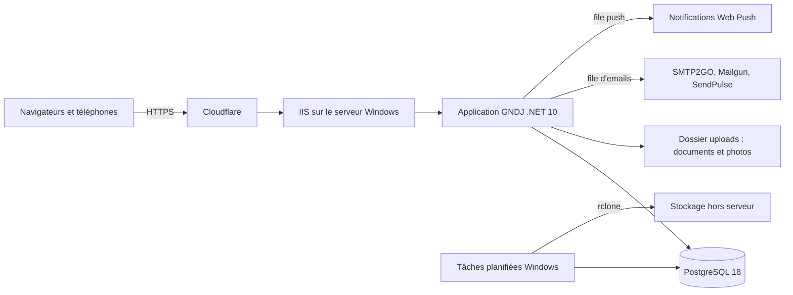
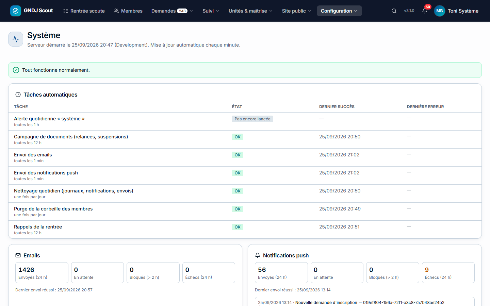
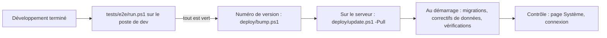
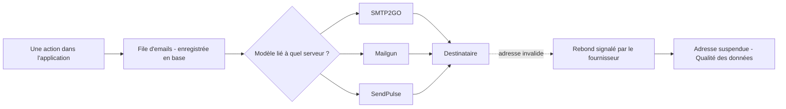
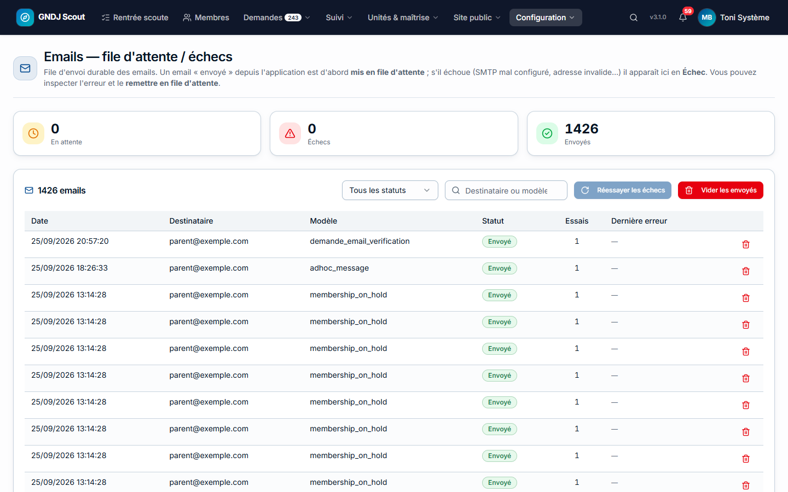
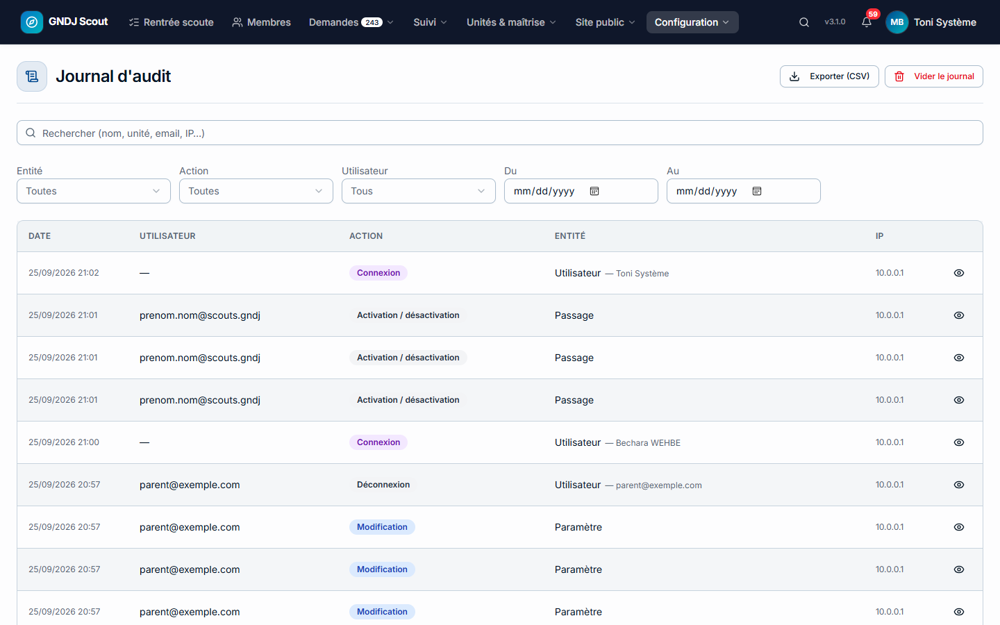

Ce guide s'adresse au **super-administrateur** : la personne qui surveille le serveur, installe les mises à jour et
règle la configuration technique. Les procédures détaillées (installation complète d'un serveur, changement de
domaine) sont dans `docs/DEPLOYMENT.md` et `deploy/OPS.md` du dépôt ; la partie technique du code est dans la
[Documentation technique](documentation-technique.md).

## Comment la plateforme est installée

| Élément | Où | Remarque |
|---|---|---|
| Site | `https://gndj.org`, derrière Cloudflare | Certificat Cloudflare Origin sur IIS, mode « Full (strict) » |
| Application | IIS, pool `gndj`, dossier `C:\inetpub\www\gndj` | Serveur partagé avec d'autres sites : ne jamais faire `iisreset` |
| Base de données | PostgreSQL 18 sur le même serveur | Base `gndj` |
| Fichiers envoyés | `C:\inetpub\www\gndj\uploads` | Documents des membres, photos, images du site |
| Configuration secrète | `appsettings.Production.json` | Jamais dans le dépôt Git |
| Sauvegardes | `C:\gndj-backups\…` + copie hors serveur (rclone) | Voir [Sauvegardes](#sauvegardes) |

## Surveiller : la page Système

**Configuration → Système** répond à la question « est-ce que tout tourne ? ».

| Section | Ce qu'elle montre | Que faire si c'est rouge |
|---|---|---|
| **Points à vérifier** | Le résumé (le même que l'email quotidien) | Traiter chaque point |
| **Tâches automatiques** | Chaque tâche de fond : dernier succès, dernière erreur | « Arrêtée » : recycler le pool `gndj` ; « En erreur » : lire l'erreur, voir le Journal des erreurs |
| **Emails / Notifications push** | Envoyés, en attente, bloqués (> 2 h), échecs (24 h) | Ouvrir **File d'emails** ; vérifier le serveur SMTP |
| **Disque** | Espace libre, taille des fichiers envoyés | Libérer de la place (anciennes sauvegardes, fichiers orphelins) |
| **Pages lentes** | Requêtes de plus de 2 s depuis le démarrage, par page et par rôle | Signaler au développeur si une page revient souvent |
| **Configuration** | Réglages contradictoires, modèles d'email avec variables inconnues | Suivre le lien « Corriger » |
| **Fichiers orphelins** | Fichiers sur le disque rattachés à aucune fiche | **Rechercher** puis **Supprimer** (bloqué si c'est anormalement élevé) |

### Les alertes automatiques

| Alerte | Envoyée par | Quand |
|---|---|---|
| **Erreur du serveur ou de l'application** | L'application | À chaque nouvelle erreur (regroupées, 30 max par heure) |
| **« N point(s) à vérifier »** | L'application | Au plus une fois par jour, s'il y a un problème |
| **Site inaccessible / rétabli** | Tâche `GNDJ-HealthCheck` | Au changement d'état |
| **Disque presque plein / rétabli** | Tâche `GNDJ-HealthCheck` | Au changement d'état |
| **Sauvegarde OK / en échec** | Tâche `GNDJ-Backup` | Chaque nuit |
| **Test de restauration OK / en échec** | Tâche `GNDJ-RestoreTest` | Toutes les 4 semaines |

Les alertes de l'application vont à l'adresse **error.notify_email** (Paramètres → Email & contact), sinon au premier
super-administrateur. Elles passent par un serveur d'alertes dédié (`ErrorAlerts:Smtp`) pour arriver même quand
l'envoi d'emails de l'application est en panne. Les alertes des tâches planifiées vont aux adresses de
`deploy\ops-alert.config.json`.

### Les tâches planifiées du serveur

| Tâche | Fréquence | Rôle |
|---|---|---|
| `GNDJ-Backup` | Chaque nuit | Sauvegarde de la base + copie hors serveur + archives |
| `GNDJ-HealthCheck` | Toutes les 2 minutes | Le site répond-il ? Reste-t-il de la place sur le disque ? |
| `GNDJ-Watchdog` | Régulièrement | Relance l'application si elle est tombée |
| `GNDJ-RestoreTest` | Toutes les 4 semaines | Restaure la dernière sauvegarde dans une base temporaire et la vérifie |

Elles s'installent (ou se réinstallent) avec `deploy\install-ops-tasks.ps1` en PowerShell administrateur.

## Mettre à jour la plateforme

1. **Avant** : la suite de tests (`powershell -ExecutionPolicy Bypass -File tests/e2e/run.ps1`) doit afficher
   **ALL SMOKE TESTS PASSED**.
2. **Sur le serveur**, en PowerShell administrateur, dans le dossier du dépôt : `.\deploy\update.ps1 -Pull`
   (récupère la dernière version, compile, installe, recycle le pool).
3. **Au démarrage**, l'application applique toute seule les **migrations** de la base et les **correctifs de
   données** en attente (`deploy/patches`, une seule fois chacun).
4. **Après** : ouvrir la page **Système** et se connecter une fois.

> ⚠️ Une mise à jour fait redémarrer l'application : quelques secondes d'interruption. Évitez les moments de forte
> activité (soirées de septembre).

**Le numéro de version** (en bas du menu, visible par le super-administrateur) ouvre le **Journal des versions**.

## Sauvegardes

| Quoi | Où | Durée de conservation |
|---|---|---|
| Base de données (chaque nuit) | `C:\gndj-backups\database` + cloud | 30 jours |
| Archive annuelle du journal d'audit | `C:\gndj-backups\audit` + cloud | Toujours |
| Archive annuelle des documents (nettoyage de nouvelle année) | `C:\gndj-backups\documents` + cloud | Toujours |

Le **test de restauration** (toutes les 4 semaines) prouve que la sauvegarde se restaure vraiment. Pour
restaurer en cas de catastrophe : `deploy/OPS.md`, section « Restoring a backup ».

> ⚠️ Les fichiers envoyés (documents, photos) ne sont **pas** dans la sauvegarde de la base : prévoyez une copie du
> dossier `uploads`.

## Les emails

- **Tout email passe par la file** (table `email_outbox`) : il survit à un redémarrage et est réessayé en cas
  d'échec (5 tentatives). **Configuration → File d'emails** montre les envois en attente, envoyés et en échec, avec
  **Réessayer**.
- **Serveurs SMTP** (Paramètres → Serveurs SMTP) : chaque serveur peut avoir une **limite par heure**, respectée
  automatiquement. Les mots de passe des fournisseurs sont dans `appsettings.Production.json` (`Smtp:Passwords`),
  pas dans la base.
- **Modèles d'email** (Paramètres → Modèles d'email) : texte, variables `{{…}}`, pièces jointes, serveur utilisé.
  Une variable inconnue est signalée en haut de la page.
- **Mode test** : si **email.override_recipient** est rempli, **tous** les emails partent vers cette adresse. À
  laisser **vide** en production.
- **Rebonds** : les fournisseurs signalent les adresses invalides ; elles ne reçoivent plus d'emails et apparaissent
  dans **Qualité des données** (bouton **Réactiver** une fois l'adresse corrigée).

> ⚠️ Chaque fournisseur doit être autorisé dans le DNS de `gndj.org` (SPF + DKIM), sinon les emails arrivent en
> courrier indésirable.

## Sécurité et accès

| Sujet | Où | À savoir |
|---|---|---|
| Super-administrateurs | **Accès & permissions**, ou fiche du membre → Actions | Il en faut toujours au moins un |
| Droits par fonction | **Accès & permissions → Profils** | Voir le [Guide du chef de groupe](guide-chef-groupe.md#acces-et-delegations) |
| Politique de mot de passe | **Paramètres → Sécurité** | Longueur, majuscule, chiffre, caractère spécial |
| Appareils connectés | **Sessions actives** | Un appareil par ligne ; **Déconnecter** met fin à cette session |
| Qui a fait quoi | **Journal d'audit** | Recherche, export CSV ; archivé puis vidé à chaque nouvelle année scoute |
| Blocage après échecs | Automatique | 5 mots de passe faux → attente de 1, 2, 4… minutes (30 max) |
| Mise en maintenance | **Paramètres → Maintenance** | Tout le site ou un module ; le super-administrateur garde l'accès |
| Clés API | **Paramètres → Clés API** | Pour les intégrations externes |

## Les journaux

- **Journal des erreurs** : les erreurs du serveur et des navigateurs, avec leur **référence** (le code affiché à
  l'utilisateur). Conservé 90 jours (réglable), **Vider le journal** pour repartir de zéro.
- **Journal d'audit** : chaque action (connexion, modification, suppression, téléchargement de document…) avec
  l'avant / après. À chaque nouvelle année scoute, il est archivé en CSV, envoyé par email à l'administrateur et au
  chef de groupe, puis vidé.

## Configuration du serveur

Les réglages secrets sont dans `C:\inetpub\www\gndj\appsettings.Production.json` :

| Section | Contenu |
|---|---|
| `ConnectionStrings:DefaultConnection` | Accès à la base (avec la taille du pool de connexions) |
| `Jwt:Secret` | Clé de signature des sessions (l'application refuse de démarrer si elle est absente ou faible) |
| `AllowedHosts`, `Cloudflare:Enabled` | Noms de domaine acceptés ; lecture de la vraie adresse IP derrière Cloudflare |
| `Smtp:Passwords` | Mots de passe des fournisseurs d'email, par nom de serveur |
| `ErrorAlerts` | Adresse et serveur SMTP dédiés aux alertes |
| `EmailBounces` | Clé Mailgun et jeton des webhooks de rebonds |
| `WebPush` | Clés VAPID des notifications (ne jamais les changer après la mise en service) |
| `AuditArchive:Directory`, `DocumentArchive:Directory` | Dossiers des archives annuelles, hors du site |
| `Monitoring` (facultatif) | Seuils : pages lentes, disque |

Après une modification : **recycler le pool `gndj`** (pas `iisreset`).

## Dépannage

| Symptôme | Où regarder | Solution habituelle |
|---|---|---|
| Le site affiche une erreur 500.30 | Observateur d'événements Windows, `logs\` | Recycler le pool ; vérifier que PostgreSQL tourne ; `deploy/OPS.md` |
| Le site est lent après une mise à jour | Page Système → Pages lentes | Normal pendant la minute qui suit le démarrage |
| Les emails ne partent plus | File d'emails, page Système | Vérifier le serveur SMTP (bouton **Tester**), le mode test, les mots de passe |
| Un utilisateur voit « Référence : XXXX » | Journal des erreurs, rechercher la référence | Transmettre au développeur |
| Un utilisateur ne peut plus se connecter | Sessions actives, Journal d'audit (Échec connexion) | Blocage temporaire (attendre), mot de passe, compte désactivé |
| Le disque se remplit | Page Système → Disque | Anciennes sauvegardes, journaux IIS, fichiers orphelins |
| « Tâche arrêtée » sur la page Système | Journal des erreurs | Recycler le pool `gndj` |
