Ce guide suit **l'année scoute** : chaque partie correspond à un moment de l'année et renvoie aux pages
concernées. Il complète le [Guide du chef d'unité](guide-chef-unite.md), que tout chef de groupe devrait aussi
connaître (les CU vous poseront des questions sur leurs écrans).

> 💡 Les assistants chefs de groupe (ACG) ont les mêmes outils, sauf ce que le chef de groupe leur a délégué ou
> non (inscriptions, Camp BP…) — voir [Accès et délégations](#acces-et-delegations).

## L'année en un coup d'œil

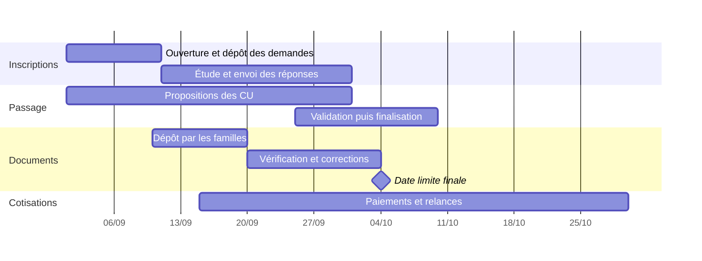

| Moment | Ce que vous faites | Où |
|---|---|---|
| Fin d'année précédente | Préparer la nouvelle année : dates, modèles, liste de rentrée | **Paramètres**, **Rentrée scoute** |
| Changement d'année scoute | Nettoyage de nouvelle année (archives, documents, classes) | **Paramètres → Passage** |
| Septembre | Ouvrir les inscriptions, étudier les demandes, envoyer les réponses | **Demandes** |
| Septembre | Envoyer l'email de rentrée aux chefs | **Unités & maîtrise → Emails aux chefs** |
| Septembre – octobre | Suivre la campagne de documents | **Suivi → Suivi documents** |
| Octobre | Valider et finaliser le passage | **Suivi → Validation passages** |
| Toute l'année | Cotisations, qualité des données, fratries, messages | Menus **Suivi** et **Unités & maîtrise** |

## Se repérer

Votre menu est **en haut de l'écran** : **Rentrée scoute** et **Membres** en accès direct, puis des menus déroulants
par thème. Les pastilles rouges signalent ce qui attend une action (demandes à étudier, modifications à valider).

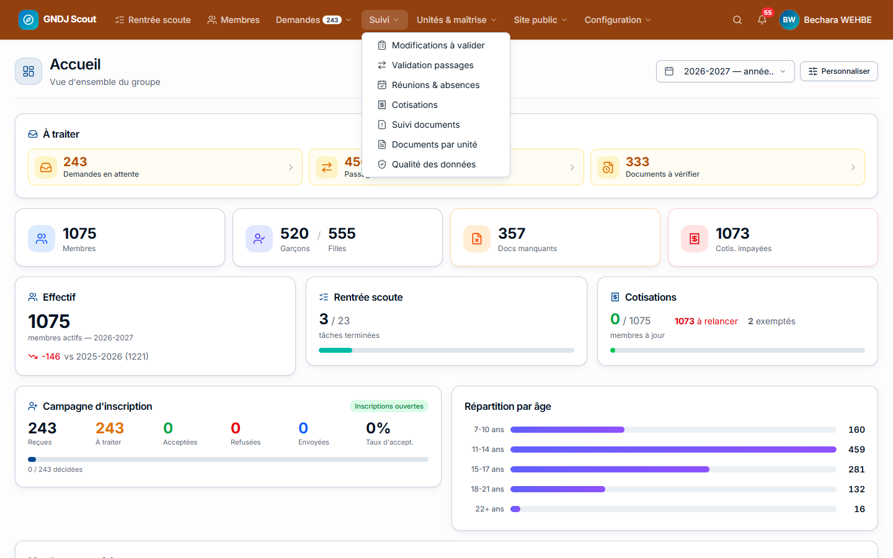

Cliquer sur **GNDJ Scout** (en haut à gauche) ramène à l'**Accueil**.

### L'Accueil

L'Accueil résume le groupe : **À traiter** (ce qui attend une action, chaque carte mène à la bonne page), effectif,
campagne d'inscription, rentrée, cotisations, anniversaires, répartition par unité et par âge.

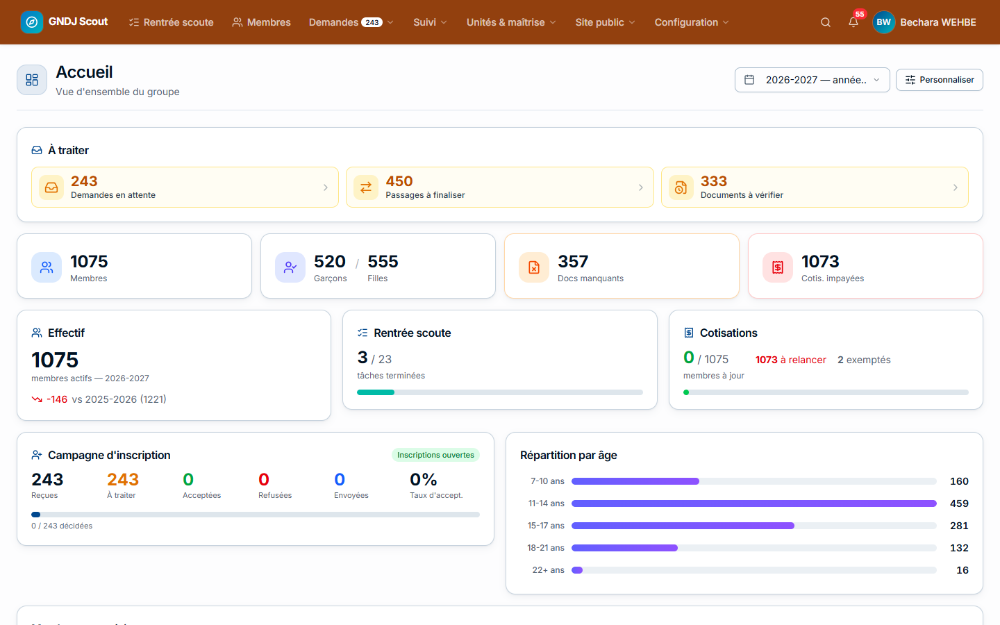

**Personnaliser** permet de choisir les cartes affichées, leur ordre et leur largeur (vos choix vous suivent sur
tous vos appareils). Le sélecteur d'année change les statistiques affichées.

## La liste de rentrée

**Rentrée scoute** est la liste des tâches de démarrage de l'année, pour vous et pour chaque CU. Chaque tâche a un
responsable, une échéance et, souvent, un **suivi automatique** : elle se coche toute seule quand le travail est
fait dans l'application (par exemple « Proposer les passages » avance avec les propositions des CU).

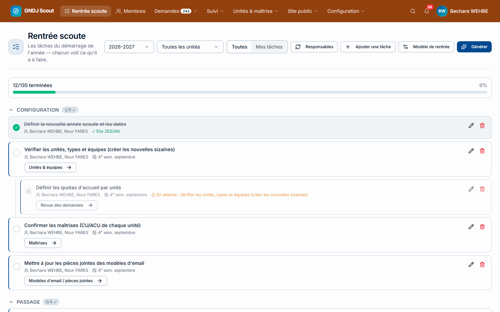

- **Générer la liste** d'une nouvelle année : à partir du **Modèle de rentrée** (bouton en haut de la page).
  **Ajouter les nouvelles tâches** complète une année déjà commencée sans effacer l'avancement.
- Une tâche **par unité** apparaît une fois avec une barre « X/N unités » ; dépliez-la pour voir chaque unité.
- **Date limite pour toutes les unités** fixe la même échéance à toutes les copies d'une tâche.
- Certaines tâches ont un **bouton d'action** (ouvrir les inscriptions, ouvrir le passage…) qui fait le travail et
  coche la tâche.
- Une fois par semaine, chaque responsable reçoit un email avec ses tâches en retard ou proches.

## Les inscriptions (demandes)

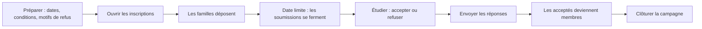

### Préparer

Dans **Paramètres → Inscriptions** :

| Réglage | Rôle |
|---|---|
| **Date d'ouverture** / **Date limite** | Le portail s'ouvre et les soumissions se ferment automatiquement à ces dates |
| **Conditions d'inscription** | Le texte que les familles doivent accepter |
| **Classe exclue** | La classe qui ne peut pas s'inscrire (par défaut 6ème) |
| **Nombre maximum de demandes par compte** | Limite par famille |
| **Motifs de refus** | Les motifs proposés quand vous refusez (avec leur texte envoyé aux familles) |
| **Textes de la page de résultat** | Ce que voit la famille acceptée ou refusée |

### Étudier les demandes

**Demandes** liste toutes les demandes de l'année. Filtrez par statut, âge, genre, classe, école, unité, ville… ;
la recherche porte sur **tous** les champs (enfant, parents, proches).

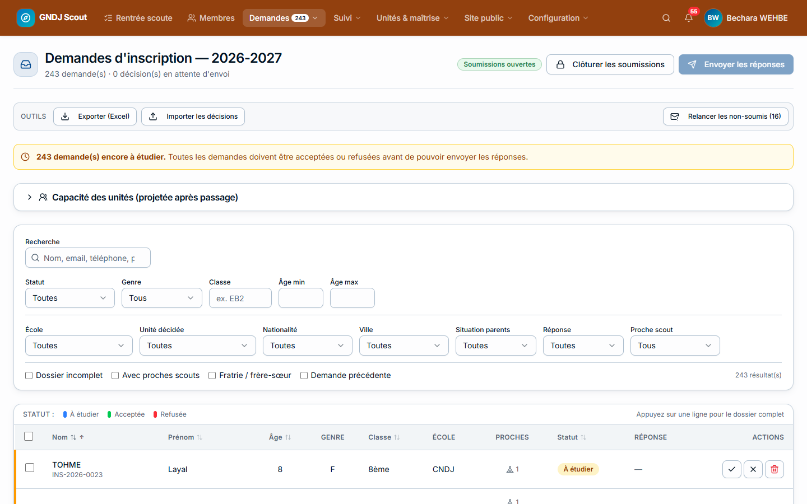

- Cliquez sur une ligne pour ouvrir le **dossier complet** à droite. Clavier : **A** accepter, **R** refuser,
  **←/→** dossier précédent / suivant.
- **Accepter** demande l'**unité** ; la plateforme en suggère une (âge, genre, places restantes). La section
  **Capacité des unités** montre les places prévues après le passage.
- **Refuser** : choisissez un **motif** (son texte est envoyé à la famille).
- **Modifier** (dans le dossier) corrige une demande, même après la date limite (par exemple un parent oublié).
- **Remettre à étudier** annule une décision prise par erreur.
- Les **proches scouts** peuvent être **liés** à un membre existant (bouton **Lier**) : les frères et sœurs
  partageront alors les mêmes parents à l'inscription.

> 💡 **Travailler dans Excel** : **Exporter (Excel)** donne un fichier avec une colonne **Décision** à remplir
> (code de l'unité pour accepter, code de motif pour refuser, `--` = motif par défaut). **Importer les décisions**
> les applique. Rien n'est envoyé aux familles avant **Envoyer les réponses**.

### Envoyer les réponses

**Envoyer les réponses** n'est possible que lorsque **toutes** les demandes soumises ont une décision. Chaque
famille reçoit un email ; pour une demande acceptée, **le membre est créé** (fiche, affectation dans l'unité,
parents, compte de connexion) et la famille reçoit un lien pour définir le mot de passe. Vous pouvez envoyer en
plusieurs fois : seules les nouvelles décisions partent.

### Les autres outils des inscriptions

| Page | À quoi elle sert |
|---|---|
| **Statistiques** | Répartition des demandes (âge, genre, classe, école), taux d'acceptation, places par unité |
| **Comptes d'inscription** | Les comptes des familles : valider un email à la main, réinitialiser un mot de passe, créer une **invitation de dernière minute** (lien qui permet à une famille précise de s'inscrire après la date limite) |
| **Doublons de demandes** | Fusionner deux demandes faites pour le même enfant |
| **Archives** | Les demandes des années précédentes (après clôture), pour vérifier une demande passée |
| **Relancer les non-soumis** | Email aux familles qui ont un brouillon non soumis |

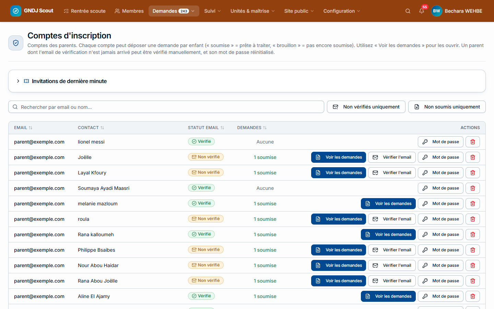

**Clôturer la campagne** (en fin de campagne) archive toutes les demandes (consultables dans **Archives**) puis
**supprime** tous les comptes et données du portail d'inscription. Les membres déjà créés ne sont pas touchés.
Irréversible : à faire quand toutes les réponses sont envoyées.

## Emails aux chefs et aux membres

Tous les membres ont déjà leur compte (les accès ont été envoyés une fois, en 2026, au lancement de la
plateforme). Il n'y a donc **plus d'envoi d'accès en masse** : chacun se connecte avec son identifiant et son mot de
passe, ou utilise **Mot de passe oublié ?** / **Se connecter avec un code**.

| Qui | Ce qui est envoyé | Comment |
|---|---|---|
| **Nouveau membre** (demande acceptée) | Son identifiant + un lien pour choisir son mot de passe | Automatique, avec la réponse à la demande (**Envoyer les réponses**) |
| **Membre accepté sans demande** (cas rare) | Son identifiant + le lien | Créez-le (**Membres → Nouveau membre**), puis sur sa fiche **Actions → Envoyer l'accès** |
| **Nouveau chef** (CU, ACU…) | « Bienvenue dans la maîtrise » : ce qui change et quoi faire | **Automatique**, une seule fois, dès qu'il reçoit sa première fonction de chef |
| **Tous les chefs** | L'email de rentrée (« Rentrée — chefs ») | **Unités & maîtrise → Emails aux chefs** |
| **Les membres** (occasionnel) | « Mise à jour de la fiche et des documents » | **Unités & maîtrise → Groupes** → le groupe voulu → **Envoyer un message** → choisir ce modèle |

> 💡 Les nouveaux CU et ACU sont **déjà membres** : ils gardent leur compte, et la fonction que vous leur donnez
> suffit à faire apparaître leurs menus de chef. Pour ne plus envoyer l'email de bienvenue automatique, désactivez
> le modèle « Bienvenue dans la maîtrise » (Paramètres → Modèles d'email).

**Emails aux chefs** : choisissez un modèle, puis toutes les maîtrises ou une unité ; prévisualisez, ajustez le
texte pour cet envoi si besoin, et envoyez.

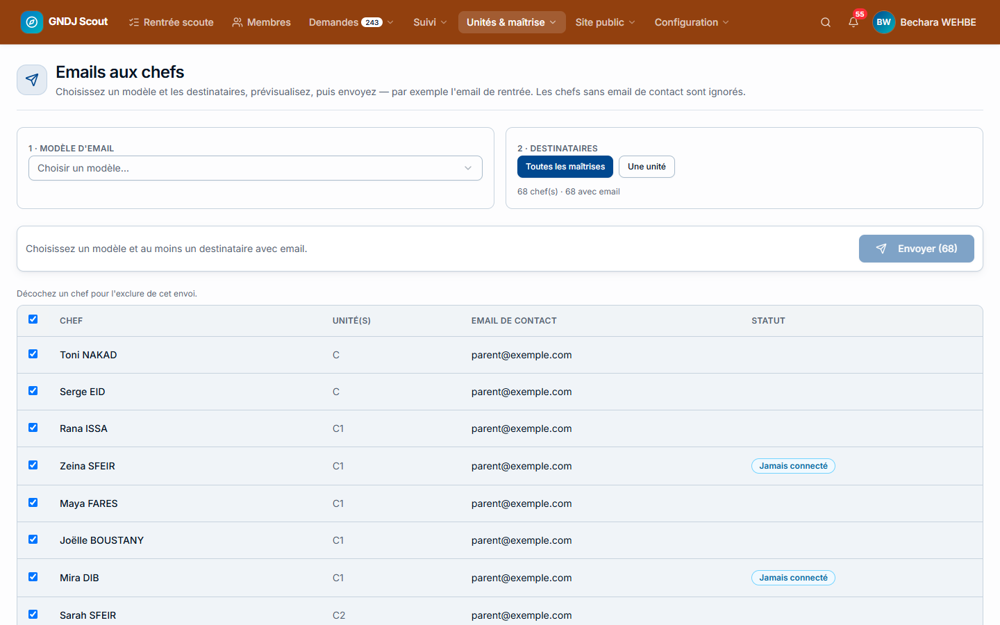

Les modèles d'email sont rangés par catégorie dans **Paramètres → Modèles d'email** ; chaque modèle indique s'il
part **automatiquement** ou par **envoi manuel**, et à quel moment.

> ⚠️ Faites d'abord un envoi test à la maîtrise de groupe. Les envois partent progressivement (limite horaire de
> chaque fournisseur d'email) : un gros envoi peut prendre plusieurs heures. Le suivi est dans **File d'emails**
> (super-administrateur).

## Le passage annuel

**Suivi → Validation passages** regroupe les propositions de toutes les unités.

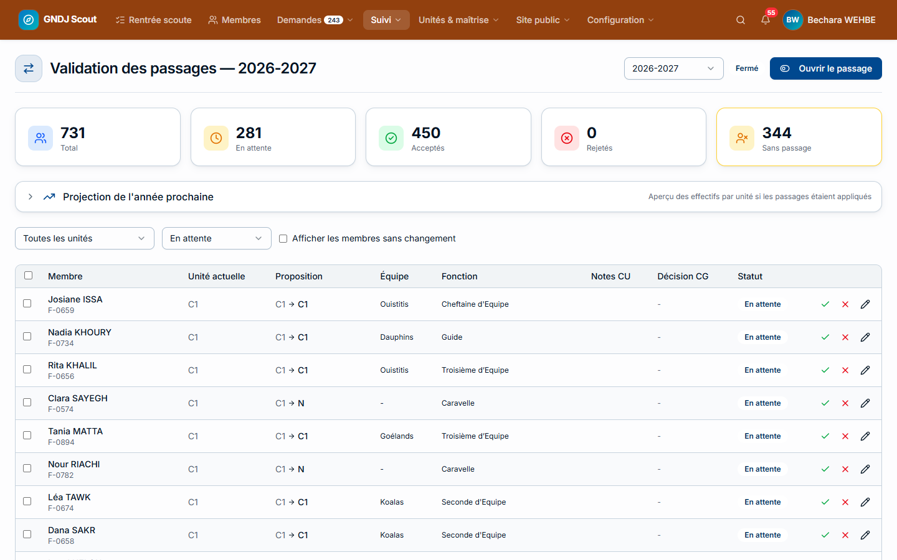

1. **Ouvrir le passage** (ou depuis la liste de rentrée) : les CU peuvent proposer.
2. Suivez l'avancement : la carte **Sans passage** compte les membres sans proposition.
3. Par défaut, seuls les **vrais changements** sont affichés (changement d'unité, d'équipe ou de fonction, départ) :
   **acceptez** ou **refusez**, un par un ou en groupe. **Revue** permet de modifier l'unité, l'équipe ou la
   fonction finales.
4. **Projection de l'année prochaine** : l'effectif de chaque unité après le passage, en simulation (comme si tout
   était accepté) ou en réel.
5. **Finaliser** (le jour du passage, réglable dans **Paramètres → Passage**) : les anciennes affectations se
   ferment, les nouvelles sont créées, l'entrée dans la nouvelle unité est ajoutée à la progression.

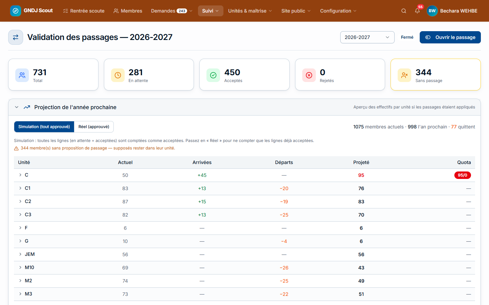

> ⚠️ **Finaliser** n'est possible que lorsque **chaque membre actif** a une ligne de passage. Seules les lignes
> **acceptées** sont appliquées.

## La campagne de documents

La campagne se règle une fois par an avec **5 dates**, sur la page **Suivi → Suivi documents** :

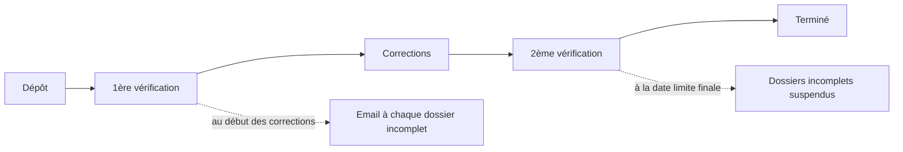

| Phase | Les familles | La maîtrise |
|---|---|---|
| **Dépôt** | Envoient leurs documents | — |
| **1ère vérification** | Ne peuvent plus déposer | Les CU vérifient |
| **Corrections** | Reçoivent la liste de ce qui manque ; renvoient | — |
| **2ème vérification** | Ne peuvent plus déposer | Les CU vérifient |
| **Terminé** | Dossiers incomplets **suspendus** | Vous réactivez au cas par cas |

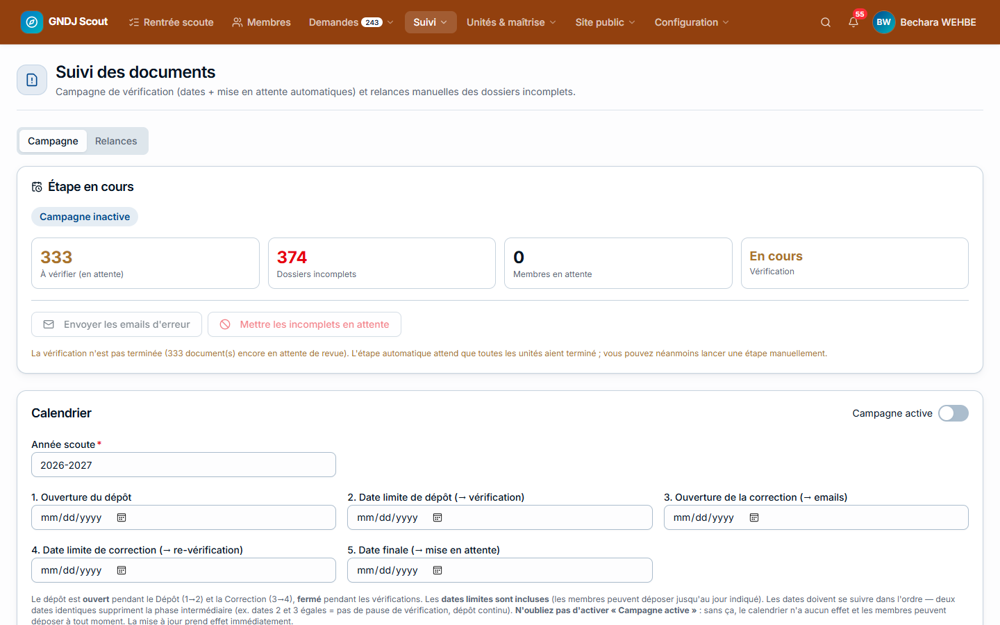

- Les deux étapes automatiques (email des dossiers incomplets, suspension) ne partent que si **plus aucun document
  n'est en attente** ; sinon vous êtes prévenu et vous les lancez à la main quand les CU ont fini.
- L'onglet **Relances** envoie un email aux familles d'une unité avec la liste exacte de leurs documents manquants.
- **Documents par unité** ouvre le tableau de n'importe quelle unité, comme le voit son CU.

**Les types de documents** (Paramètres → Documents) : nom, code, date d'expiration, et un **modèle** que la famille
télécharge **déjà rempli** avec les informations du membre (autorisation des parents, fiche médicale…). Le modèle
se crée dans l'application (texte, champs du membre, lignes à remplir, cases à cocher, en-tête).

## Les cotisations

**Suivi → Cotisations** : payés, partiels, impayés et exemptés, par unité ; la liste des membres à relancer avec
le parent à contacter (email, téléphone), exportable et imprimable.

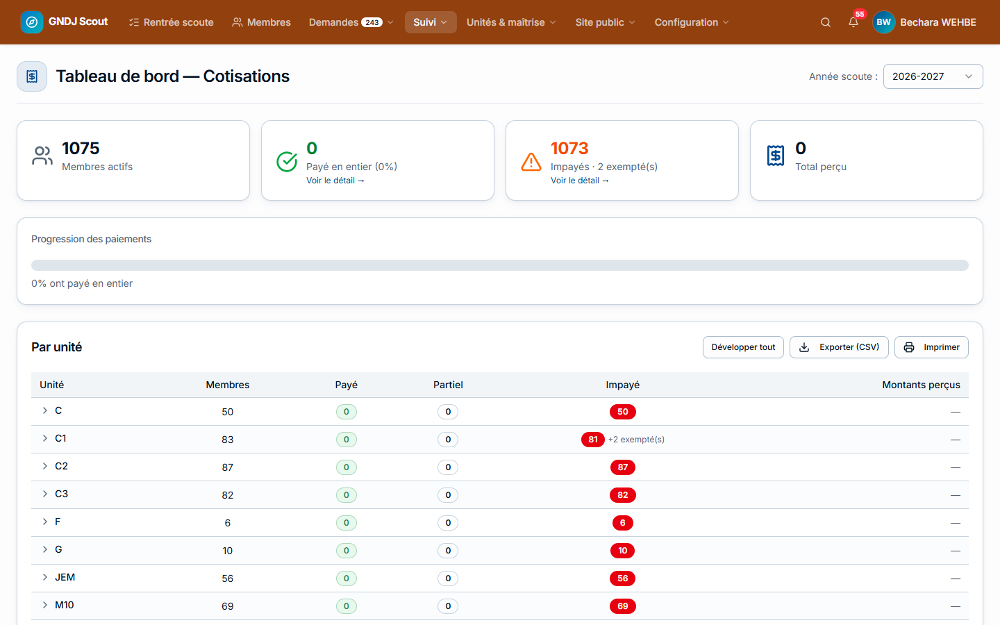

Réglages (**Paramètres → Cotisations**) : les **devises** et leurs taux de change, le **montant de la cotisation**
dans chaque devise (payer ce montant dans une devise = cotisation complète), les montants dus à chaque
**association** et le choix « la maîtrise paie une cotisation ». La carte **Dû aux associations** calcule le montant
à reverser.

## Les membres

**Membres** : tous les membres, avec recherche (sans tenir compte des accents), filtre par unité, par lettre,
« Actifs / Anciens » et « Maîtrises ».

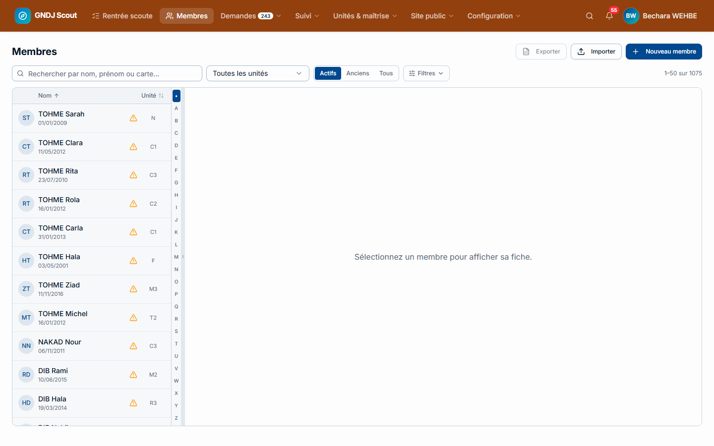

| Besoin | Comment |
|---|---|
| Créer un membre | **Nouveau membre** (parents et unité en option) |
| Importer une liste | **Importer** (modèle Excel fourni, aperçu avant import) |
| Corriger nom, date de naissance, sexe | **Modifier** sur la fiche (réservé au chef de groupe) |
| Membre placé dans la mauvaise unité | Onglet **Unités / Fonctions** → **Corriger l'unité** (sans garder de trace de l'erreur) |
| Changer de branche en gardant l'historique | Le passage |
| Voir l'application comme un membre | **Actions → Voir comme** (lecture seule, dans un nouvel onglet) |
| Supprimer un membre | **Actions → Supprimer** : il va dans la **Corbeille**, restaurable 30 jours |

### Fratries et doublons

**Unités & maîtrise → Fratries** :

- **Suggestions** : des familles probables (même parent, même téléphone ou email de parent…). **Réviser** ouvre la
  famille : choisissez le bon père, la bonne mère et la bonne adresse, puis **Confirmer la fratrie** — les parents
  en double sont fusionnés.
- **Signalements** : les erreurs signalées par les membres sur leurs frères et sœurs ; **Répondre** les prévient.
- **Doublons** : le même membre saisi deux fois ; **Fusionner** en choisissant la bonne valeur de chaque champ.

### Qualité des données

**Suivi → Qualité des données** liste ce qui doit être corrigé chez les membres actifs : emails invalides ou en
échec (le fournisseur n'a pas pu livrer), membres sans aucun email, date de naissance ou genre manquant, doublons.

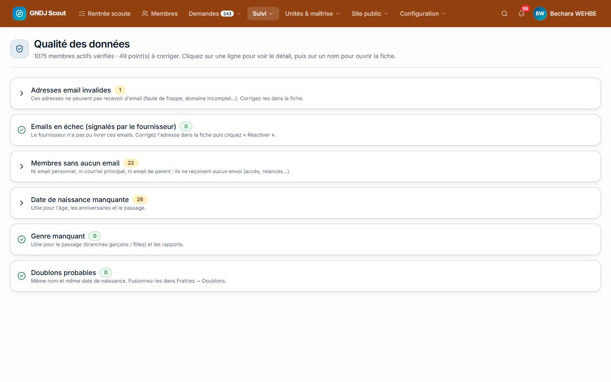

## Maîtrises, groupes et accès

- **Maîtrises** : les chefs de chaque unité, avec **Retirer** (fin de fonction) et **Transférer** (vers une autre
  unité).
- **Groupes** : des listes de membres définies par des règles (toute la maîtrise, les chefs d'unité, les chefs
  d'équipe de toutes les troupes…). Un groupe sert pour les réunions, comme filtre dans « Mon unité », comme liste
  de diffusion (emails, export).

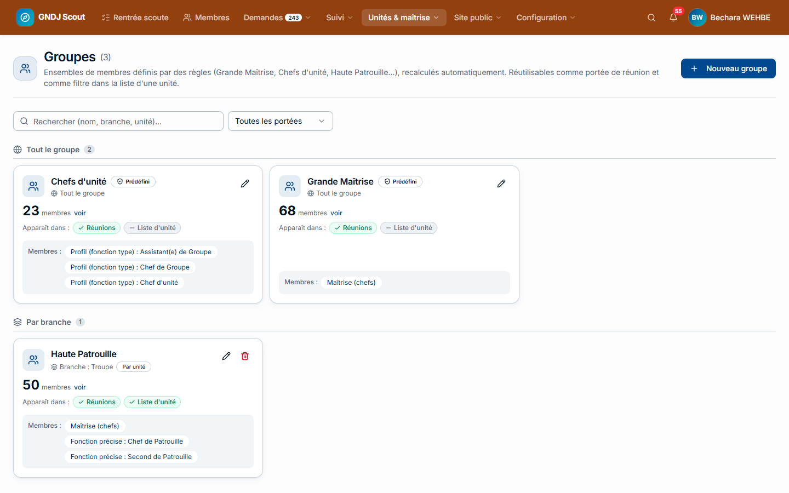

### Accès et délégations

**Configuration → Accès & permissions** :

- **Profils** : ce que chaque fonction permet (membres, documents, cotisations, passage…), par niveau
  (aucun / lecture / complet). Modifier un profil change les droits de toutes les fonctions qui l'utilisent.
- **Délégation** : donner à **une personne précise** des droits en plus, sans changer sa fonction (par exemple un
  assistant chargé des inscriptions ou du Camp BP, ou le futur chef de groupe avant l'annonce).
- **Voir les accès** : ce qu'une personne peut réellement faire, et pourquoi.

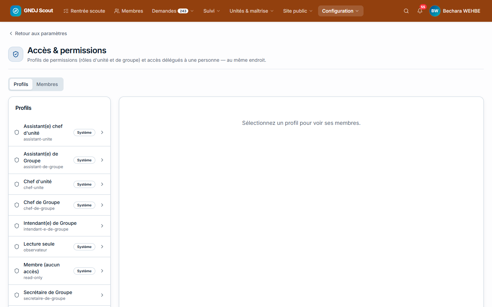

## Notifications et messages

- **Envoyer une notification** : un message dans l'application (et sur le téléphone de ceux qui ont activé les
  notifications) à une unité, un groupe ou des membres choisis.
- **Site public → Messages de contact** : les messages envoyés depuis le formulaire du site ; **Je m'en occupe**
  évite que deux personnes répondent, **Répondre** envoie la réponse par email.

## Les paramètres

**Configuration → Paramètres** : vous voyez les sections que vous pouvez modifier (inscriptions, documents,
cotisations, passage, membres, connexion) ainsi que **Listes** (écoles, classes, villes, professions). Les réglages
techniques (emails, sécurité, maintenance) sont réservés au super-administrateur.

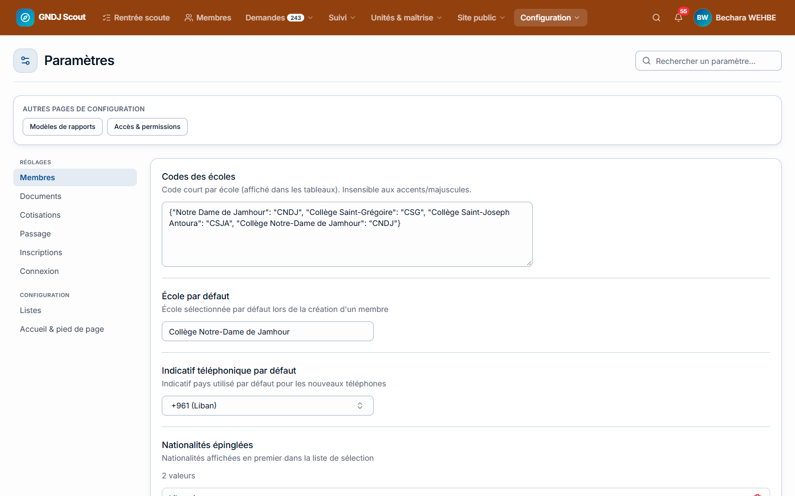

Un encadré en haut de la page signale les **réglages contradictoires** (dates dans le désordre, années scoutes
différentes…) avec un lien pour corriger.

> 💡 Renommer une école ou une ville dans **Listes** la renomme aussi sur toutes les fiches. Supprimer une valeur
> utilisée l'**archive** (elle reste sur les fiches mais disparaît des choix).

## Nouvelle année scoute

Quand vous passez à l'année suivante (**Paramètres → Passage → Année scoute**), la plateforme propose le
**nettoyage de nouvelle année** :

1. une archive de **tous** les documents est créée (zip, conservée hors du site) ;
2. les documents de l'année sont supprimés, sauf les types que vous gardez (par défaut la carte d'identité) ;
3. les sections sont effacées et chaque membre monte d'une **classe**.

Un aperçu montre les chiffres avant de lancer ; l'opération ne se fait qu'une fois par année. Le journal d'audit
de l'année est aussi archivé et envoyé par email à l'administrateur et au chef de groupe.

## Questions fréquentes

| Question | Réponse |
|---|---|
| Je ne peux pas envoyer les réponses | Il reste des demandes soumises sans décision : filtre **Statut → À étudier** |
| Je ne peux pas finaliser le passage | Certains membres n'ont pas de ligne : carte **Sans passage** |
| Une famille dit ne pas avoir reçu l'email | Vérifiez son adresse dans **Comptes d'inscription** (ou le courriel principal sur la fiche) ; l'email peut aussi apparaître dans **Qualité des données** s'il a été refusé par le fournisseur |
| Une famille veut s'inscrire après la date limite | **Comptes d'inscription → Invitations de dernière minute** |
| Un CU ne voit pas un membre | Le membre n'a pas d'affectation active dans son unité |
| Un chef ne reçoit pas les notifications | Il doit les activer dans le menu de son nom (et installer l'application sur iPhone) |
| J'ai supprimé un membre par erreur | **Corbeille** → **Restaurer** (30 jours) |
