Ce guide suit **l'année scoute** : chaque partie correspond à un moment de l'année et renvoie aux pages
concernées. Il complète le [Guide du chef d'unité](guide-chef-unite.md), que tout chef de groupe devrait aussi
connaître (les CU vous poseront des questions sur leurs écrans).

> 💡 Les assistants chefs de groupe (ACG) ont les mêmes outils, sauf ce que le chef de groupe leur a délégué ou
> non (inscriptions, Camp BP…) — voir [Accès et délégations](#acces-et-delegations).

## L'année en un coup d'œil

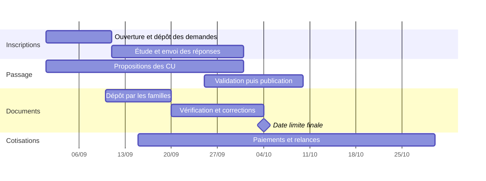
```mermaid
gantt
    dateFormat YYYY-MM-DD
    axisFormat %d/%m
    tickInterval 1week
    todayMarker off
    section Inscriptions
    Ouverture et dépôt des demandes      :a1, 2026-09-01, 10d
    Étude et envoi des réponses          :a2, after a1, 20d
    section Passage
    Propositions des CU                  :b1, 2026-09-01, 30d
    Validation puis publication          :b2, 2026-09-25, 15d
    section Documents
    Dépôt par les familles               :c1, 2026-09-10, 10d
    Vérification et corrections          :c2, after c1, 14d
    Date limite finale                   :milestone, 2026-10-04, 0d
    section Cotisations
    Paiements et relances                :d1, 2026-09-15, 45d
```

| Moment | Ce que vous faites | Où |
|---|---|---|
| Fin d'année précédente | Préparer la nouvelle année : dates, modèles, liste de rentrée | **Paramètres**, **Rentrée scoute** |
| Changement d'année scoute | Nettoyage de nouvelle année (archives, documents, classes) | **Paramètres → Passage** |
| Septembre | Ouvrir les inscriptions, étudier les demandes, envoyer les réponses | **Demandes** |
| Septembre | Envoyer l'email de rentrée aux chefs | **Unités & maîtrise → Emails aux chefs** |
| Septembre – octobre | Suivre la campagne de documents | **Suivi → Suivi documents** |
| Octobre | Valider et publier le passage | **Suivi → Validation passages** |
| Toute l'année | Cotisations, qualité des données, fratries, messages | Menus **Suivi** et **Unités & maîtrise** |

## Se repérer

Votre menu est **en haut de l'écran** : **Rentrée scoute** et **Membres** en accès direct, puis des menus déroulants
par thème. Les pastilles rouges signalent ce qui attend une action (demandes à étudier, modifications à valider).

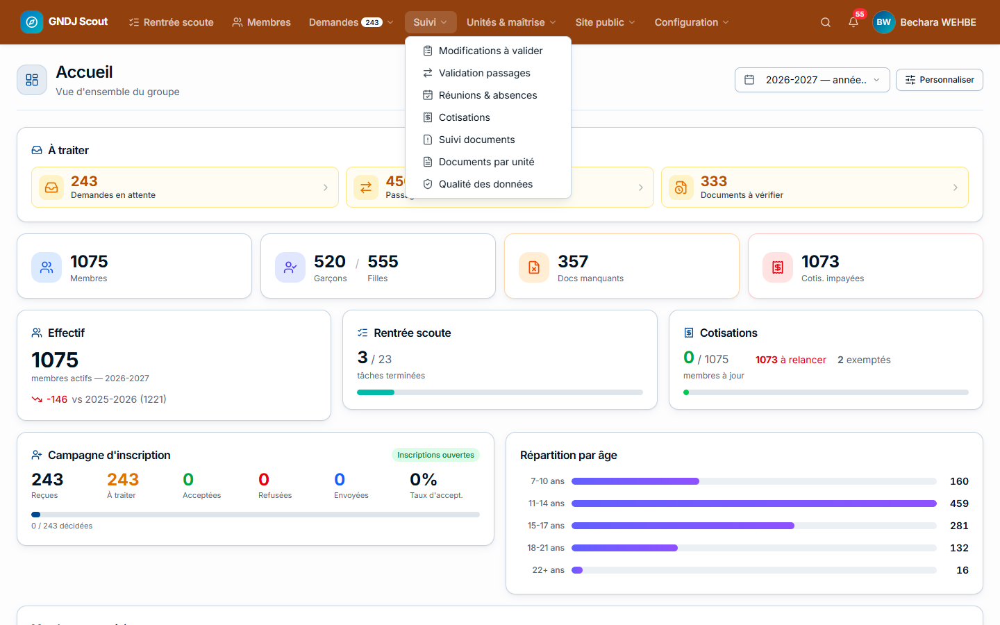

Cliquer sur **GNDJ Scout** (en haut à gauche) ramène à l'**Accueil**.

### L'Accueil

L'Accueil résume le groupe : **À traiter** (ce qui attend une action, chaque carte mène à la bonne page), effectif,
campagne d'inscription, rentrée, cotisations, anniversaires, répartition par unité et par âge.

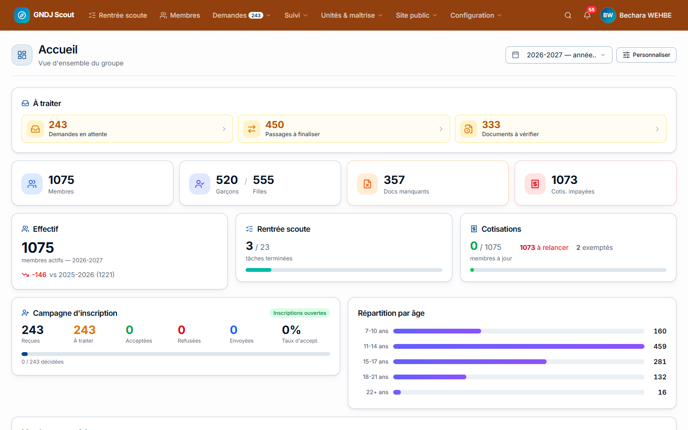

**Personnaliser** permet de choisir les cartes affichées, leur ordre et leur largeur (vos choix vous suivent sur
tous vos appareils). Le sélecteur d'année change les statistiques affichées.

## La liste de rentrée

**Rentrée scoute** est la liste des tâches de démarrage de l'année, pour vous et pour chaque CU. Chaque tâche a un
responsable, une échéance et, souvent, un **suivi automatique** : elle se coche toute seule quand le travail est
fait dans l'application (par exemple « Proposer les passages » avance avec les propositions des CU).

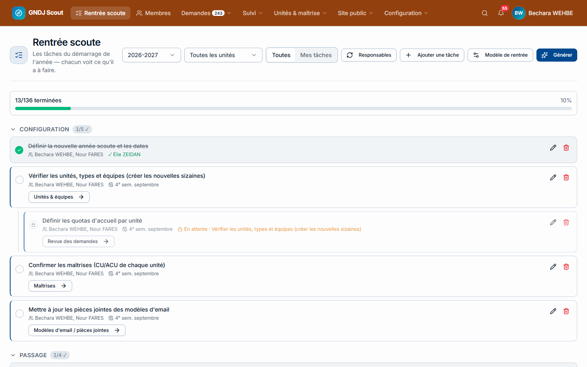

- **Générer la liste** d'une nouvelle année : à partir du **Modèle de rentrée** (bouton en haut de la page).
  **Ajouter les nouvelles tâches** complète une année déjà commencée sans effacer l'avancement.
- Une tâche **par unité** apparaît une fois avec une barre « X/N unités » ; dépliez-la pour voir chaque unité.
- **Date limite pour toutes les unités** fixe la même échéance à toutes les copies d'une tâche.
- Certaines tâches ont un **bouton d'action** (ouvrir les inscriptions, ouvrir le passage…) qui fait le travail et
  coche la tâche.
- Une fois par semaine, chaque responsable reçoit un email avec ses tâches en retard ou proches.

## Les inscriptions (demandes)

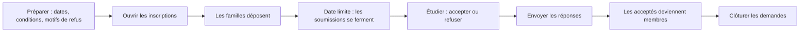
```mermaid
flowchart LR
    A[Préparer : dates, conditions, motifs de refus] --> B[Ouvrir les inscriptions]
    B --> C[Les familles déposent]
    C --> D[Date limite : les soumissions se ferment]
    D --> E[Étudier : accepter ou refuser]
    E --> F[Envoyer les réponses]
    F --> G[Les acceptés deviennent membres]
    G --> H[Clôturer les demandes]
```

### Préparer

Dans **Paramètres → Inscriptions** :

| Réglage | Rôle |
|---|---|
| **Date d'ouverture** / **Date limite** | Le portail s'ouvre et les soumissions se ferment automatiquement à ces dates |
| **Conditions d'inscription** | Le texte que les familles doivent accepter |
| **Classe exclue** | La classe qui ne peut pas s'inscrire (par défaut 6ème) |
| **Nombre maximum de demandes par compte** | Limite par famille |
| **Motifs de refus** | Les motifs proposés quand vous refusez (avec leur texte envoyé aux familles) |
| **Date de la réponse aux familles** | Quand les familles auront la réponse (texte libre, par ex. « la deuxième semaine d'octobre ») : affiché dans la fenêtre « Demande reçue » juste après la soumission |
| **Textes de la page de résultat** | Ce que voit la famille acceptée ou refusée |

### Étudier les demandes

**Demandes** liste toutes les demandes de l'année. Filtrez par statut, âge, genre, classe, école, unité, ville… ;
la recherche porte sur **tous** les champs (enfant, parents, proches).

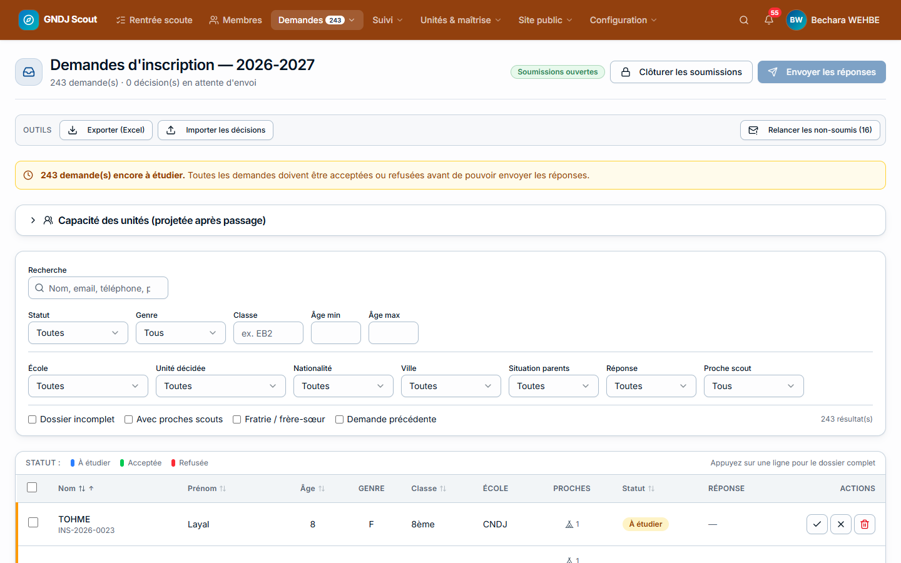

- Cliquez sur une ligne pour ouvrir le **dossier complet** à droite. Clavier : **A** accepter, **R** refuser,
  **←/→** dossier précédent / suivant.
- **Accepter** demande l'**unité** ; la plateforme en suggère une (âge, genre, places restantes). La section
  **Capacité des unités** montre les places prévues après le passage.
- **Refuser** : choisissez un **motif** (son texte est envoyé à la famille).
- **Modifier** (dans le dossier) corrige une demande, même après la date limite (par exemple un parent oublié).
- **Remettre à étudier** annule une décision prise par erreur.
- Pendant la période d'inscription, **Ma fiche** propose **Inscrire un frère ou une sœur** (la demande s'ouvre avec
  les parents, l'adresse et la fratrie déjà remplis). Paramètres → Inscriptions choisit qui le voit : jeunes membres
  uniquement (par défaut), tous les membres (chefs compris) ou personne.
- Les **proches scouts** peuvent être **liés** à un membre existant (bouton **Lier**) : les frères et sœurs
  partageront alors les mêmes parents à l'inscription.

> 💡 **Encadré « À vérifier »** en haut de la page : il compte ce qu'il reste à regarder avant l'envoi — les
> **Déjà membre ?** sans réponse, les frères et sœurs **à lier**, et les **décisions à vérifier** (ci-dessous). Le
> bouton **Afficher** de chaque ligne ne montre que ces demandes (filtres **Déjà membre ? (à vérifier)**,
> **Frère / sœur à lier**, **Décisions à vérifier**).

> ⚠️ **Décisions à vérifier** : la page signale (encadré « À vérifier », badges rouges sur les lignes, encadré
> dans le dossier) trois cas à revoir. **Réponses différentes** : une même famille a un enfant accepté et un autre
> refusé (les enfants d'une famille devraient tous être acceptés ou tous refusés). **Refus · fratrie membre** : une
> demande refusée alors qu'un frère ou une sœur est déjà membre du groupe. **Refus · déjà demandé** : une demande
> refusée alors que la famille indique une demande une année précédente (vérifiez dans les **Archives des
> demandes**). Le bouton **Afficher** de l'encadré (ou le filtre **Décisions à vérifier**) ne montre que ces demandes. Ce sont des avertissements : l'envoi reste
> possible, et ils sont rappelés dans **Ce qui va se passer**.

> 💡 **Travailler dans Excel** : **Exporter (Excel)** donne un fichier avec une colonne **Décision** à remplir
> (code de l'unité pour accepter, code de motif pour refuser, `--` = motif par défaut). **Importer les décisions**
> les applique. Rien n'est envoyé aux familles avant **Envoyer les réponses**.

### Envoyer les réponses

**Envoyer les réponses** n'est possible que lorsque **toutes** les demandes soumises ont une décision. Chaque
famille reçoit un email par enfant, **à l'adresse qui a ouvert le compte d'inscription** ; pour une demande
acceptée, **le membre est créé** (fiche, affectation dans l'unité, parents, compte de connexion) et l'email contient
l'identifiant et un lien pour définir le mot de passe. Si le parent est déjà connu du groupe, la fiche existante du
parent est reprise : les informations de la demande l'emportent (nom, profession) et le nouveau téléphone ou email y
est ajouté. Les enfants acceptés d'une même famille sont reliés
comme frères et sœurs. Chaque chef d'unité reçoit un email avec la liste Excel de ses nouveaux membres. Vous pouvez
envoyer en plusieurs fois : seules les nouvelles décisions partent.

> 💡 Avant de confirmer, la fenêtre affiche **Ce qui va se passer** : le nombre de membres créés (par unité), de refus,
> d'emails aux familles et de chefs d'unité prévenus, et ce qui manque encore (demandes sans décision, famille sans
> email, unité sans chef d'unité). Le bouton **Envoyer** reste grisé tant que quelque chose bloque. Un avertissement
> liste aussi les « Déjà membre ? » auxquels vous n'avez pas encore répondu (voir ci-dessous).

### « Déjà membre ? »

Quand l'enfant d'une demande ressemble à un membre déjà dans le groupe (un ancien qui revient, un enfant réinscrit
par erreur…), la demande porte le badge orange **Déjà membre ?** dans la liste, et la notification de la nouvelle
demande le signale. L'application compare la date de naissance, le nom et le prénom (accents, tirets et ordre
nom/prénom ignorés) et les téléphones / emails des parents.

Ouvrez la demande : l'encadré montre la fiche existante (matricule, dernière unité, identifiant). Répondez une fois :

- **Oui, même personne** : à l'envoi des réponses, **la fiche existante est reprise** au lieu d'en créer une
  nouvelle. Les informations de la demande l'emportent, l'enfant garde son matricule, son historique et son
  identifiant, et l'email d'acceptation donne cet identifiant. Le badge devient vert **Fiche existante**.
- **Non, personne différente** : une nouvelle fiche est créée comme d'habitude, et ce membre n'est plus proposé.

Si les réponses sont **déjà parties** (une deuxième fiche existe), **Même personne — fusionner** fusionne tout de
suite la nouvelle fiche dans l'ancienne (même règle : la demande l'emporte, l'identifiant de l'ancienne fiche est
gardé) puis envoie à la famille l'email d'accès avec cet identifiant. Plus besoin de passer par Fratries → Doublons.

> 💡 Filtres → **Déjà membre ? (à vérifier)** n'affiche que les demandes en attente de votre réponse. Une réponse
> donnée par erreur s'annule (**Annuler**) tant que rien n'a été fusionné.

> 💡 **Programmer l'envoi** : choisissez une date et une heure (heure du Liban) ; les réponses partent toutes seules
> à ce moment-là, et vous êtes prévenu(e) du résultat dans les notifications. S'il reste des demandes non décidées,
> rien ne part et la notification explique pourquoi.

### Les autres outils des inscriptions

| Page | À quoi elle sert |
|---|---|
| **Statistiques** | Répartition des demandes (âge, genre, classe, école), taux d'acceptation, places par unité |
| **Comptes d'inscription** | Les comptes des familles : valider un email à la main, réinitialiser un mot de passe, créer une **invitation de dernière minute** (lien qui permet à une famille précise de s'inscrire après la date limite) |
| **Doublons de demandes** | Fusionner deux demandes faites pour le même enfant |
| **Archives** | Les demandes des années précédentes (après clôture), pour vérifier une demande passée |
| **Relancer les non-soumis** | Email aux familles qui ont un brouillon non soumis |

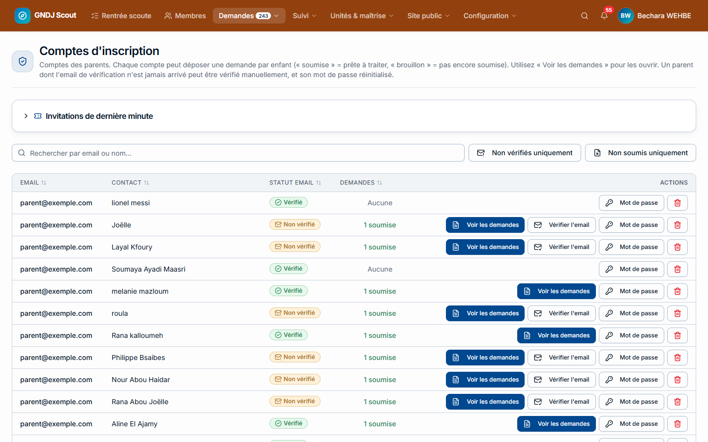

**Clôturer les demandes** (en fin de période) archive toutes les demandes puis **supprime** tous les comptes
et données du portail d'inscription. Les membres déjà créés ne sont pas touchés. Irréversible : à faire quand
toutes les réponses sont envoyées.

Une fois les demandes clôturées, le menu **Demandes** disparaît (ses pages seraient vides). Les anciennes
demandes restent consultables dans **Configuration → Archives des demandes**. Le menu revient dès que les
inscriptions sont rouvertes (**Paramètres → Inscriptions**).

## Emails aux chefs et aux membres

Tous les membres ont déjà leur compte (les accès ont été envoyés une fois, en 2026, au lancement de la
plateforme). Il n'y a donc **plus d'envoi d'accès en masse** : chacun se connecte avec son identifiant et son mot de
passe, ou utilise **Mot de passe oublié ?** / **Se connecter avec un code**.

| Qui | Ce qui est envoyé | Comment |
|---|---|---|
| **Nouveau membre** (demande acceptée) | Son identifiant + un lien pour choisir son mot de passe | Automatique, avec la réponse à la demande (**Envoyer les réponses**) |
| **Chef d'unité** de chaque unité qui reçoit des nouveaux membres | La liste des nouveaux membres de son unité (fichier Excel : nom, date de naissance, classe, école, matricule, noms des parents, frère / sœur dans la même unité) | Automatique, avec **Envoyer les réponses** |
| **Membre accepté sans demande** (cas rare) | Son identifiant + le lien | Créez-le (**Membres → Nouveau membre**), puis sur sa fiche **Actions → Envoyer l'accès** |
| **Nouveau chef** (CU, ACU…) | « Bienvenue dans la maîtrise » : ce qui change et quoi faire | **Automatique**, une seule fois, dès qu'il reçoit sa première fonction de chef |
| **Tous les chefs** | L'email de rentrée (« Rentrée — chefs ») | **Unités & maîtrise → Emails aux chefs** |
| **Les membres** (occasionnel) | « Mise à jour de la fiche et des documents » | **Unités & maîtrise → Groupes** → le groupe voulu → **Envoyer un message** → choisir ce modèle |

> 💡 Les nouveaux CU et ACU sont **déjà membres** : ils gardent leur compte, et la fonction que vous leur donnez
> suffit à faire apparaître leurs menus de chef. Pour ne plus envoyer l'email de bienvenue automatique, désactivez
> le modèle « Bienvenue dans la maîtrise » (Paramètres → Modèles d'email).

**Emails aux chefs** : choisissez un modèle, puis toutes les maîtrises ou une unité ; prévisualisez, ajustez le
texte pour cet envoi si besoin, et envoyez.

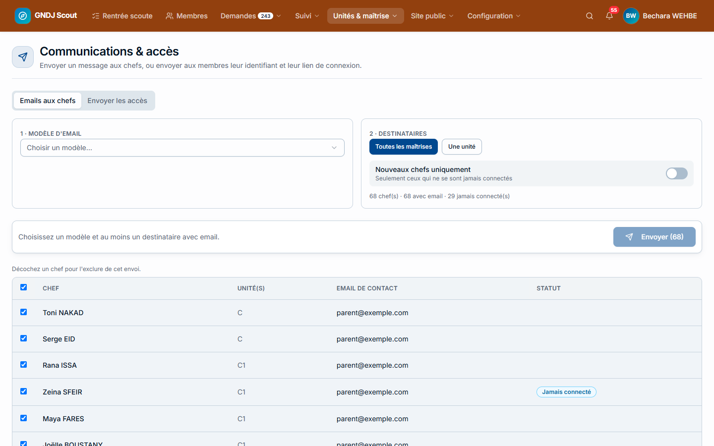

Les modèles d'email sont rangés par catégorie dans **Paramètres → Modèles d'email** ; chaque modèle indique s'il
part **automatiquement** ou par **envoi manuel**, et à quel moment.

> ⚠️ Faites d'abord un envoi test à la maîtrise de groupe. Les envois partent progressivement (limite horaire de
> chaque fournisseur d'email) : un gros envoi peut prendre plusieurs heures. Le suivi est dans **File d'emails**
> (super-administrateur).

## Le passage annuel

**Suivi → Validation passages** regroupe les propositions de toutes les unités.

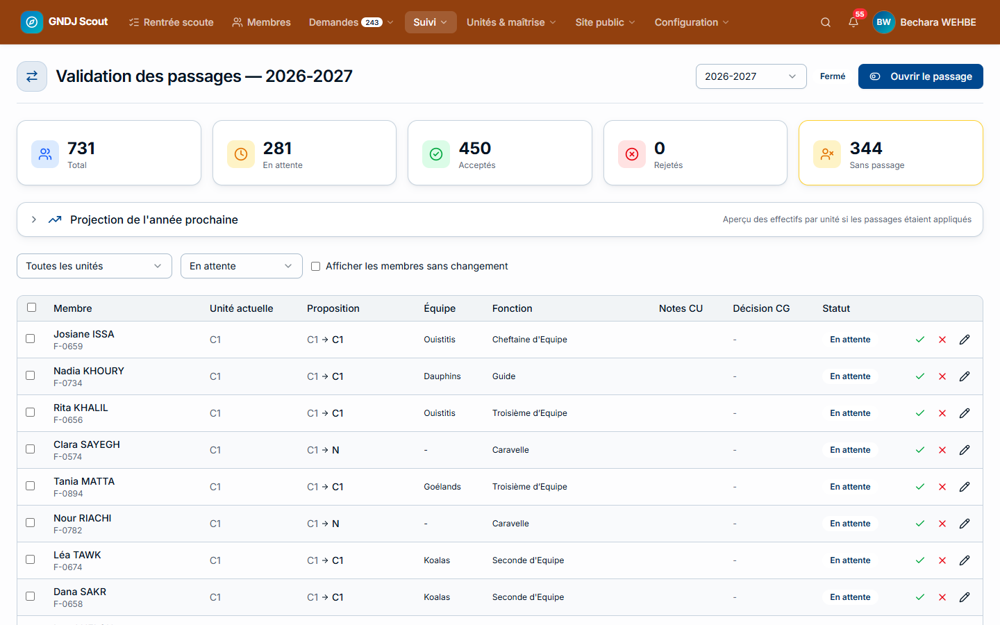

1. **Ouvrir le passage** (ou depuis la liste de rentrée) : les CU peuvent proposer.
2. Les lignes qui restent dans la même unité (pas de changement, autre équipe, autre fonction) et les départs sont
   **acceptés automatiquement**. Seuls les passages vers **une autre unité** attendent votre décision.
3. Pour chaque ligne en attente : **accepter** (un par un ou en groupe), ou **Changer** : choisissez une autre
   unité, équipe ou fonction (ou « Quitte le groupe ») et, si vous voulez, une **raison**. Il n'y a pas de refus :
   ne pas être d'accord, c'est choisir autre chose. Le CU voit votre décision et votre raison, reçoit une
   notification, et ne peut plus modifier cette ligne. Pour donner **la même décision à plusieurs membres**, cochez-les
   puis **Changer la sélection** : une seule notification par unité liste les membres concernés.
4. Accepter ne change encore rien pour les membres : vous pouvez commencer avant que toutes les unités aient fini.
5. **En haut de la page, les 3 étapes** disent où vous en êtes : ① les chefs d'unité proposent (unités terminées,
   membres sans proposition), ② vous validez les changements (combien restent **à valider**), ③ publier (prêt ou
   ce qui bloque encore).
6. **Le tableau des unités** répond, pour chaque unité, à trois questions :
   - **Chef d'unité** : *Pas commencé*, *En cours · N sans proposition*, *Tout proposé, pas terminé* (il reste à
     cliquer **Terminer le passage de l'unité**) ou *Terminé* (verrouillé pour lui). Vous pouvez la **rouvrir** (🔓)
     ou la terminer à sa place (🏁). **Relancer les unités non terminées** envoie une notification et un email aux
     chefs ; ce rappel part aussi **automatiquement 7 jours et 2 jours avant la date du passage**.
   - **À valider (CG)** : le nombre de changements qui attendent votre décision (✓ = rien).
   - **Cette année → l'an prochain** : l'effectif actuel, l'effectif prévu, les arrivées (+) et départs (−), et
     **Arrivent de** (par ex. « M2 7 · M3 6 »). **Prévu** compte toutes les propositions, **Validé seulement** les
     changements déjà validés. Cliquez sur une unité pour voir qui reste, qui arrive (et d'où) et qui part (et vers
     où), puis **Voir les lignes de passage** pour agir sur ses membres.
7. **Publier le passage** (le jour du passage, réglable dans **Paramètres → Passage**), pour tout le groupe en une
   fois : les lignes encore en attente sont acceptées automatiquement, les anciennes affectations se ferment, les
   nouvelles sont créées, l'entrée dans la nouvelle unité est ajoutée à la progression. Chaque CU qui reçoit des
   membres d'une autre unité reçoit leur liste par email (Excel).
8. Après la publication, téléchargez la liste des **nouveaux membres par unité** en Word, **un document par
   association** (« Passe à la … : » puis un nom par ligne).

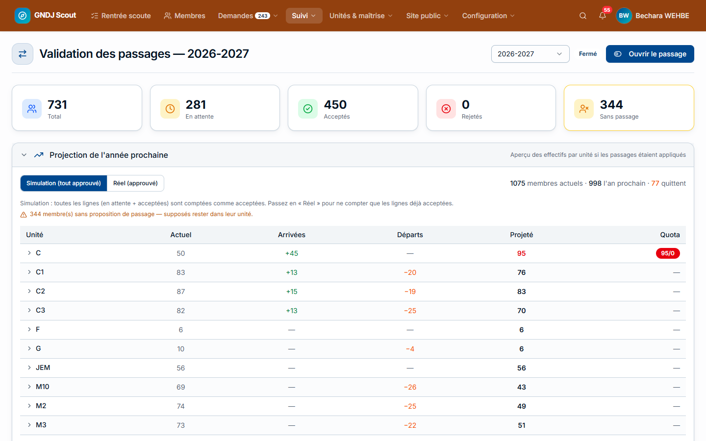

> ⚠️ **Publier** n'est possible que lorsque **chaque membre actif** a une ligne de passage et que **toutes les
> unités** ont terminé leur passage.

> 💡 En cliquant **Publier le passage**, la fenêtre affiche **Ce qui va se passer** : lignes publiées (dont celles
> encore en attente), membres qui changent d'unité (par unité d'arrivée), qui restent, qui quittent le groupe,
> changements de maîtrise prévus et chefs d'unité prévenus. Ce qui bloque encore y est listé et le bouton reste grisé.

> 💡 **Programmer la publication** : sous l'étape « Publier le passage », choisissez une date et une heure (heure du
> Liban) ; le passage est publié tout seul à ce moment-là, exactement comme avec le bouton, et vous êtes prévenu(e) du
> résultat dans les notifications. S'il manque encore une ligne ou qu'une unité n'a pas terminé, rien n'est publié
> et la notification explique pourquoi.

## La campagne de documents

La campagne se règle une fois par an avec **5 dates**, sur la page **Suivi → Suivi documents** :

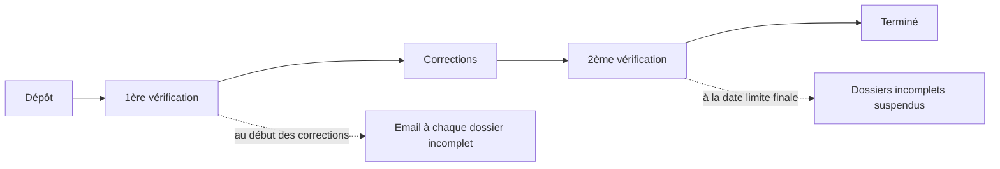
```mermaid
flowchart LR
    A[Dépôt] --> B[1ère vérification]
    B --> C[Corrections]
    C --> D[2ème vérification]
    D --> E[Terminé]
    B -.->|au début des corrections| F[Email à chaque dossier incomplet]
    D -.->|à la date limite finale| G[Dossiers incomplets suspendus]
```

| Phase | Les familles | La maîtrise |
|---|---|---|
| **Dépôt** | Envoient leurs documents | — |
| **1ère vérification** | Ne peuvent plus déposer | Les CU vérifient |
| **Corrections** | Reçoivent la liste de ce qui manque ; renvoient | — |
| **2ème vérification** | Ne peuvent plus déposer | Les CU vérifient |
| **Terminé** | Dossiers incomplets **suspendus** | Vous réactivez au cas par cas |

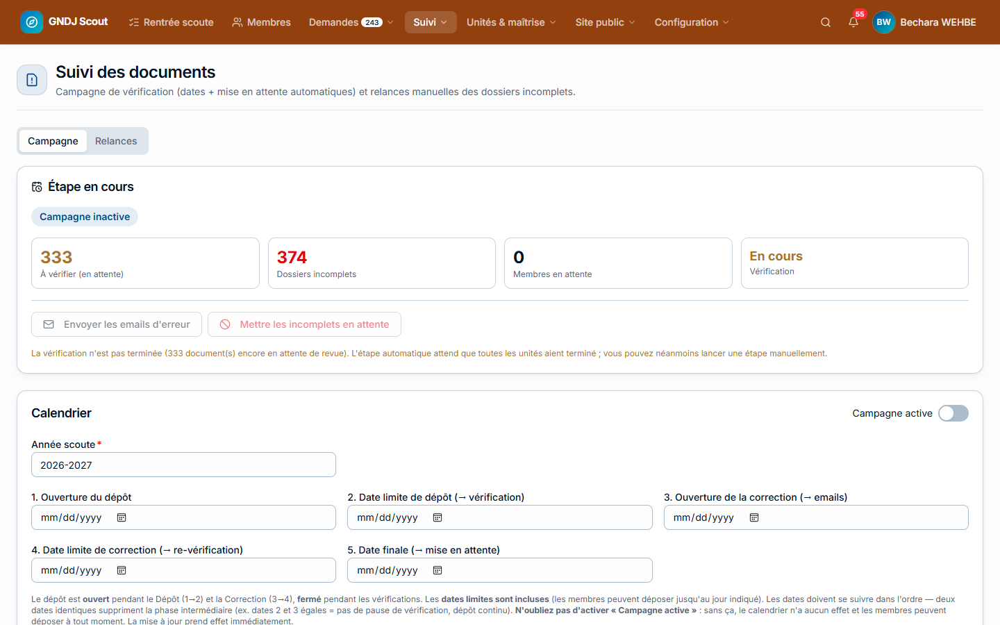

- Les deux étapes automatiques (email des dossiers incomplets, suspension) ne partent que si **plus aucun document
  n'est en attente** ; sinon vous êtes prévenu et vous les lancez à la main quand les CU ont fini.
- L'onglet **Relances** envoie un email aux familles d'une unité avec la liste exacte de leurs documents manquants.
- **Documents par unité** ouvre le tableau de n'importe quelle unité, comme le voit son CU.

**Les types de documents** (Paramètres → Documents) : nom, code, date d'expiration, et un **modèle** que la famille
télécharge **déjà rempli** avec les informations du membre (autorisation des parents, fiche médicale…). Le modèle
se crée dans l'application (texte, champs du membre, lignes à remplir, cases à cocher, en-tête).

Avec un modèle créé dans l'application, cochez **Remplissable en ligne (avec signature)** : la famille remplit
alors les lignes, cadres et cases sur son téléphone et **signe avec le doigt**. Le PDF signé est enregistré comme
le document du membre et arrive « à vérifier » chez le chef d'unité ; il compte pour le dossier comme un document
envoyé. Si le modèle contient une ligne « Signature : … », la signature s'y place ; sinon elle est ajoutée à la
fin. Le nom du signataire, la date, l'appareil et une empreinte du PDF sont gardés dans le journal d'audit.

Dans l'éditeur du modèle, **cliquez sur une ligne ou un cadre à remplir** : une barre apparaît sous les outils.
- **Date (calendrier)** (lignes) : la famille choisit la date dans un calendrier sur son téléphone, et le PDF
  l'écrit en JJ/MM/AAAA. Le menu « Insérer un champ » propose aussi **Date à remplir (calendrier)**.
- **Enregistrer dans la fiche** : **Allergies**, **Remarques médicales** ou **Groupe sanguin** (une liste des
  8 groupes, déjà remplie avec celui de la fiche). Quand la famille signe en ligne, ses
  réponses sont aussi écrites dans l'onglet **Médical** du membre (une ligne par réponse, « Libellé : réponse »).
  Une partie laissée vide ne touche pas ce qui est déjà sur la fiche. Les lignes liées apparaissent teintées dans
  l'éditeur. La fiche médicale est déjà réglée ainsi (groupe sanguin, vaccins en dates, allergies, antécédents,
  médecin…) ; cochez « Remplissable en ligne » pour l'ouvrir aux familles.
- **D'une année à l'autre** : le formulaire s'ouvre déjà rempli avec les réponses données la dernière fois (et le
  dernier signataire) ; la famille vérifie, corrige si besoin et signe. La date de signature est celle du jour.

Pour un document remplissable en ligne, **Remplir et signer en ligne** est le bouton principal ; le modèle papier
reste disponible par le petit lien « ou télécharger pour remplir sur papier ».

Décochez l'option pour revenir au seul téléchargement : la famille peut toujours imprimer, remplir à la main et
envoyer une photo.

## Les cotisations

**Suivi → Cotisations** : payés, partiels, impayés et exemptés, par unité ; la liste des membres à relancer avec
le parent à contacter (email, téléphone), exportable et imprimable.

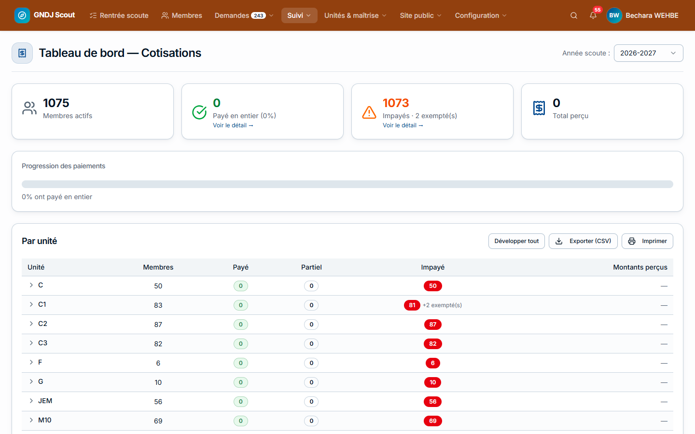

Réglages (**Paramètres → Cotisations**) : les **devises** et leurs taux de change, le **montant de la cotisation**
dans chaque devise (payer ce montant dans une devise = cotisation complète), les montants dus à chaque
**association** et le choix « la maîtrise paie une cotisation ». La carte **Dû aux associations** calcule le montant
à reverser.

## Les membres

**Membres** : tous les membres, avec recherche (sans tenir compte des accents), filtre par unité, par lettre,
« Actifs / Anciens » et « Maîtrises ».

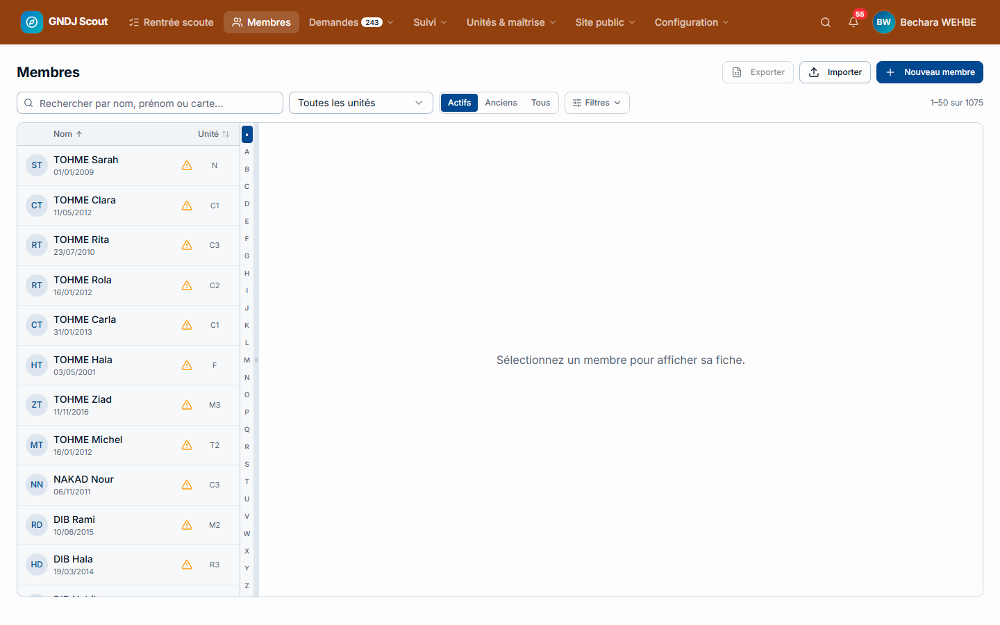

| Besoin | Comment |
|---|---|
| Créer un membre | **Nouveau membre** (parents et unité en option) |
| Importer une liste | **Importer** (modèle Excel fourni, aperçu avant import) |
| Corriger nom, date de naissance, sexe | **Modifier** sur la fiche (réservé au chef de groupe) |
| Membre placé dans la mauvaise unité | Onglet **Unités / Fonctions** → **Corriger l'unité** (sans garder de trace de l'erreur) |
| Changer de branche en gardant l'historique | Le passage |
| Voir l'application comme un membre | **Actions → Voir comme** (lecture seule, dans un nouvel onglet) |
| Supprimer un membre | **Actions → Supprimer** : il va dans la **Corbeille**, restaurable 30 jours |

### Fratries et doublons

**Unités & maîtrise → Fratries** :

- **Suggestions** : des familles probables (même parent, même téléphone ou email de parent…). **Réviser** ouvre la
  famille : choisissez le bon père, la bonne mère et la bonne adresse, puis **Confirmer la fratrie** — les parents
  en double sont fusionnés.
- **Signalements** : les erreurs signalées par les membres sur leurs frères et sœurs ; **Répondre** les prévient.
- **Doublons** : le même membre saisi deux fois ; **Fusionner** en choisissant la bonne valeur de chaque champ. Pour
  un ancien membre revenu par une demande (fiche marquée « Inscription »), la fenêtre propose de garder l'**ancienne**
  fiche (historique, matricule et identifiant déjà connus de la famille) avec les informations de la **demande**,
  qui l'emportent. Après la fusion, envoyez l'identifiant à la famille : fiche du membre → **Actions → Envoyer
  l'accès** (l'email reçu avec la réponse à la demande ne fonctionne plus).

### Qualité des données

**Suivi → Qualité des données** liste ce qui doit être corrigé chez les membres actifs : emails invalides ou en
échec (le fournisseur n'a pas pu livrer), membres sans aucun email, date de naissance ou genre manquant, doublons.

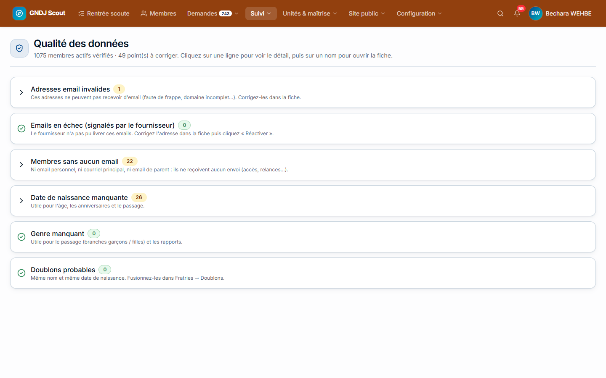

## Maîtrises, groupes et accès

- **Maîtrises** : la maîtrise de chaque unité **cette année et l'an prochain**, comme le passage (voir ci-dessous).
- **Groupes** : des listes de membres définies par des règles (toute la maîtrise, les chefs d'unité, les chefs
  d'équipe de toutes les troupes…). Un groupe sert pour les réunions, comme filtre dans « Mon unité », comme liste
  de diffusion (emails, export).

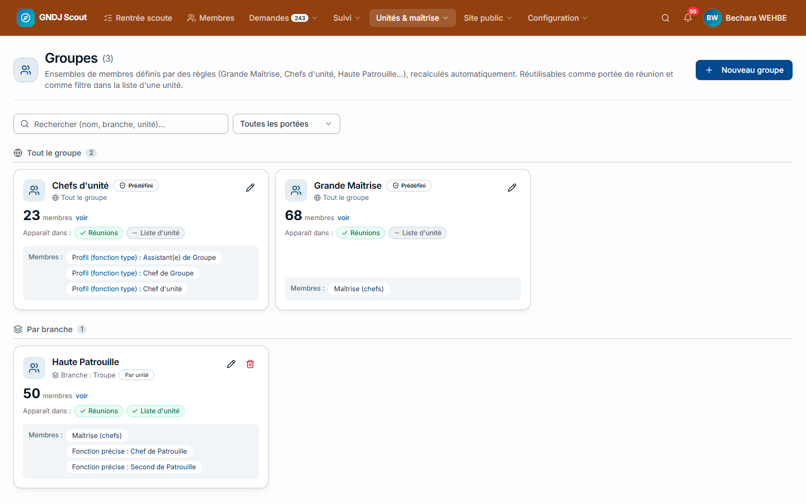

### Préparer la maîtrise de l'an prochain

**Unités & maîtrise → Maîtrises** affiche une ligne par unité : le chef d'unité de l'an prochain, et le nombre de chefs
cette année → l'an prochain (+ arrivées, − départs). Ouvrez une unité pour voir qui **reste**, qui **arrive** et qui
**part**.

- **Changer** (sur un chef) : autre unité et/ou autre fonction — cochez « garder aussi » pour un cumul — ou **Arrête**.
- **Ajouter un chef** : n'importe quel membre. Si c'est un **jeune**, sa ligne de passage devient automatiquement
  « quitte l'unité » (même si le CU en avait déjà mis une) ; elle est verrouillée tant que le changement est prévu.
- Chaque changement se fait **au passage** (par défaut) ou **maintenant** (correction en cours d'année).
- Nommer quelqu'un **chef d'unité** place automatiquement le chef d'unité actuel dans **Partent** (« remplacé par … »).
  C'est la même règle partout : un chef d'unité donné « maintenant » (ici ou dans les postes d'un membre) arrête
  aussitôt la fonction de l'ancien.
- ↺ annule un changement prévu en entier : annuler une nomination de chef d'unité (sur le nouveau chef ou sur le départ
  de l'ancien) remet l'ancien chef d'unité à sa place et rend à la personne sa fonction d'avant ; la ligne de passage
  d'un jeune revient comme avant.

Les changements prévus **ne changent rien tout de suite** : ils sont appliqués en même temps que le passage des jeunes,
quand vous cliquez **Publier le passage**, à la date du passage. Un encadré signale les unités qui n'auraient **pas de
chef d'unité** l'an prochain.

### Accès et délégations

**Configuration → Accès & permissions** :

- **Profils** : ce que chaque fonction permet (membres, documents, cotisations, passage…), par niveau
  (aucun / lecture / complet). Modifier un profil change les droits de toutes les fonctions qui l'utilisent.
- **Délégation** : donner à **une personne précise** des droits en plus, sans changer sa fonction (par exemple un
  assistant chargé des inscriptions ou du Camp BP, ou le futur chef de groupe avant l'annonce).
- **Voir les accès** : ce qu'une personne peut réellement faire, et pourquoi.

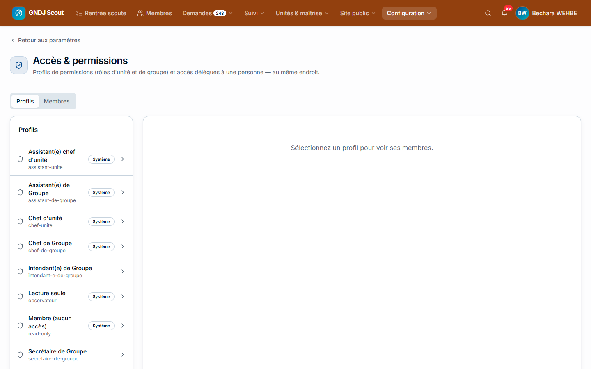

## Le Camp BP

Le Camp BP se prépare dans **Camp BP** (vous, ou les chefs de commission que vous nommez). Les onglets :

- **Familles** : le tirage répartit les membres notés par leurs chefs d'unité en familles équilibrées ; vous
  ajustez à la main (glisser-déposer) et choisissez le Père et la Mère de chaque famille. Le crayon à côté d'une
  famille lui donne un **nom** (son personnage) et une **description**, imprimés sur son passeport.
  **Superfamilles** (facultatif) : regroupez les familles, par exemple 5 univers de 10 familles.
- **Jeux** : un jeu pour deux familles (50 familles = 25 jeux), chacun avec son **numéro** (jeu 1 à 25 pour 50 familles), son **lieu A**, son **lieu B** (repli en cas de mauvais temps) et ses étapistes. Le numéro place le jeu
  dans la grille de rotation. **Attribuer les lieux** donne à chaque jeu un lieu libre de la liste (lieu A, lieu B
  ou les deux). Un lieu qui sert à la fois de lieu A et de lieu B est mis des deux côtés du jeu. Un jeu qui ne peut pas se jouer au lieu B reçoit un **jeu de repli** : en plan B, c'est
  lui qui est joué à cette étape.
- **Les lieux** se gèrent dans **Paramètres → Camp BP** (les mêmes chaque année) : pour chaque lieu, s'il sert de
  lieu A et/ou de lieu B et combien de jeux il peut accueillir en même temps.
- **Rotation** : la grille suit le **nombre de familles** du camp : deux familles par jeu, donc autant de jeux et
  d'étapes que de familles ÷ 2 (50 familles → 25 jeux, 25 étapes). Chaque famille joue chaque jeu une fois et ne
  rencontre jamais deux fois la même famille. Le nombre de familles doit être **pair**, de 8 à 100 (avec 4 ou 6
  familles, aucune rotation n'est possible). Pour 50 familles, c'est la
  grille habituelle de la commission. Choisissez les deux jours du camp et le nombre d'étapes du premier jour
  (proposé : environ 60 %), ajustez les horaires si besoin, et imprimez les **passeports des familles** et les **feuilles de
  pointage**. S'il pleut, activez **Plan B** : tous les lieux passent aux lieux de repli.
- **Pointage** : saisissez les scores par jeu ou par étape — sur place, ou plus tard depuis la feuille papier.
  Les règles sont appliquées toutes seules (manches de 50 points, retards A et B, 5 points d'esprit, énigme) et le
  **Classement** se met à jour.
- **Où est… ?** : un membre a perdu sa famille ? Tapez son nom (ou le numéro de la famille) : vous voyez sa
  famille, l'étape d'avant, celle en cours (ou la prochaine) et celle d'après, avec le lieu et le téléphone du
  Père et de la Mère.
- **Commission** : les membres de la commission, leurs droits, et leurs **sous-commissions** (Trésor, Jeu, Code,
  Logistique, Veillée… — la liste se modifie).

> 💡 Les étapistes saisissent eux-mêmes les scores de leur jeu depuis **Mes jeux** (ou la page Camp BP de leur
> unité). S'ils ont pointé sur papier, la commission saisit la feuille ensuite en choisissant « Depuis la feuille
> papier ».

## Le calendrier

**Calendrier** réunit les événements, les réunions des unités et les dates importantes de l'année (dates des
documents, du passage, de la première réunion ; les dates des inscriptions ne sont visibles que par votre équipe).
Ces dates viennent des **Paramètres** : les changer met le calendrier à jour.

**Nouvel événement** — choisissez **pour qui** :

| Pour qui | Qui le voit |
|---|---|
| **Tout le groupe** | Tous les membres |
| **Une branche** | Les membres de toutes les unités de la branche |
| **Une unité** | Les membres de l'unité (un chef d'unité peut créer pour la sienne) |
| **La maîtrise** | Tous les chefs |
| **Équipe du Chef de Groupe** | Vous et vos assistants |

Options : plusieurs jours, heures, lieu, **répétition** (chaque semaine / 2 semaines / mois, jusqu'à une date),
**rappel** (notification à tous les concernés, de 1 heure à 1 semaine avant), **Publier aussi sur le site** (groupe,
branche ou unité, sans répétition : l'événement est ajouté à l'agenda public et retiré si vous le supprimez).
Pour un événement qui se répète : **Modifier cette date** change un seul jour (heure, lieu, titre…) sans toucher aux
autres, **Annuler cette date** le retire ; **Modifier tout** / **Supprimer tout** agit sur toutes les dates.

Par défaut vous voyez les réunions de vos propres unités ; le menu **Réunions : …** affiche celles d'une autre unité.
Les réunions d'un **groupe de membres** (Grande Maîtrise, Chefs d'unité…) apparaissent aussi : chacun voit celles des
groupes dont il fait partie.
Chacun peut ajouter le calendrier à son téléphone (**Dans mon téléphone**).

## Notifications et messages

- **Envoyer une notification** : un message dans l'application (et sur le téléphone de ceux qui ont activé les
  notifications) à une unité, un groupe ou des membres choisis.
- **Site public → Messages de contact** : les messages envoyés depuis le formulaire du site ; **Je m'en occupe**
  évite que deux personnes répondent, **Répondre** envoie la réponse par email, **Marquer comme résolu** classe
  le message sans répondre (réglé par téléphone, rien à faire…). La liste s'ouvre sur **À traiter** ; une réponse
  envoyée marque aussi le message comme résolu, et **Rouvrir** le remet à traiter.

## Les paramètres

**Configuration → Paramètres** : vous voyez les sections que vous pouvez modifier (inscriptions, documents,
cotisations, passage, membres, connexion) ainsi que **Listes** (écoles, classes, villes, professions). Les réglages
techniques (emails, sécurité, maintenance) sont réservés au super-administrateur.

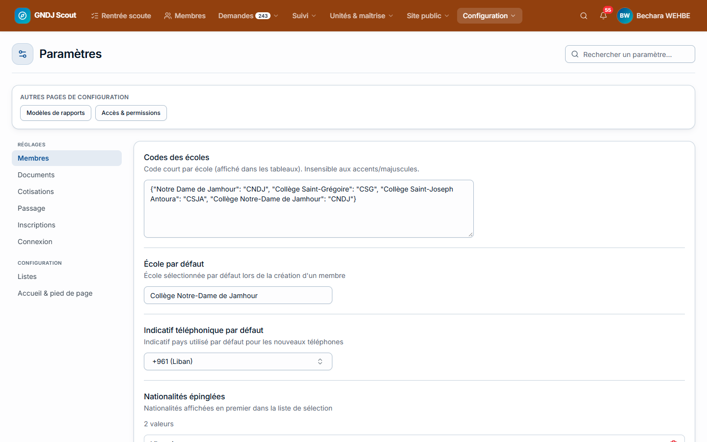

Un encadré en haut de la page signale les **réglages contradictoires** (dates dans le désordre, années scoutes
différentes…) avec un lien pour corriger.

Dans **Membres**, « Alerte après absences de suite » fixe le nombre de réunions manquées de suite au-delà duquel le
chef d'unité est prévenu (0 = pas d'alerte).

> 💡 Renommer une école ou une ville dans **Listes** la renomme aussi sur toutes les fiches. Supprimer une valeur
> utilisée l'**archive** (elle reste sur les fiches mais disparaît des choix).

## Nouvelle année scoute

Quand vous passez à l'année suivante (**Paramètres → Passage → Année scoute**), la plateforme propose le
**nettoyage de nouvelle année** :

1. une archive de **tous** les documents est créée (zip, conservée hors du site) ;
2. les documents de l'année sont supprimés, sauf les types que vous gardez (par défaut la carte d'identité) ;
3. les sections sont effacées et chaque membre monte d'une **classe**.

Un aperçu montre les chiffres avant de lancer ; l'opération ne se fait qu'une fois par année. Le journal d'audit
de l'année est aussi archivé et envoyé par email à l'administrateur et au chef de groupe.

## Questions fréquentes

| Question | Réponse |
|---|---|
| Je ne peux pas envoyer les réponses | Il reste des demandes soumises sans décision : filtre **Statut → À étudier** |
| Je ne peux pas publier le passage | Regardez l'étape ③ en haut de la page : certains membres n'ont pas de proposition ou une unité n'a pas terminé (tableau des unités) |
| Une famille dit ne pas avoir reçu l'email | Vérifiez son adresse dans **Comptes d'inscription** (ou le courriel principal sur la fiche) ; l'email peut aussi apparaître dans **Qualité des données** s'il a été refusé par le fournisseur |
| Une famille veut s'inscrire après la date limite | **Comptes d'inscription → Invitations de dernière minute** |
| Un CU ne voit pas un membre | Le membre n'a pas d'affectation active dans son unité |
| Un chef ne reçoit pas les notifications | Il doit les activer dans le menu de son nom (et installer l'application sur iPhone) |
| J'ai supprimé un membre par erreur | **Corbeille** → **Restaurer** (30 jours) |
