Bienvenue dans la maîtrise ! Ce guide vous accompagne pas à pas. Vous n'avez pas besoin de tout lire d'un coup :
commencez par **« Votre première connexion »** et **« Mon unité »**, puis revenez aux autres parties au moment où
vous en avez besoin (le **Sommaire** à droite vous y emmène directement).

> 💡 Ce guide est toujours à jour : il se trouve dans le menu **Aide** de l'application. Vous pouvez aussi
> l'imprimer ou l'enregistrer en PDF avec le bouton **Imprimer / PDF**.

## En bref : ce que fait un chef d'unité

| Quand | Quoi | Où dans l'application |
|---|---|---|
| Dès votre nomination | Vous connecter avec votre compte habituel, vérifier votre email, installer l'application | Page de connexion, **Ma fiche** |
| Début septembre | Vérifier la fiche de chaque membre (coordonnées, parents, école) | **Mon unité** |
| Septembre | Vérifier les documents déposés par les familles, suivre les cotisations | **Documents** |
| Septembre – octobre | Proposer le passage de chaque membre (qui reste, qui monte, qui quitte) | **Passage des membres** |
| Octobre | Répartir les membres en équipes, organiser la séance photo | **Organiser mon unité**, **Session photo** |
| Toute l'année | Noter les absences aux réunions, valider les progressions | **Réunions**, **Modifications à valider** |
| Toute l'année | Imprimer la liste, le trombinoscope, les cartes | Boutons en haut de **Mon unité** |

Votre **liste de rentrée** (menu **Rentrée scoute**) vous rappelle chaque tâche, dans le bon ordre, avec sa date limite.

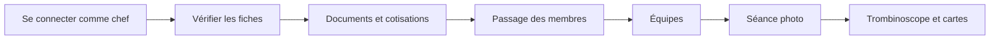
```mermaid
flowchart LR
    A[Se connecter comme chef] --> B[Vérifier les fiches]
    B --> C[Documents et cotisations]
    C --> D[Passage des membres]
    D --> E[Équipes]
    E --> F[Séance photo]
    F --> G[Trombinoscope et cartes]
```

## Votre première connexion

Vous êtes déjà membre du groupe : vous avez **déjà un compte** sur la plateforme, il n'y a **rien à activer**.
Dès que le chef de groupe vous a donné votre fonction de CU ou d'ACU, vous vous connectez **avec le même compte
qu'avant** et les menus de chef (Mon unité, Réunions, Passage…) apparaissent automatiquement.
Vous recevez aussi, une seule fois, un email **« Bienvenue dans la maîtrise »** qui résume ce qui change et
les premières choses à faire.

1. Allez sur **https://gndj.org** → **Espace membres**.
2. Saisissez votre **identifiant** (de la forme `prenom.nom@scouts.gndj`) et votre mot de passe habituel.
3. Si vous ne vous en souvenez plus, utilisez une des solutions ci-dessous.

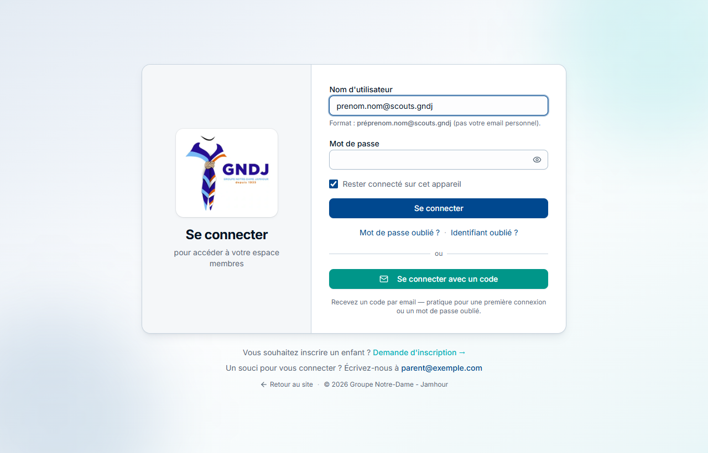

> ⚠️ Votre identifiant **n'est pas** votre email personnel : c'est toujours `prenom.nom@scouts.gndj`.
> L'email personnel sert à recevoir les messages de la plateforme.

**Autres façons de se connecter :**

- **Se connecter avec un code** : saisissez votre identifiant, un code à 6 chiffres est envoyé à votre adresse
  email. Pratique si vous avez oublié votre mot de passe.
- **Mot de passe oublié ?** : vous recevez un lien pour en choisir un nouveau.
- **Identifiant oublié ?** : saisissez votre email personnel, on vous renvoie votre identifiant.

**Rester connecté sur cet appareil** (coché par défaut) vous évite de vous reconnecter pendant 90 jours sur votre
téléphone ou votre ordinateur. Décochez-le sur un ordinateur partagé.

> 💡 Vous pouvez être connecté sur plusieurs appareils en même temps (téléphone et ordinateur). La liste de vos
> appareils se trouve dans le menu de votre nom → **Mes appareils connectés** ; vous pouvez y déconnecter un
> appareil perdu.

### Vérifier vos coordonnées

Comme chef, c'est à **votre** adresse email et à **votre** téléphone que la plateforme écrira (rappels, tâches de
rentrée, notifications). Beaucoup de chefs ont encore sur leur fiche l'adresse d'un parent (du temps où ils étaient
louveteaux ou éclaireurs) : ouvrez **Ma fiche → Contact & famille** et vérifiez que le **courriel de contact
principal** est bien le vôtre ; corrigez-le sinon.

## Installer l'application sur votre téléphone

La plateforme s'installe comme une application, sans passer par un store :

| Téléphone | Comment faire |
|---|---|
| **iPhone** (Safari) | Bouton **Partager** → **Sur l'écran d'accueil** |
| **Android** (Chrome) | Menu **⋮** → **Installer l'application** (ou le bandeau « Installer » en bas de l'écran) |
| **Ordinateur** (Chrome, Edge) | Icône d'installation à droite de la barre d'adresse |

Une fois installée, activez les **notifications** (menu de votre nom → **Activer les notifications**) : vous serez
prévenu quand un membre dépose un document ou propose une modification.

## Se repérer dans l'application

- **Le menu à gauche** (sur téléphone : le bouton ☰ en haut) donne accès à toutes vos pages.
- **La cloche** 🔔 en haut à droite montre vos notifications (document déposé, modification proposée…). Un clic
  vous emmène au bon endroit.
- **La loupe** (ou `Ctrl` + `K` sur ordinateur) : tapez quelques lettres d'un nom pour ouvrir directement la fiche
  d'un membre.
- **Votre nom** en haut à droite : votre fiche, vos appareils, le thème clair / sombre, l'aide, la déconnexion.

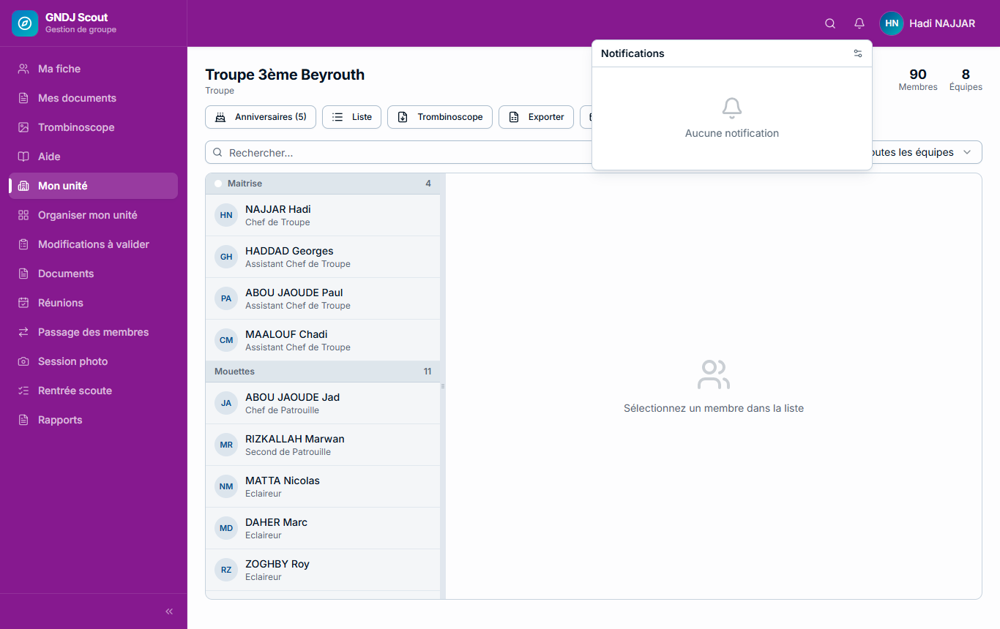

## Mon unité

C'est votre page d'accueil : la liste de tous les membres de votre unité, groupés par équipe (la maîtrise en
premier). Cliquez sur un nom pour ouvrir sa fiche à droite.

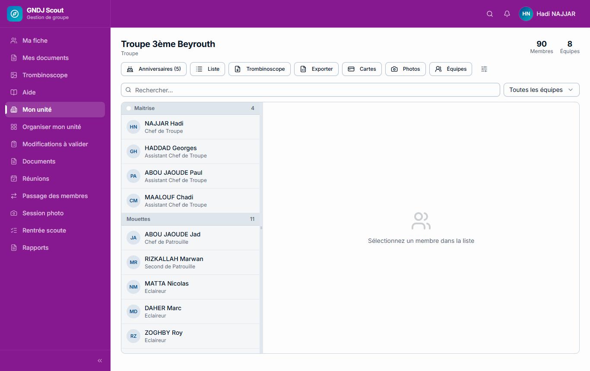

**En haut de la page :**

| Bouton | À quoi il sert |
|---|---|
| **Anniversaires** | Les anniversaires des 30 prochains jours (visible seulement s'il y en a) |
| **Liste** | La liste des membres en PDF, avec les colonnes de votre choix |
| **Trombinoscope** | Générer le trombinoscope de l'unité (voir [Impressions](#impressions-liste-trombinoscope-cartes-export)) |
| **Exporter** | Un fichier Excel ou CSV avec les colonnes de votre choix |
| **Cartes** | Les cartes de membre à imprimer (10 par page) |
| **Photos** | Ouvrir la séance photo |
| **Équipes** | Organiser les équipes |

La **barre de recherche** filtre par nom ; la liste déroulante **Toutes les équipes** filtre par équipe (et par
groupe, si le chef de groupe en a créé pour votre unité).

### Personnaliser la page

Le bouton ⚙ (réglages, au bout de la rangée de boutons) permet de choisir les boutons affichés et leur ordre, et
ce que montre chaque ligne de la liste (photo, fonction, équipe, matricule, âge, absences, état du dossier), ainsi
que le classement (par équipe ou de A à Z). Vos choix vous suivent sur tous vos appareils.

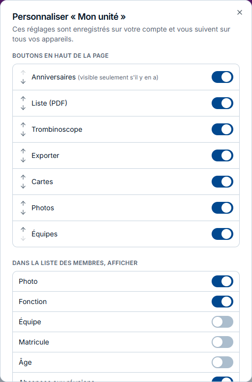

### Sur un téléphone

La liste occupe tout l'écran ; touchez un membre pour ouvrir sa fiche, et le bouton **Retour** du téléphone vous
ramène à la liste.

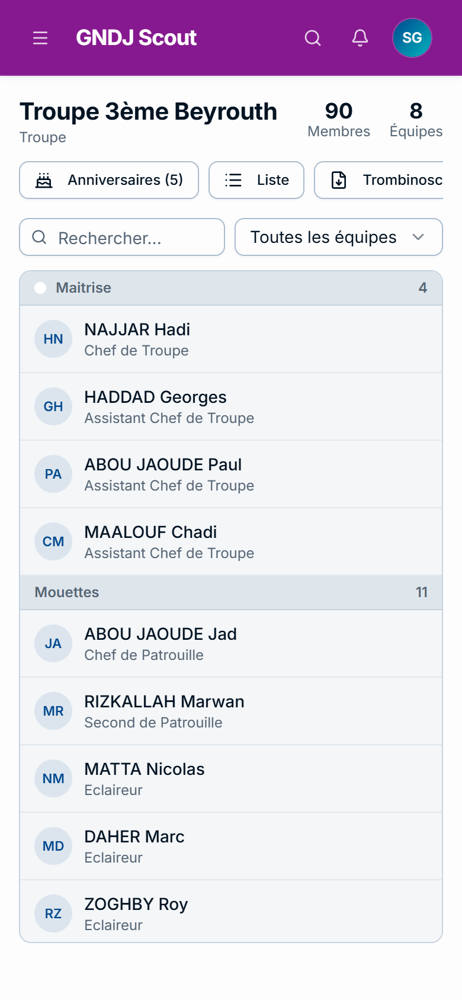

## La fiche d'un membre

La fiche est organisée en onglets :

| Onglet | Contenu |
|---|---|
| **Informations** | Identité, photo, scolarité ou profession |
| **Contact & famille** | Téléphones et emails du foyer, adresse, parents, frères et sœurs |
| **Unités / Fonctions** | L'historique des postes du membre dans le groupe |
| **Documents & cotisations** | Les documents déposés et la cotisation de l'année |
| **Progression** | Étapes et badges |
| **Médical & infos** | Groupe sanguin, allergies, informations complémentaires |

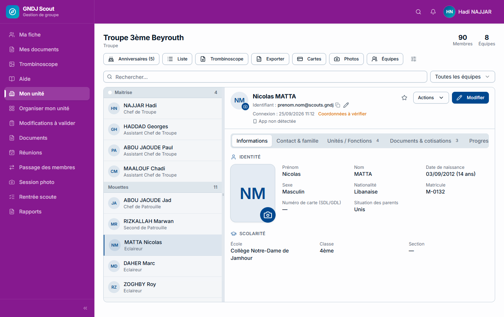

**Pour modifier :** cliquez sur **Modifier** en haut de la fiche (onglets Informations et Médical), faites vos
changements puis **Enregistrer**. Les coordonnées se modifient directement dans l'onglet **Contact & famille**
(crayon ✏️ sur chaque ligne, bouton **Ajouter**).

> ⚠️ Le nom, le prénom, la date de naissance et le sexe ne peuvent être corrigés que par le chef de groupe :
> écrivez-lui si l'un d'eux est faux.

### Contact & famille

Tous les téléphones et emails du foyer sont réunis au même endroit, avec à qui ils appartiennent (le membre, le
père, la mère). Le badge **Urgence** indique qui appeler en premier. Le **courriel de contact principal** est
l'adresse qui reçoit les messages de la plateforme (réinitialisation de mot de passe, relances) : choisissez celle
du parent qui s'occupe réellement du dossier.

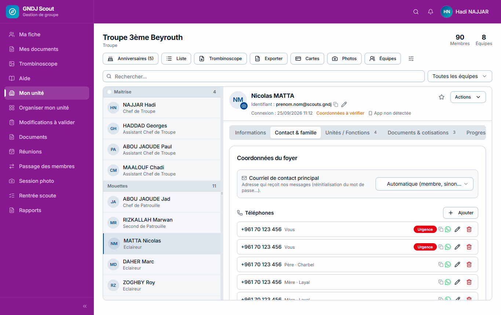

Les icônes à droite de chaque numéro permettent de **copier** le numéro ou d'ouvrir directement **WhatsApp**.

> 💡 Les frères et sœurs reconnus par le chef de groupe partagent les mêmes parents : une correction faite sur
> la fiche d'un enfant s'applique aussi à ses frères et sœurs.

### Le menu « Actions »

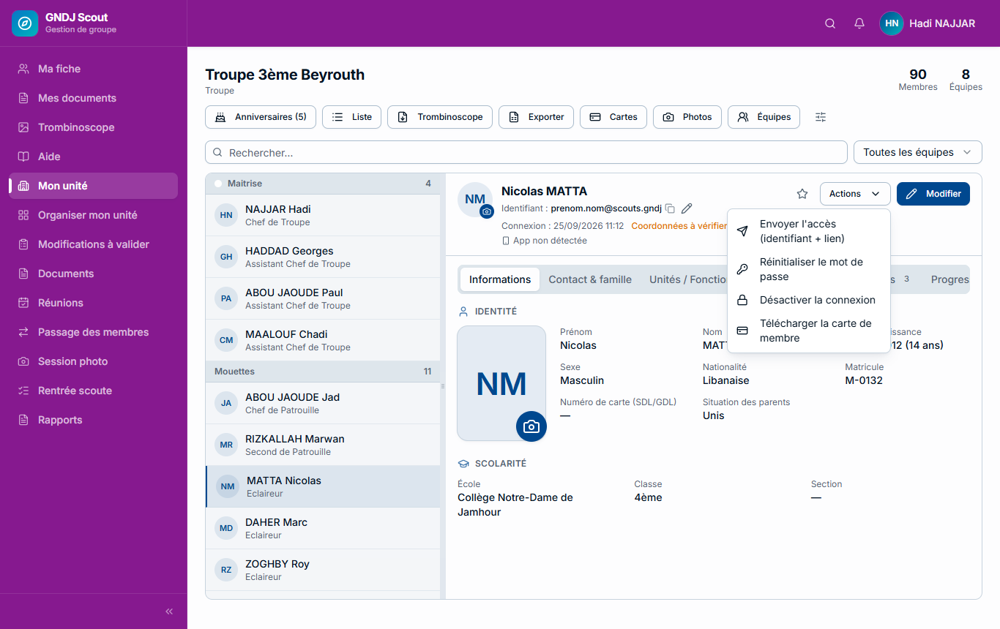

| Action | Quand l'utiliser |
|---|---|
| **Envoyer l'accès** | Le membre (ou ses parents) n'a jamais reçu ou a perdu son email d'activation |
| **Réinitialiser le mot de passe** | Le membre n'arrive plus à se connecter : un mot de passe temporaire est créé et envoyé par email (il s'affiche aussi à l'écran pour le transmettre vous-même) |
| **Désactiver la connexion** | Bloquer l'accès d'un compte sans supprimer le membre (réversible) |
| **Télécharger la carte de membre** | La carte en PDF |

## Documents et cotisations

Chaque famille dépose les documents demandés (autorisation des parents, fiche médicale, carte d'identité…)
depuis son espace. Votre rôle : **vérifier chaque document** et **enregistrer les cotisations**.

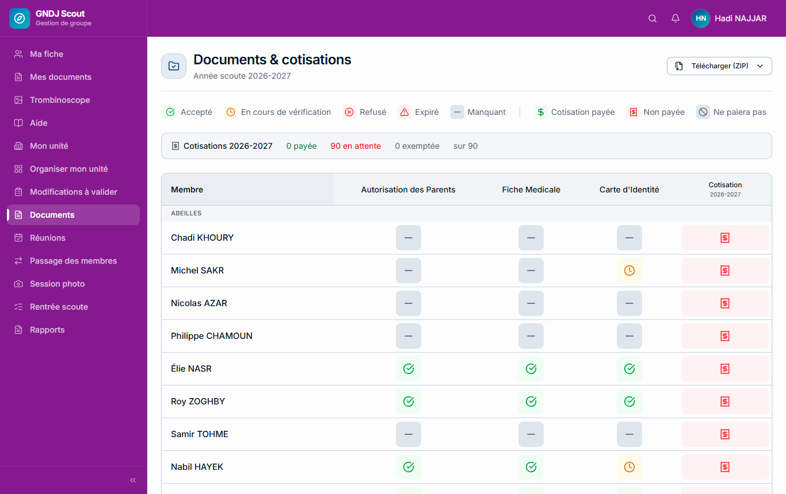

Chaque case correspond à un document d'un membre :

| Icône | Signification | Ce que vous faites |
|---|---|---|
| ✅ vert | Accepté | Rien |
| 🕒 orange | Déposé, en cours de vérification | Ouvrir, vérifier, accepter ou refuser |
| ❌ rouge | Refusé | La famille doit en renvoyer un correct |
| ⚠️ | Expiré | La famille doit en renvoyer un à jour |
| — gris | Manquant | Relancer la famille |

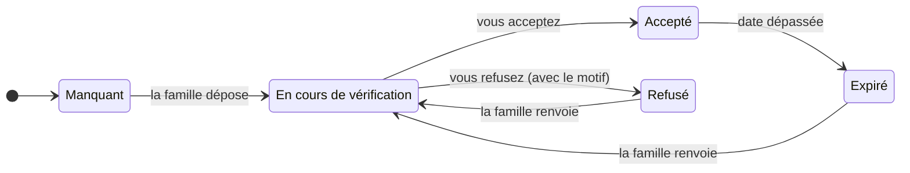
```mermaid
stateDiagram-v2
    direction LR
    state "En cours de vérification" as Verification
    state "Accepté" as Accepte
    state "Refusé" as Refuse
    state "Expiré" as Expire
    [*] --> Manquant
    Manquant --> Verification: la famille dépose
    Verification --> Accepte: vous acceptez
    Verification --> Refuse: vous refusez (avec le motif)
    Refuse --> Verification: la famille renvoie
    Accepte --> Expire: date dépassée
    Expire --> Verification: la famille renvoie
```

### Vérifier un document

Cliquez sur une case orange : le document s'affiche. Vérifiez qu'il est lisible, complet et signé, puis :

- **Accepter** ;
- ou **Refuser** en écrivant le motif dans **Notes** (« signature manquante », « page 2 absente »…) : la famille
  voit ce motif et peut renvoyer le document.

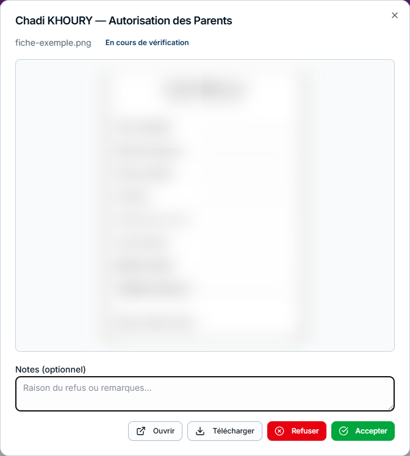

> 💡 Un document peut avoir plusieurs pages (recto / verso d'une carte d'identité) : utilisez les flèches
> **◀ Page 1/2 ▶** pour les parcourir. **Ouvrir** l'affiche en grand dans un nouvel onglet.

Vous pouvez aussi **déposer un document à la place d'une famille** (depuis l'onglet **Documents & cotisations** de
la fiche, bouton **Envoyer**). Sur ordinateur, le bouton **Scanner avec le téléphone** affiche un QR code :
scannez-le avec votre téléphone, photographiez la feuille, et le document arrive directement dans la fiche.

### Les cotisations

La dernière colonne montre la cotisation de l'année : **payée** (vert), **non payée** (rouge) ou **ne paiera pas**
(gris). Cliquez sur la case pour enregistrer un paiement :

1. Choisissez la **devise** (le montant se remplit tout seul) ;
2. Ajustez le **montant** si la famille paie une partie seulement ;
3. **Enregistrer** : un reçu numéroté est créé (téléchargeable depuis la fiche du membre).

Un membre peut payer en plusieurs fois ou en plusieurs devises : ajoutez une ligne de paiement. La plateforme
calcule si la cotisation est **complète** ou **partielle**. Pour un membre dispensé, cochez **Ne paiera pas**.

> ⚠️ Le dépôt des documents suit un calendrier fixé par le chef de groupe (bandeau en haut de la page). Après la
> date limite finale, les dossiers incomplets sont **suspendus** : le membre garde l'accès à sa fiche mais ne peut
> plus déposer ; seul le chef de groupe peut le réactiver.

## Le passage annuel

Chaque année, vous indiquez pour **chaque membre** de votre unité ce qu'il devient l'année suivante. Le chef de
groupe valide, puis applique tous les passages le jour du passage.

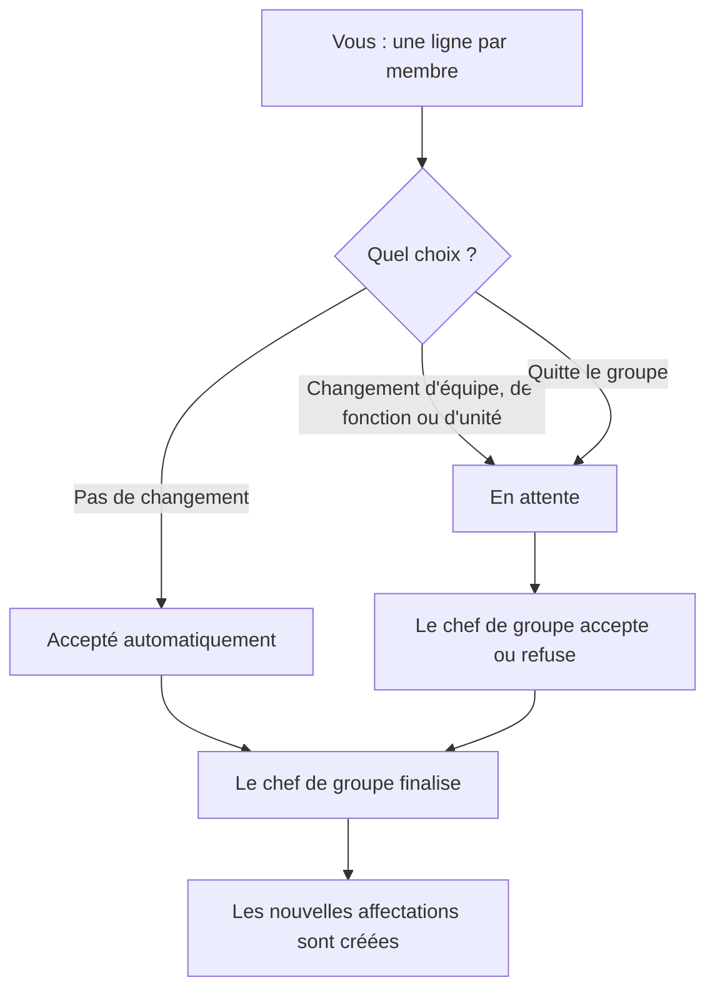
```mermaid
flowchart TD
    A[Vous : une ligne par membre] --> B{Quel choix ?}
    B -->|Pas de changement| C[Accepté automatiquement]
    B -->|Changement d'équipe, de fonction ou d'unité| D[En attente]
    B -->|Quitte le groupe| D
    D --> E[Le chef de groupe accepte ou refuse]
    C --> F[Le chef de groupe finalise]
    E --> F
    F --> G[Les nouvelles affectations sont créées]
```

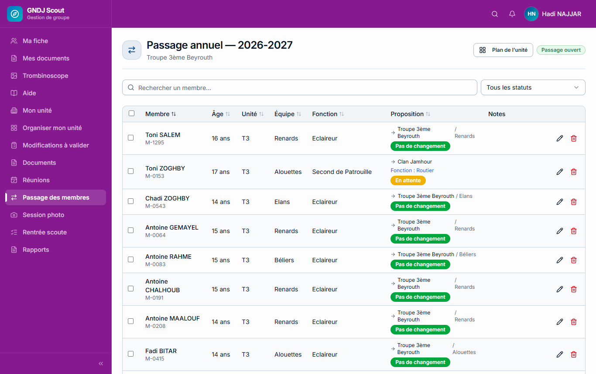

Pour chaque membre, trois choix :

| Choix | Signification |
|---|---|
| **Pas de changement** | Le membre reste dans l'unité, même équipe, même fonction |
| **Proposer** | Un changement : autre équipe, autre fonction, ou montée dans l'unité supérieure (la liste propose uniquement les unités possibles selon le parcours scout) |
| **Quitte le groupe** | Le membre ne revient pas l'année prochaine |

- Cochez plusieurs membres pour leur appliquer le même choix en une fois (barre d'actions en bas).
- Tant que le chef de groupe n'a pas **finalisé**, vous pouvez changer d'avis : bouton **Modifier le choix** sur
  la ligne.
- Quand vous choisissez **Quitte le groupe**, une fenêtre vous demande l'email et le téléphone **personnels** du
  membre (pas ceux de ses parents) : ils permettent de rester en contact avec les anciens.

> ✅ Le bandeau de la page indique combien de membres ont déjà une ligne. Le chef de groupe ne peut finaliser que
> lorsque **tous** les membres en ont une.

## Organiser mon unité

Une vue d'ensemble de votre unité, équipe par équipe, pour déplacer rapidement les membres.

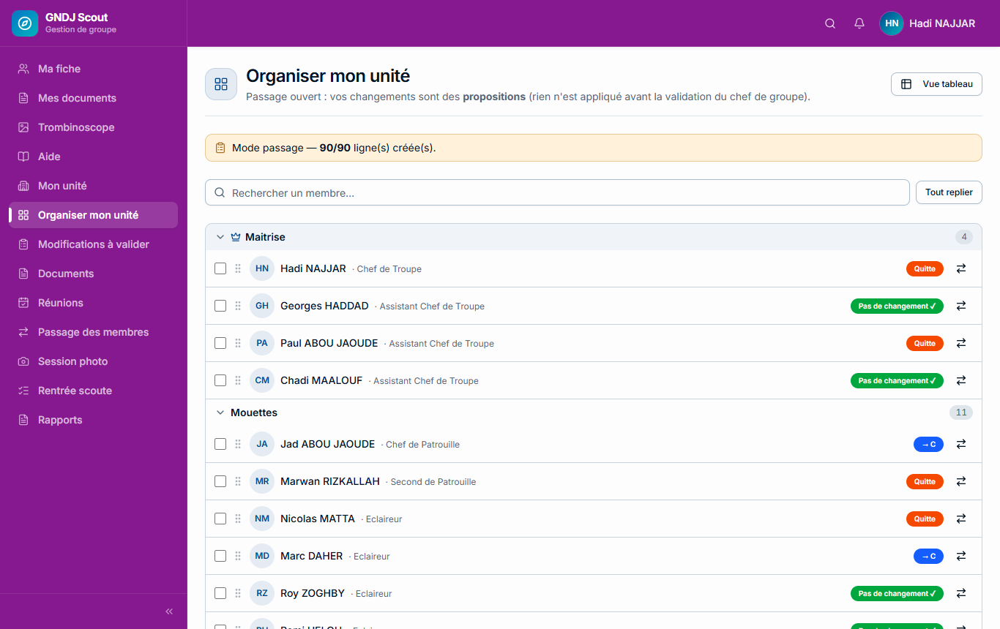

- Glissez un membre d'une équipe à l'autre, ou utilisez le bouton ⇄ au bout de la ligne.
- Cochez plusieurs membres pour les déplacer ensemble.
- **Pendant la période de passage**, ces déplacements sont des **propositions** de passage (badges « Pas de
  changement », « Quitte »…) ; le reste de l'année, ils modifient directement l'équipe et la fonction.

## Modifications à valider

Les membres peuvent proposer eux-mêmes une **étape**, un **badge** ou une **fonction** depuis leur fiche. Ces
propositions arrivent ici (et dans vos notifications) :

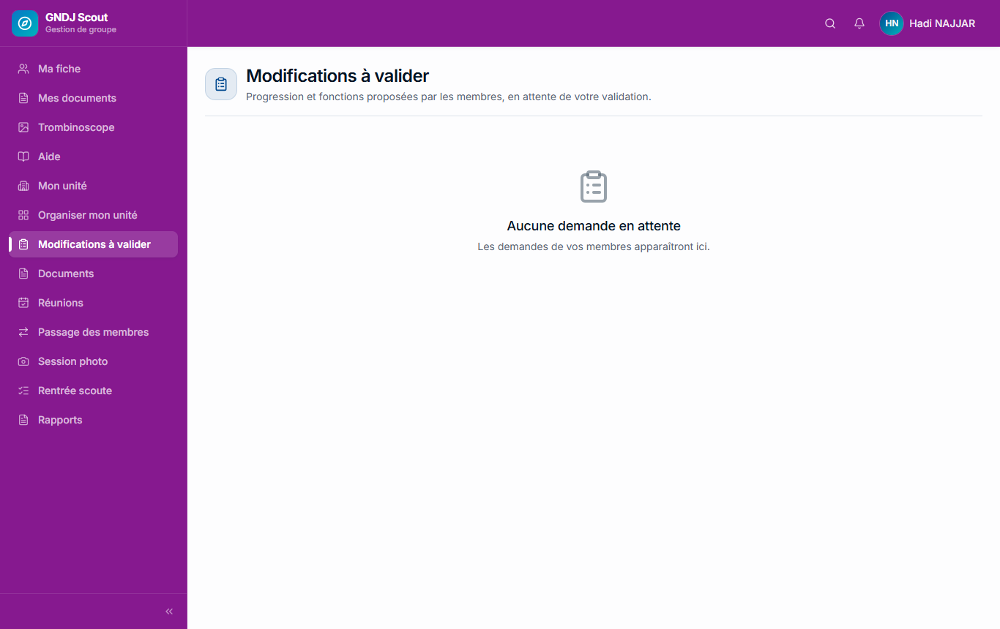

- **Accepter** : la progression ou la fonction est ajoutée à la fiche du membre.
- **Refuser** : écrivez le motif ; le membre le voit sur sa fiche.

## Réunions et absences

Notez qui était absent à chaque réunion, sortie ou camp. Les présents sont cochés par défaut : vous n'indiquez que
les absents (avec un motif si vous le connaissez).

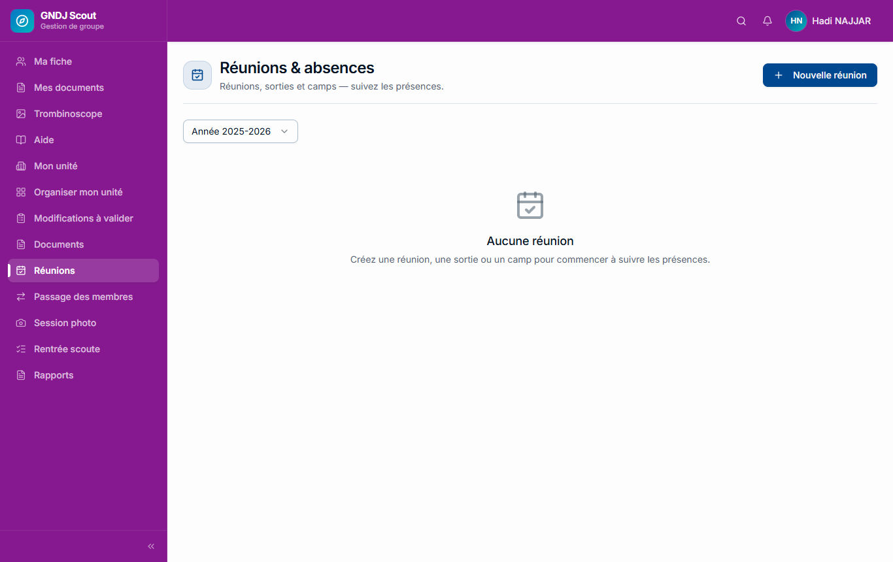

1. **Nouvelle réunion** : type (réunion, sortie, camp), date, et **qui est concerné** (toute l'unité, une équipe
   ou un groupe) ;
2. Cochez les absents, **Enregistrer**.

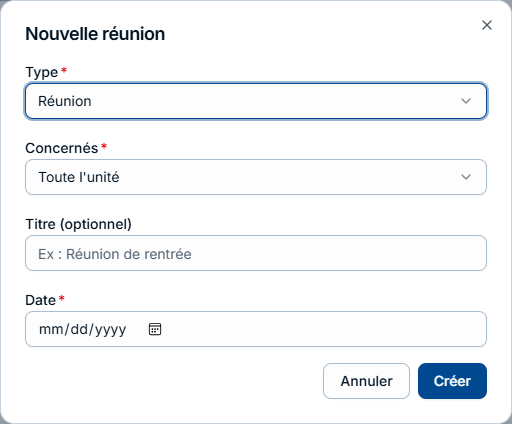

Le nombre d'absences de l'année s'affiche sur la fiche du membre et dans la liste de **Mon unité**.

> 💡 Les **chefs d'équipe** (CP, sizenier…) peuvent aussi créer une réunion pour leur équipe : elle vous arrive
> **à approuver**.

## Session photo

Prenez les photos de vos membres directement avec votre téléphone : la page affiche la liste, vous touchez un nom,
l'appareil photo s'ouvre avec un cadre pour bien placer le visage, et la photo est enregistrée sur la fiche.

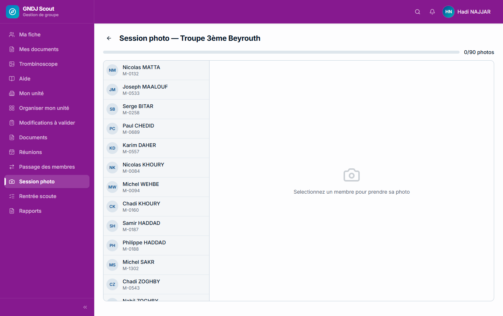

## Impressions : liste, trombinoscope, cartes, export

Depuis les boutons en haut de **Mon unité** :

| Bouton | Résultat | Bon à savoir |
|---|---|---|
| **Liste** | PDF de la liste des membres | Vous choisissez les colonnes (téléphones, parents, école…) |
| **Trombinoscope** | PDF avec la photo de chaque membre, par équipe | **Générer** l'enregistre : c'est cette version que voient les membres dans « Trombinoscope ». Générez-le à nouveau après la séance photo |
| **Cartes** | Cartes de membre, 10 par page A4 | À découper |
| **Exporter** | Fichier Excel ou CSV | Pour vos propres tableaux |

Le menu **Rapports** permet de créer vos propres modèles de liste (colonnes, ordre, filtre maîtrise / jeunes) et de
les régénérer en un clic.

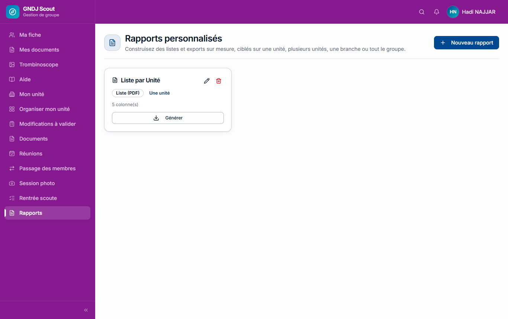

## Votre liste de rentrée

Le menu **Rentrée scoute** montre **vos** tâches de l'année, dans l'ordre, avec leur date limite (en rouge si elle
est dépassée). Beaucoup se cochent **toutes seules** quand le travail est fait dans l'application (par exemple
« Proposer les passages » avance au fur et à mesure de vos propositions). Les autres, cochez-les vous-même.

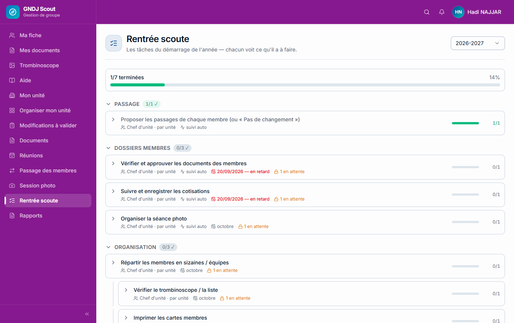

Un cadenas 🔒 signifie que la tâche attend qu'une autre soit terminée d'abord. Une fois par semaine, un email vous
rappelle les tâches en retard ou proches de leur échéance.

## Aider un membre qui n'arrive pas à se connecter

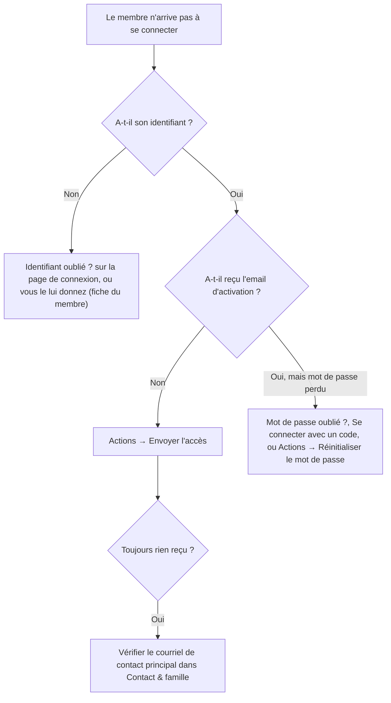
```mermaid
flowchart TD
    A[Le membre n'arrive pas à se connecter] --> B{A-t-il son identifiant ?}
    B -->|Non| C["Identifiant oublié ? sur la page de connexion, ou vous le lui donnez (fiche du membre)"]
    B -->|Oui| D{A-t-il reçu l'email d'activation ?}
    D -->|Non| E["Actions → Envoyer l'accès"]
    D -->|Oui, mais mot de passe perdu| F["Mot de passe oublié ?, Se connecter avec un code, ou Actions → Réinitialiser le mot de passe"]
    E --> G{Toujours rien reçu ?}
    G -->|Oui| H["Vérifier le courriel de contact principal dans Contact & famille"]
```

L'identifiant du membre est affiché en haut de sa fiche (bouton pour le copier).

## Questions fréquentes

| Question | Réponse |
|---|---|
| Un membre de mon unité n'apparaît pas dans ma liste | Il n'a pas d'affectation active dans votre unité : demandez au chef de groupe |
| Je ne vois pas les documents d'un membre d'une autre unité | Normal : vous ne voyez que les membres de votre unité |
| Une famille n'a pas reçu l'email | Vérifiez son **courriel de contact principal** (onglet Contact & famille) ; regardez aussi les courriers indésirables |
| Je me suis trompé dans une proposition de passage | Bouton **Modifier le choix** sur la ligne, tant que le chef de groupe n'a pas finalisé |
| J'ai accepté un document par erreur | Rouvrez-le et **Refusez-le** avec un motif : la famille pourra le renvoyer |
| Le nom ou la date de naissance d'un membre est faux | Seul le chef de groupe peut les corriger : écrivez-lui |
| L'application me déconnecte | Cochez **Rester connecté sur cet appareil** à la connexion |

> 💡 Un autre souci ? Écrivez au chef de groupe, ou utilisez l'adresse indiquée en bas de la page de connexion.
