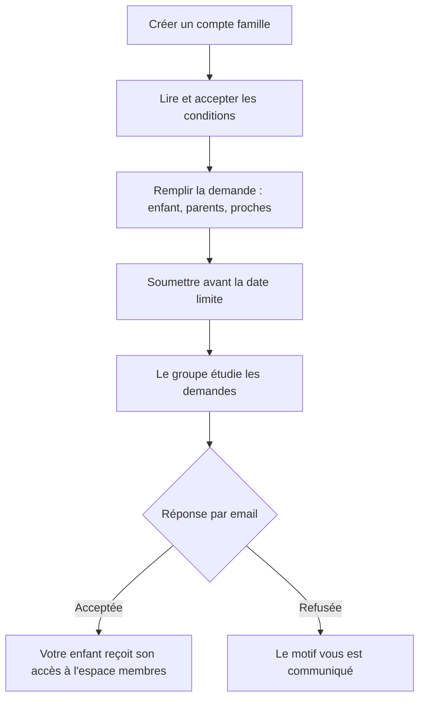
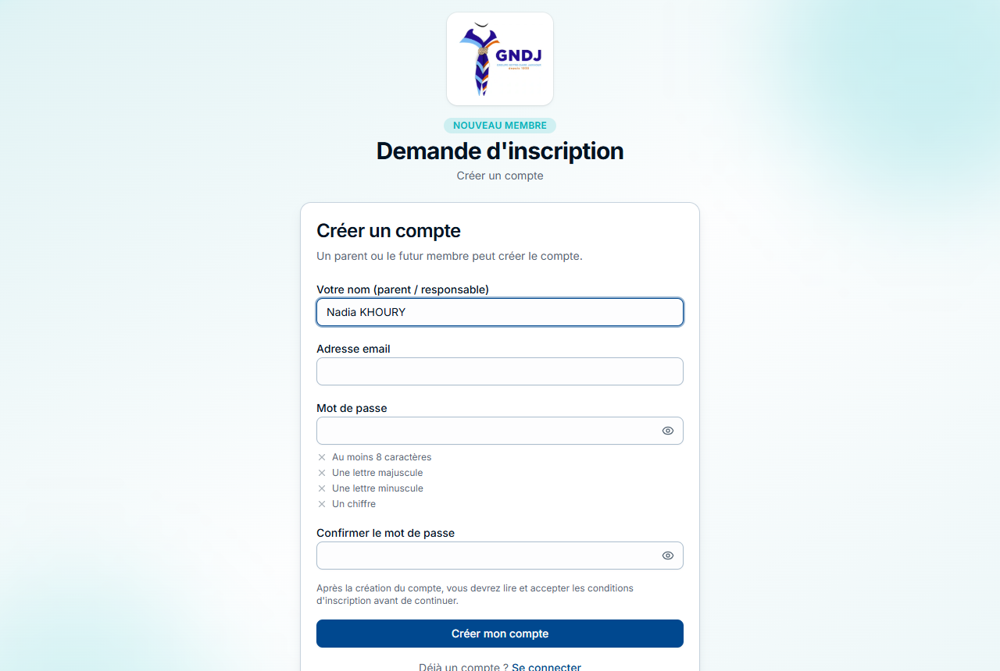
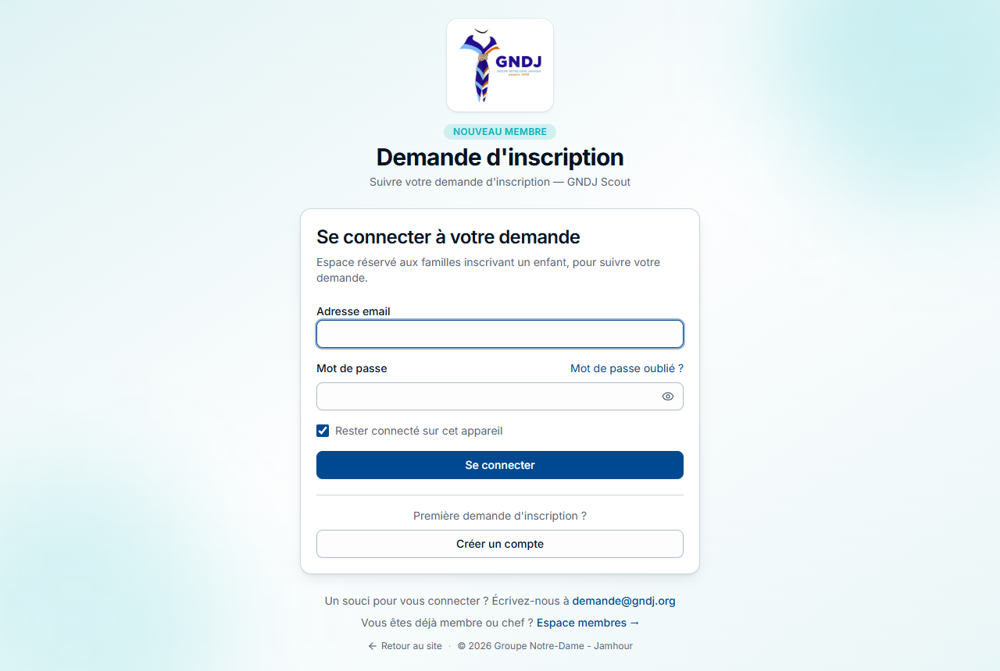
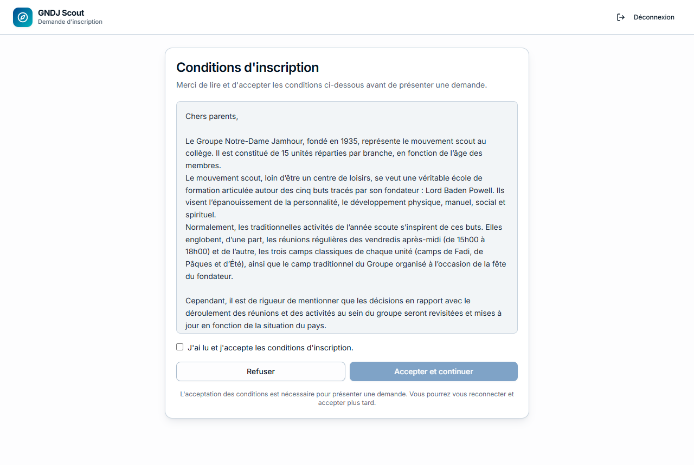
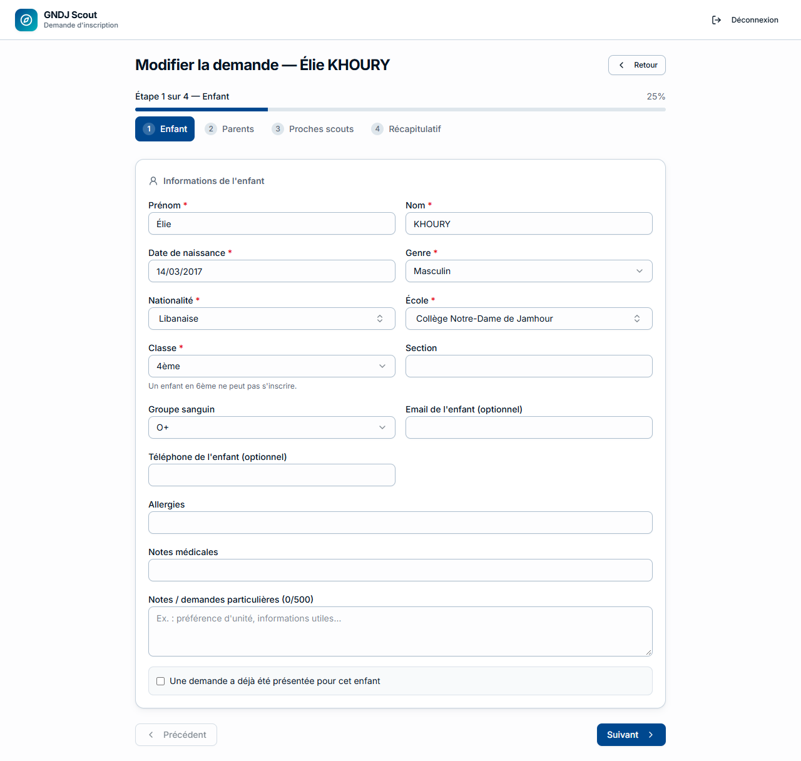
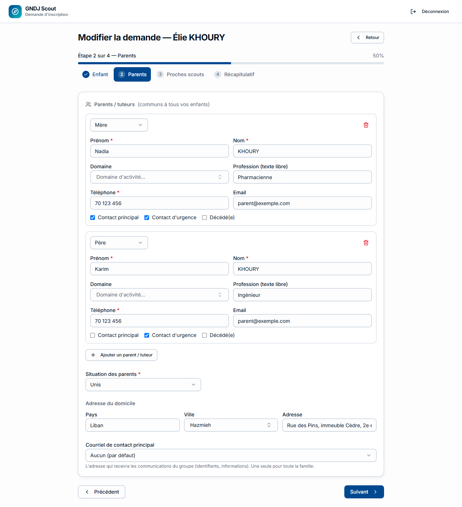
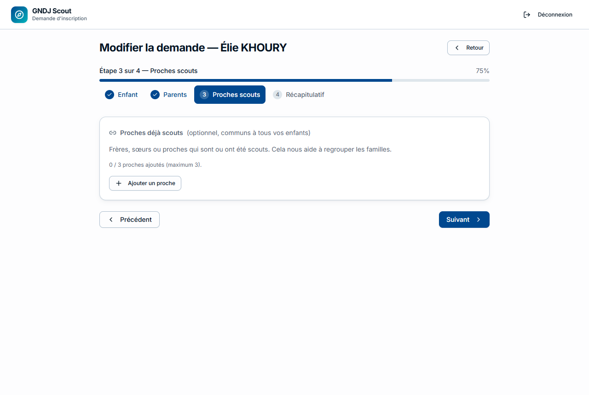
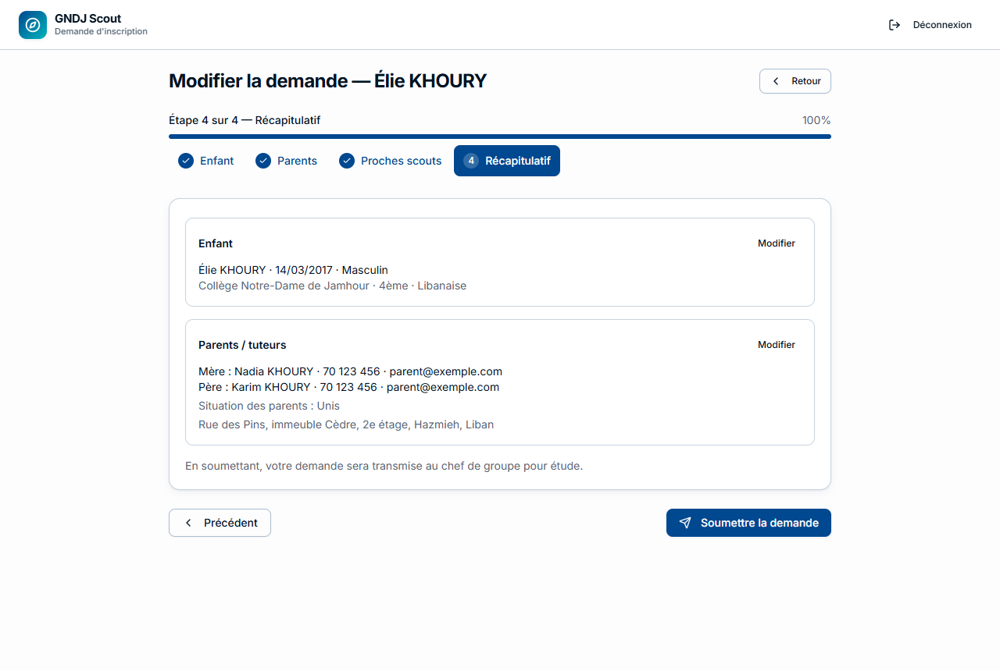
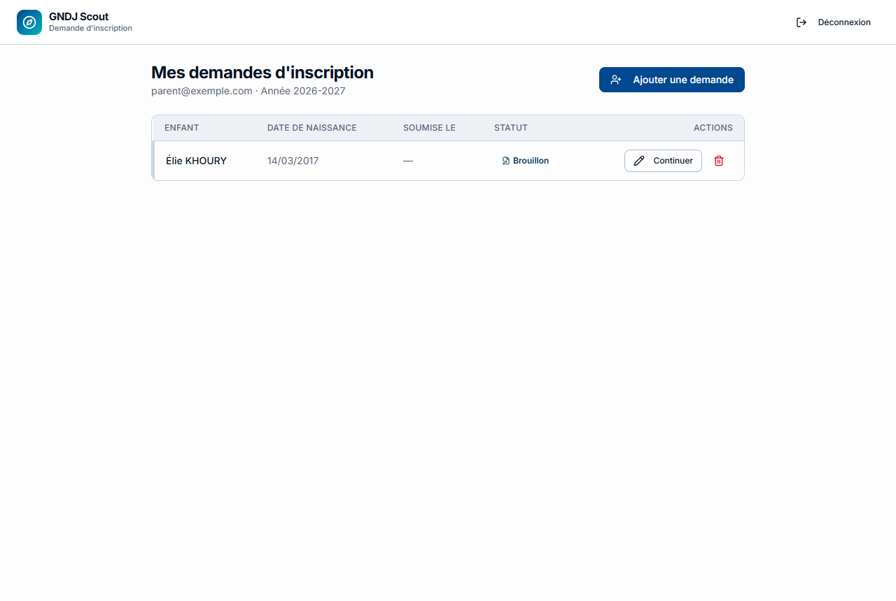

Les inscriptions des nouveaux membres se font en ligne, pendant la période annoncée par le groupe (en général au
début du mois de septembre). Ce guide vous accompagne de la création de votre compte jusqu'à la réponse.

> 💡 Votre enfant a **déjà un frère ou une sœur au groupe** ? Connectez-vous plutôt à l'**espace membres** avec le
> compte de celui-ci et utilisez le bouton **Inscrire un frère ou une sœur** sur sa fiche : les parents et l'adresse
> seront déjà remplis.

## Les étapes en un coup d'œil

| Étape | Qui | Quand |
|---|---|---|
| Créer le compte et remplir la demande | Vous | Pendant la période d'inscription |
| Soumettre la demande | Vous | **Avant la date limite** |
| Étudier les demandes | La maîtrise de groupe | Après la date limite |
| Envoyer les réponses | La maîtrise de groupe | Vous recevez un email |

## 1. Créer votre compte

Allez sur **https://gndj.org/inscription**. Un seul compte suffit pour **toute la famille** : si vous inscrivez
plusieurs enfants, vous ferez une demande par enfant depuis ce même compte.

- **Votre nom** : le nom du parent (ou du responsable) qui fait la demande ;
- **Adresse email** : une adresse que vous consultez — toutes les réponses y seront envoyées ;
- **Mot de passe** : les règles s'affichent sous le champ et se cochent au fur et à mesure.

Vous avez déjà un compte ? **Se connecter**.

> ⚠️ Cet espace est **différent de l'espace membres** : ici, vous utilisez votre adresse email et le mot de passe
> que vous avez choisi pour la demande d'inscription.

## 2. Accepter les conditions d'inscription

Avant de remplir la demande, lisez les conditions du groupe et acceptez-les. Si vous refusez, vous êtes simplement
déconnecté : vous pourrez revenir plus tard.

## 3. Remplir la demande

La demande a **4 étapes**. Vous pouvez passer de l'une à l'autre en cliquant sur leur nom en haut, et **tout est
enregistré au fur et à mesure** : vous pouvez vous arrêter et reprendre plus tard.

### Étape 1 — L'enfant

Les champs marqués d'une **\*** sont obligatoires : prénom, nom, date de naissance, genre, nationalité, école et
classe. Si votre école n'est pas dans la liste, tapez son nom dans **Autre**.

> 💡 La case **« Une demande a déjà été présentée pour cet enfant »** permet d'indiquer que vous aviez déjà fait une
> demande une année précédente.

### Étape 2 — Les parents

- Ajoutez **chaque parent ou tuteur** (bouton **Ajouter un parent / tuteur**), avec au moins un téléphone ;
- **Contact principal** : le parent à contacter en premier ; **Contact d'urgence** : à appeler en cas d'urgence ;
- **Situation des parents** et **adresse du domicile** ;
- **Courriel de contact principal** : l'adresse qui recevra les messages du groupe pour toute la famille.

Les parents et l'adresse sont **communs à tous vos enfants** : vous ne les saisissez qu'une fois.

> 💡 Un membre de votre famille est déjà au groupe ? Utilisez **Retrouver mes informations** : saisissez votre email
> (ou celui d'un parent déjà connu du groupe), un code vous est envoyé, et les parents et l'adresse se remplissent
> tout seuls.

### Étape 3 — Proches scouts (facultatif)

Indiquez les frères, sœurs ou proches qui sont (ou ont été) scouts, au groupe ou ailleurs. Cela aide le groupe à
regrouper les familles.

### Étape 4 — Récapitulatif et envoi

Relisez tout (le bouton **Modifier** ramène à l'étape concernée), puis **Soumettre la demande**. Vous recevez un
email de confirmation avec le **numéro de votre demande** (par exemple `INS-2026-0123`).

> ⚠️ Une demande **non soumise** n'est pas étudiée. Après la date limite, les brouillons ne peuvent plus être envoyés.

## 4. Suivre votre demande

Votre espace montre toutes vos demandes et leur état.

| État | Signification |
|---|---|
| **Brouillon** | Pas encore soumise : terminez-la et cliquez sur **Soumettre** |
| **Soumise** | Reçue, en attente d'étude |
| **Acceptée** | Votre enfant est inscrit — voir ci-dessous |
| **Refusée** | Le motif est affiché |
| **Expirée** | Brouillon jamais soumis avant la date limite |

Tant que la période d'inscription est ouverte et que la demande n'a pas encore été étudiée, vous pouvez encore
**modifier** une demande soumise.

## 5. Après l'acceptation

Quand la demande est acceptée, vous recevez un email avec :

- l'**unité** de votre enfant ;
- son **identifiant** pour l'espace membres (de la forme `prenom.nom@scouts.gndj`) ;
- un lien **Définir mon mot de passe** (valable quelques semaines).

Ensuite, tout se passe dans l'**espace membres** (**https://gndj.org/login**) : la fiche de votre enfant, les
documents à envoyer, la cotisation. Le guide du membre vous y attend dans le menu **Aide**.

## Questions fréquentes

| Question | Réponse |
|---|---|
| Je n'ai pas reçu d'email | Regardez dans les courriers indésirables ; vérifiez l'adresse de votre compte |
| J'ai oublié mon mot de passe | **Mot de passe oublié ?** sur la page de connexion de l'espace inscription |
| La période d'inscription est fermée | Le groupe annonce chaque année les dates : revenez à ce moment-là |
| Je veux inscrire deux enfants | Une demande par enfant, depuis le même compte (bouton **Ajouter une demande**) |
| Mon enfant est en 6ème | Les inscriptions ne sont pas ouvertes à cette classe (le formulaire l'indique) |
| Je me suis trompé après avoir soumis | Tant que la période est ouverte, ouvrez la demande et corrigez-la |

> 💡 Un problème ? Écrivez à l'adresse indiquée en bas de la page de connexion.
