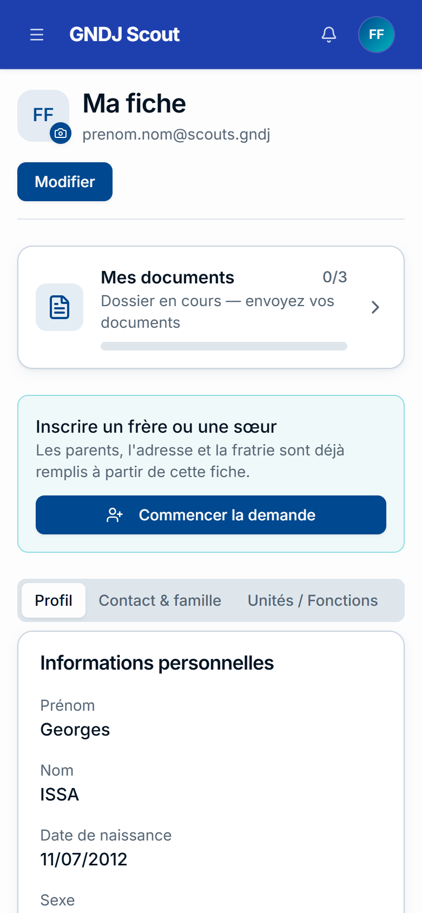
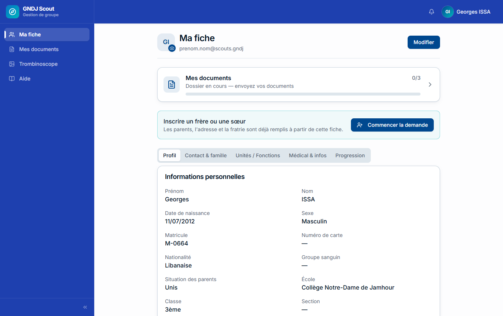
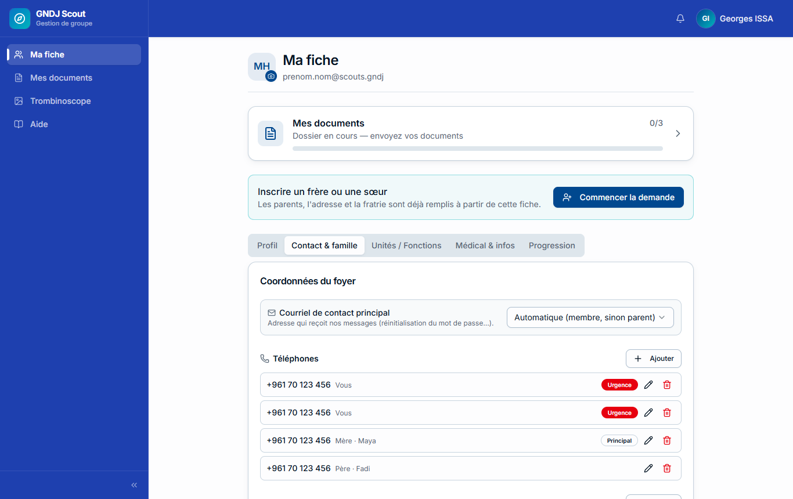
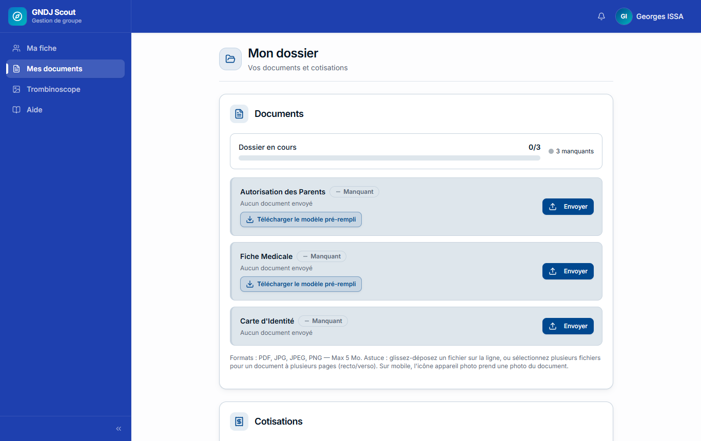
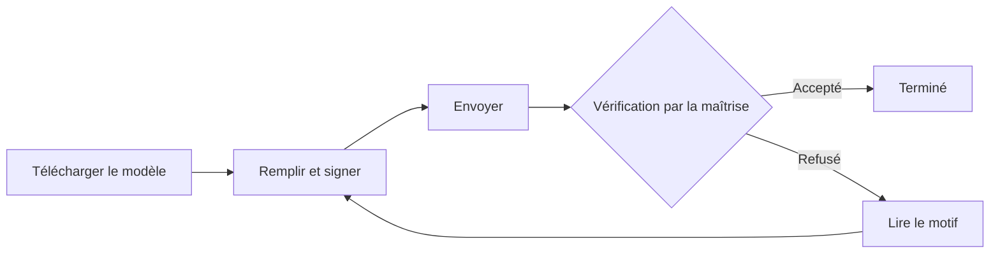
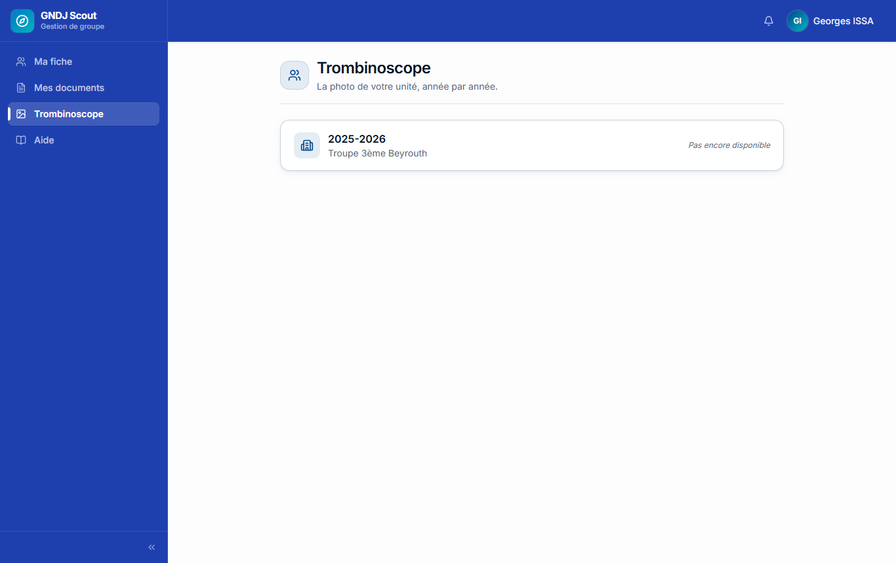

Chaque membre du groupe a son propre compte. Pour les plus jeunes, ce sont **les parents** qui l'utilisent :
ce guide s'adresse donc aux uns comme aux autres.

> 💡 Ce guide est aussi dans l'application : menu **Aide**. Vous pouvez l'imprimer avec **Imprimer / PDF**.

## Ce que vous pouvez faire

| Page | À quoi elle sert |
|---|---|
| **Ma fiche** | Vos informations : identité, école, coordonnées, parents, santé, progression |
| **Mes documents** | Envoyer les documents demandés chaque année et suivre leur vérification ; voir la cotisation |
| **Trombinoscope** | Le trombinoscope de votre unité, pour chaque année où vous y étiez |
| **Aide** | Ce guide |

La cloche 🔔 en haut de l'écran vous prévient quand un document est accepté ou refusé, ou qu'une proposition a
reçu une réponse.

## Se connecter

Votre **identifiant** est de la forme `prenom.nom@scouts.gndj` (ce n'est **pas** votre email personnel). Vous
l'avez reçu par email, avec un lien **Activer mon compte** pour choisir votre mot de passe.

| Situation | Que faire |
|---|---|
| Première fois | Cliquez sur **Activer mon compte** dans l'email, choisissez votre mot de passe |
| Mot de passe oublié | **Mot de passe oublié ?** (un lien vous est envoyé), ou **Se connecter avec un code** (un code à 6 chiffres arrive par email) |
| Identifiant oublié | **Identifiant oublié ?** : saisissez votre email personnel ou celui d'un parent, l'identifiant vous est renvoyé |
| Plusieurs enfants dans le groupe | Chaque enfant a son propre identifiant. Une fois connecté, passez de l'un à l'autre par le menu de votre nom → **Changer de compte** |
| Rien ne marche | Écrivez à l'adresse indiquée en bas de la page de connexion |

> 💡 **Rester connecté sur cet appareil** (coché par défaut) vous évite de vous reconnecter pendant 90 jours.
> Décochez-le sur un ordinateur que d'autres utilisent.

**Mot de passe :** les règles à respecter (longueur, majuscule, chiffre…) s'affichent sous le champ et se cochent au
fur et à mesure. Pour le changer plus tard : menu de votre nom → **Modifier le mot de passe**.

## Installer l'application sur le téléphone

Pas besoin de store : la plateforme s'installe depuis le navigateur.

| Téléphone | Comment faire |
|---|---|
| **iPhone** | Ouvrez **gndj.org** dans **Safari** → bouton **Partager** → **Sur l'écran d'accueil** |
| **Android** | Ouvrez **gndj.org** dans **Chrome** → menu **⋮** → **Installer l'application** |

L'icône GNDJ apparaît ensuite sur votre écran d'accueil, comme une application.

Sur téléphone, le menu est derrière le bouton ☰ en haut à gauche.

## Ma fiche

La fiche est organisée en onglets : **Profil**, **Contact & famille**, **Unités / Fonctions**, **Médical & infos**
et **Progression**.

### Ce que vous pouvez modifier vous-même

| Vous pouvez modifier | Seule la maîtrise peut modifier |
|---|---|
| École, classe, section, nationalité | Nom, prénom |
| Groupe sanguin, allergies, informations médicales | Date de naissance, sexe |
| Téléphones, emails, adresse | Matricule, numéro de carte |
| Les parents (ajouter, corriger leurs coordonnées) | L'unité, l'équipe et la fonction |

Pour modifier le profil ou les informations médicales : bouton **Modifier** en haut, puis **Enregistrer**. Les
coordonnées se modifient directement dans l'onglet **Contact & famille** (crayon ✏️, bouton **Ajouter**).

> ⚠️ Une erreur sur le nom ou la date de naissance ? Prévenez votre chef d'unité : il la fera corriger.

### Vérifier vos coordonnées

À la première connexion, une fenêtre **« Vérifiez vos coordonnées »** vous demande de relire vos emails et
téléphones, et de choisir le **courriel principal** : c'est l'adresse qui recevra les messages du groupe
(relances, liens pour le mot de passe). Choisissez celle du parent qui s'occupe réellement du dossier.

### Frères et sœurs

Si plusieurs enfants de la famille sont au groupe, ils apparaissent dans **Contact & famille**. Si l'un d'eux est
faux ou manquant, utilisez **Signaler une erreur** : le chef de groupe corrigera.

Pour **inscrire un frère ou une sœur** qui n'est pas encore au groupe, utilisez le bouton **Commencer la demande**
en haut de **Ma fiche** (visible pendant la période d'inscription) : les parents et l'adresse sont déjà remplis.

### Progression et fonctions

Dans les onglets **Progression** et **Unités / Fonctions**, le bouton **Proposer** vous permet d'indiquer une étape
franchie, un badge obtenu ou une fonction. Votre chef d'unité reçoit la proposition et l'accepte ou la refuse (le
motif s'affiche alors sur votre fiche).

## Mes documents

Chaque année, le groupe demande quelques documents (autorisation des parents, fiche médicale, carte d'identité…).

**Pour envoyer un document :**

1. Si le groupe fournit un modèle, cliquez sur **Télécharger le modèle pré-rempli** : le formulaire arrive déjà
   rempli avec vos informations. Imprimez-le, complétez et signez-le.
2. Cliquez sur **Envoyer** sur la ligne du document, choisissez le fichier (PDF, photo JPG ou PNG).
3. Sur téléphone, l'icône **appareil photo** permet de photographier directement la feuille.

> 💡 Un document de plusieurs pages (recto et verso d'une carte d'identité, fiche de deux pages) : sélectionnez
> **plusieurs fichiers en même temps**, ou envoyez les pages l'une après l'autre sur la même ligne — elles sont
> regroupées en un seul document.

**Suivre la vérification :**

| État | Signification |
|---|---|
| **Manquant** | Rien n'a été envoyé |
| **En cours de vérification** | Envoyé, la maîtrise doit le vérifier |
| **Accepté** | C'est bon |
| **Refusé** | Le motif est affiché sous le document : corrigez et renvoyez-le |
| **Expiré** | Le document n'est plus valable : envoyez-en un nouveau |

> ⚠️ Les documents sont à envoyer **avant la date limite** annoncée par le groupe. Après la date limite finale,
> un dossier incomplet est **suspendu** : vous gardez l'accès à votre fiche, mais pour le débloquer il faut
> contacter la maîtrise.

### La cotisation

En bas de **Mes documents**, la section **Cotisations** indique si la cotisation de l'année est réglée, en partie
ou en totalité, et permet de télécharger les **reçus**. Le paiement se fait auprès de votre chef d'unité.

## Trombinoscope

La page **Trombinoscope** donne accès au trombinoscope de votre unité pour chaque année où vous y étiez, dès que la
maîtrise l'a publié.

## Questions fréquentes

| Question | Réponse |
|---|---|
| Je ne reçois pas les emails du groupe | Vérifiez le **courriel principal** dans **Contact & famille**, et regardez dans les courriers indésirables |
| Mon document a été refusé | Lisez le motif sous le document, corrigez, renvoyez-le sur la même ligne |
| Je me suis trompé de fichier | Envoyez le bon : la maîtrise refusera le mauvais |
| Mon enfant a changé d'unité, sa fiche n'est pas à jour | L'unité est mise à jour par la maîtrise au moment du passage |
| Je veux supprimer une coordonnée | Onglet **Contact & famille**, icône 🗑 sur la ligne |
| L'application me déconnecte souvent | Cochez **Rester connecté sur cet appareil** à la connexion |
