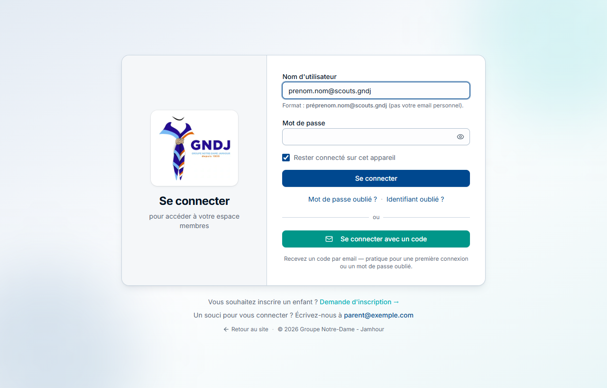
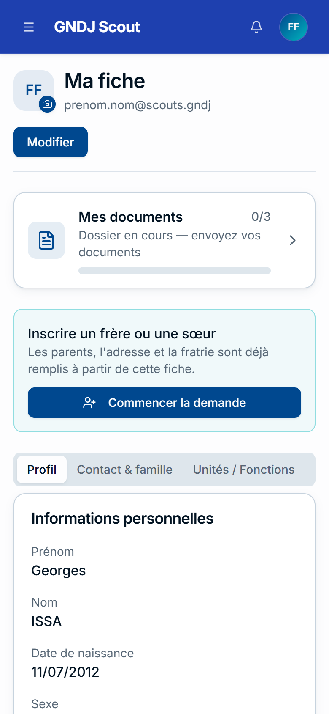
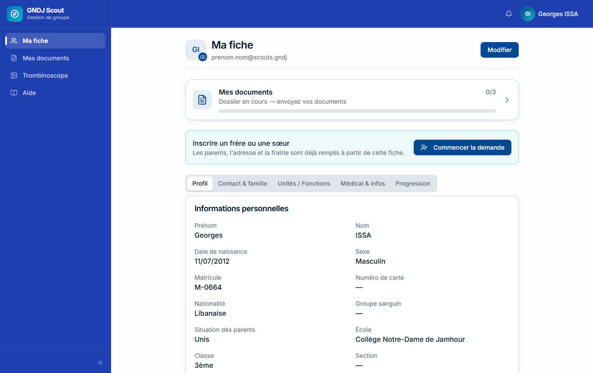
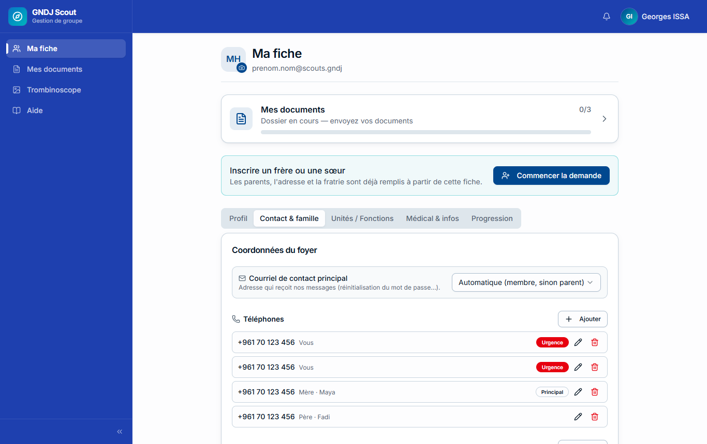
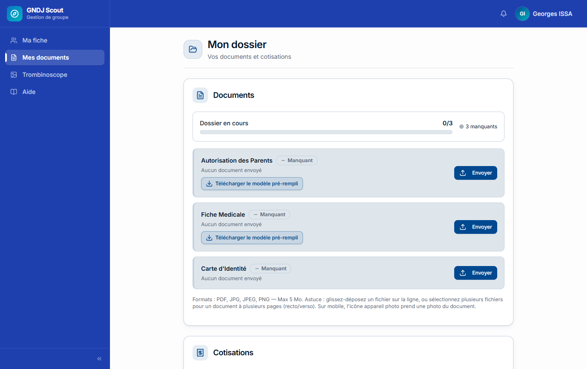
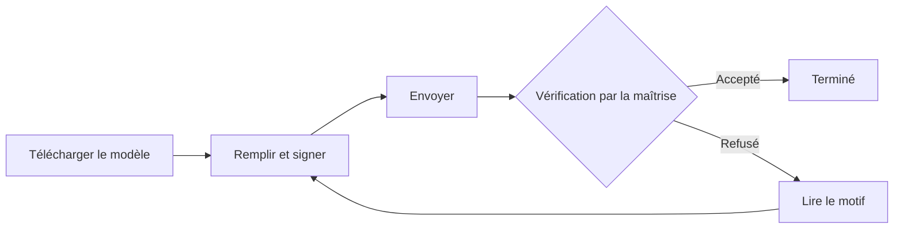
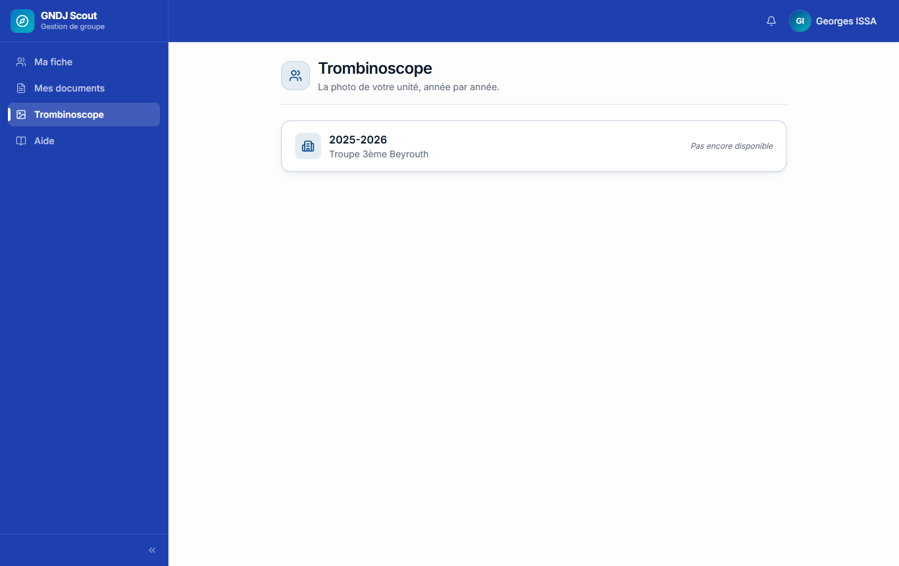

Chaque membre du groupe a son propre compte. Pour les plus jeunes, ce sont **les parents** qui l'utilisent :
ce guide s'adresse donc aux uns comme aux autres.

> 💡 Ce guide est aussi dans l'application : menu **Aide**. Vous pouvez l'imprimer avec **Imprimer / PDF**.

## Ce que vous pouvez faire

| Page | À quoi elle sert |
|---|---|
| **Ma fiche** | Vos informations : identité, école, coordonnées, parents, santé, progression |
| **Mes documents** | Envoyer les documents demandés chaque année et suivre leur vérification ; voir la cotisation |
| **Trombinoscope** | Le trombinoscope de votre unité, pour chaque année où vous y étiez |
| **Aide** | Ce guide |

La cloche 🔔 en haut de l'écran vous prévient quand un document est accepté ou refusé, ou qu'une proposition a
reçu une réponse.

## Se connecter

Votre **identifiant** est de la forme `prenom.nom@scouts.gndj` (ce n'est **pas** votre email personnel). Vous
l'avez reçu par email, avec un lien **Activer mon compte** pour choisir votre mot de passe.

| Situation | Que faire |
|---|---|
| Première fois | Cliquez sur **Activer mon compte** dans l'email, choisissez votre mot de passe |
| Mot de passe oublié | **Mot de passe oublié ?** (un lien vous est envoyé), ou **Se connecter avec un code** (un code à 6 chiffres arrive par email) |
| Identifiant oublié | **Identifiant oublié ?** : saisissez votre email personnel ou celui d'un parent, l'identifiant vous est renvoyé |
| Plusieurs enfants dans le groupe | Chaque enfant a son propre identifiant. Une fois connecté, passez de l'un à l'autre par le menu de votre nom → **Changer de compte**. Si les enfants ont le même email principal, aucun mot de passe n'est demandé ; sinon, ou si l'un d'eux est chef, le mot de passe de l'autre compte est demandé la première fois |
| Rien ne marche | Écrivez à l'adresse indiquée en bas de la page de connexion |

> 💡 **Rester connecté sur cet appareil** (coché par défaut) vous évite de vous reconnecter pendant 90 jours.
> Décochez-le sur un ordinateur que d'autres utilisent.

**Mot de passe :** les règles à respecter (longueur, majuscule, chiffre…) s'affichent sous le champ et se cochent au
fur et à mesure. Pour le changer plus tard : menu de votre nom → **Modifier le mot de passe**.

## Installer l'application sur le téléphone

Pas besoin de store : la plateforme s'installe depuis le navigateur.

| Téléphone | Comment faire |
|---|---|
| **iPhone** | Ouvrez **gndj.org** dans **Safari** → bouton **Partager** → **Sur l'écran d'accueil** |
| **Android** | Ouvrez **gndj.org** dans **Chrome** → menu **⋮** → **Installer l'application** |

L'icône GNDJ apparaît ensuite sur votre écran d'accueil, comme une application.

Sur téléphone, le menu est derrière le bouton ☰ en haut à gauche.

## Ma fiche

### Ma rentrée

En haut de **Ma fiche**, la carte **Ma rentrée** liste ce qu'il vous reste à faire pour l'année : vérifier les
coordonnées de la famille, envoyer vos documents (et, si le groupe l'a activé, la cotisation). Chaque ligne se coche
toute seule quand c'est fait. Quand tout est fait, la carte se réduit à « Tout est en ordre » ; elle se rouvre d'elle-même
si quelque chose de nouveau est demandé (un document refusé ou expiré, la rentrée suivante).

La fiche est organisée en onglets : **Profil**, **Contact & famille**, **Mon unité**, **Médical & infos**
et **Progression**.

### Ce que vous pouvez modifier vous-même

| Vous pouvez modifier | Seule la maîtrise peut modifier |
|---|---|
| École, classe, section, nationalité | Nom, prénom |
| Groupe sanguin, allergies, informations médicales | Date de naissance, sexe |
| Téléphones, emails, adresse | Matricule, numéro de carte |
| Les parents (ajouter, corriger leurs coordonnées) | L'unité, l'équipe et la fonction |

Pour modifier le profil ou les informations médicales : bouton **Modifier** en haut, puis **Enregistrer**. Les
coordonnées se modifient directement dans l'onglet **Contact & famille** (crayon ✏️, bouton **Ajouter**).

> ⚠️ Une erreur sur le nom ou la date de naissance ? Prévenez votre chef d'unité : il la fera corriger.

### Vérifier vos coordonnées

À la première connexion (puis une fois par an, au début de la période des documents), une fenêtre
**« Vérifiez vos coordonnées »** vous demande de relire vos emails et téléphones, et de choisir le **courriel principal** : c'est l'adresse qui recevra les messages du groupe
(relances, liens pour le mot de passe). Choisissez celle du parent qui s'occupe réellement du dossier.

### Frères et sœurs

Si plusieurs enfants de la famille sont au groupe, ils apparaissent dans **Contact & famille**. Si l'un d'eux est
faux ou manquant, utilisez **Signaler une erreur** : le chef de groupe corrigera.

**Ma famille** (menu de votre nom → **Ma famille**, ou le lien sous « Ma rentrée ») montre tous les frères et sœurs
reliés, avec ce qu'il reste à faire pour chacun cette année (coordonnées, documents, cotisation). **Ouvrir son
compte** passe directement sur le compte de l'enfant. Le compte d'un frère ou d'une sœur chef n'affiche que son nom.

Pour **inscrire un frère ou une sœur** qui n'est pas encore au groupe, utilisez le bouton **Commencer la demande**
en haut de **Ma fiche** (visible pendant la période d'inscription) : les parents et l'adresse sont déjà remplis.

### Progression et fonctions

Dans l'onglet **Progression**, le bouton **Ajouter une étape** vous permet d'indiquer une étape franchie ou un
badge obtenu ; dans **Mon unité**, **Signaler un changement** sert pour un changement d'unité, d'équipe ou de
fonction. Votre chef d'unité le reçoit et le confirme ou le refuse (le motif s'affiche alors sur votre fiche).

## Mes documents

Chaque année, le groupe demande quelques documents (autorisation des parents, fiche médicale, carte d'identité…).

**Pour envoyer un document :**

1. Si le groupe fournit un modèle, cliquez sur **Télécharger le modèle pré-rempli** : le formulaire arrive déjà
   rempli avec vos informations. Imprimez-le, complétez et signez-le.

   Quand le bouton **Remplir et signer en ligne** apparaît, vous pouvez tout faire sur votre téléphone : complétez
   les champs, indiquez votre nom et qui vous êtes (père, mère…), cochez « Je certifie », **signez avec le doigt**
   dans le cadre, puis **Signer et envoyer**. Le document signé arrive directement dans le dossier : pas besoin
   d'imprimer ni de scanner. Les dates se choisissent dans un calendrier. Pour la fiche médicale, le groupe
   sanguin, les allergies et les remarques indiquées sont aussi enregistrés dans votre fiche (onglet Médical).
   L'année suivante, le formulaire s'ouvre déjà rempli avec vos réponses : vérifiez, corrigez si besoin et signez.
   Vous préférez le papier ? Le lien « ou télécharger pour remplir sur papier » donne le modèle à imprimer.
2. Cliquez sur **Envoyer** sur la ligne du document, choisissez le fichier (PDF, photo JPG ou PNG).
3. Sur téléphone, l'icône **appareil photo** permet de photographier directement la feuille.

> 💡 Un document de plusieurs pages (recto et verso d'une carte d'identité, fiche de deux pages) : sélectionnez
> **plusieurs fichiers en même temps**, ou envoyez les pages l'une après l'autre sur la même ligne — elles sont
> regroupées en un seul document.

**Suivre la vérification :**

| État | Signification |
|---|---|
| **Manquant** | Rien n'a été envoyé |
| **En cours de vérification** | Envoyé, la maîtrise doit le vérifier |
| **Accepté** | C'est bon |
| **Refusé** | Le motif est affiché sous le document : corrigez et renvoyez-le |
| **Expiré** | Le document n'est plus valable : envoyez-en un nouveau |

```mermaid
flowchart LR
    A[Télécharger le modèle] --> B[Remplir et signer]
    B --> C[Envoyer]
    C --> D{Vérification par la maîtrise}
    D -->|Accepté| E[Terminé]
    D -->|Refusé| F[Lire le motif]
    F --> B
```

> ⚠️ Les documents sont à envoyer **avant la date limite** annoncée par le groupe. Après la date limite finale,
> un dossier incomplet est **suspendu** : vous gardez l'accès à votre fiche, mais pour le débloquer il faut
> contacter la maîtrise.

### La cotisation

En bas de **Mes documents**, la section **Cotisations** indique si la cotisation de l'année est réglée, en partie
ou en totalité, et permet de télécharger les **reçus**. Le paiement se fait auprès de votre chef d'unité.

## Le calendrier

**Calendrier** (dans le menu) réunit tout ce qui est daté : les événements du groupe, de votre branche et de votre
unité, les réunions, sorties et camps de votre unité (ou de votre équipe, ou d'un groupe dont vous faites partie), et
les dates importantes de l'année
(documents à rendre, passage, première réunion). Vue **Mois** ou **Liste** ; touchez un jour ou un événement pour le détail.

> 💡 **Dans mon téléphone** : ajoutez votre lien personnel à l'agenda de votre téléphone (iPhone : « Ajouter à mon
> agenda » puis « S'abonner » ; Android : Google Agenda → « À partir de l'URL »). Les événements s'y mettent à jour
> tout seuls. Ce lien est personnel : ne le partagez pas (« Nouveau lien » coupe l'ancien).

Quand un événement a un rappel, vous recevez une notification avant qu'il commence.

## Trombinoscope

La page **Trombinoscope** donne accès au trombinoscope de votre unité pour chaque année où vous y étiez, dès que la
maîtrise l'a publié.

## Questions fréquentes

| Question | Réponse |
|---|---|
| Je ne reçois pas les emails du groupe | Vérifiez le **courriel principal** dans **Contact & famille**, et regardez dans les courriers indésirables |
| Mon document a été refusé | Lisez le motif sous le document, corrigez, renvoyez-le sur la même ligne |
| Je me suis trompé de fichier | Envoyez le bon : la maîtrise refusera le mauvais |
| Mon enfant a changé d'unité, sa fiche n'est pas à jour | L'unité est mise à jour par la maîtrise au moment du passage |
| Je veux supprimer une coordonnée | Onglet **Contact & famille**, icône 🗑 sur la ligne |
| L'application me déconnecte souvent | Cochez **Rester connecté sur cet appareil** à la connexion |
